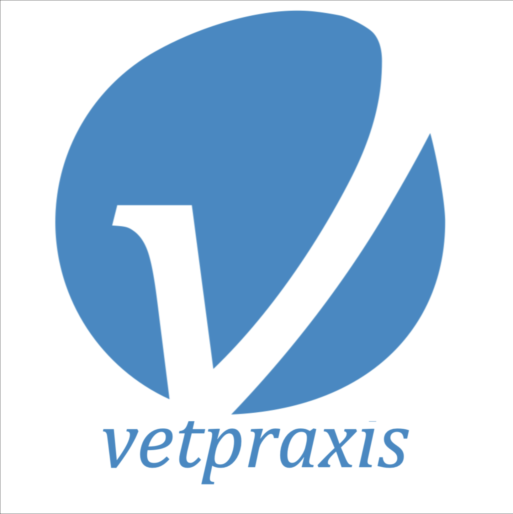

# **Capítulo II: Requirements Elicitation & Analysis**

## 2.1. Competidores.

| Plataforma | Descripción |
|------------|-------------|
| **VetPraxis**    | VetPraxis es una herramienta enfocada en la gestión integral de clínicas veterinarias, pensada para facilitar la administración de sus actividades diarias. Entre sus principales funciones se encuentran el manejo de citas, la digitalización de historias clínicas, el control de inventario y la facturación. Además, incorpora recursos para mejorar la comunicación con los clientes y el monitoreo de tratamientos.   **Página web:** [https://vetpraxis.net/](https://vetpraxis.net/) |
| **VetApp**    | VetApp es una plataforma orientada a la administración de clínicas veterinarias. Ofrece funcionalidades como la organización de citas, el registro de historias clínicas electrónicas y el control del inventario.   **Página web:** [https://vetapp.app/en](https://vetapp.app/en) |
| **PetClinic**    | PetClinic es una solución digital creada para la administración de clínicas veterinarias y atención a mascotas. Sus herramientas permiten coordinar citas, gestionar historias clínicas electrónicas, y controlar tanto el inventario como los procesos de facturación. Esta plataforma busca mejorar la eficiencia interna de las clínicas y reforzar la comunicación con los clientes. Está especialmente adaptada al contexto veterinario del Perú.   **Página web:** [https://petclinic.es/](https://petclinic.es/) |

### 2.1.1. Análisis competitivo.
# Análisis Comparativo

<table><tr><th colspan="2">¿Por qué llevar a cabo este análisis? </th><th colspan="5" valign="top">Para comparar las características tanto internas como externas de los productos que compiten con nosotros. </th></tr>
<tr><td colspan="1"></td><td colspan="1"></td><td colspan="1">Pet Nova </td><td colspan="1">VetPraxis </td><td colspan="1">VetApp </td><td colspan="1">PetClinic </td></tr>
<tr><td colspan="1" rowspan="2">Perfil </td><td colspan="1" valign="top">Overview </td><td colspan="1">Plataforma enfocada en clínicas veterinarias, facilita la administració n de historiales clínicos, recordatorios y control de inventario a través de una interfaz sencilla. </td><td colspan="1" valign="top">Solución digital para clínicas veterinarias que centraliza la gestión de citas, registros médicos y facturación, todo en una interfaz fácil de manejar. </td><td colspan="1" valign="top">App móvil que permite gestionar citas y registros médicos, facilitando la interacción entre veterinarios y tutores de mascotas. </td><td colspan="1" valign="top">
Sistema integral que combina administració n de historiales, citas e inventario, con el objetivo de optimizar el funcionamient

o de clínicas veterinarias. 
</td></tr>
<tr><td colspan="1" valign="top">Ventaja competitive ¿Qué valor ofrece a los clientes? </td><td colspan="1" valign="top">Manejo simplificado de funciones clave mediante una interfaz amigable. </td><td colspan="1">Administració n completa de aspectos clínicos y administrativo s, ideal para clínicas de mayor tamaño. </td><td colspan="1">Gestión móvil accesible que favorece la comunicació n con los clientes. </td><td colspan="1" valign="top">Herramienta todo-en-uno adaptada para clínicas pequeñas y medianas. </td></tr>
<tr><td colspan="1" rowspan="2">Perfil de Marketin g </td><td colspan="1" valign="top">Mercado objetivo </td><td colspan="1" valign="top">Clínicas veterinarias y personas con mascotas. </td><td colspan="1" valign="top">Clínicas medianas a grandes. </td><td colspan="1">Dueños de mascotas y veterinarios que trabajan de forma móvil. </td><td colspan="1" valign="top">Clínicas de menor y mediano tamaño. </td></tr>
<tr><td colspan="1" valign="top">Estrategias de marketing </td><td colspan="1">Presencia en redes sociales y alianzas estratégicas con clínicas veterinarias. </td><td colspan="1" valign="top">Marketing educativo (contenido, webinars). </td><td colspan="1" valign="top">Promoción vía redes sociales. </td><td colspan="1" valign="top">Promociones y anuncios segmentados. </td></tr>
<tr><td colspan="1">Perfil del Producto </td><td colspan="1" valign="top">Productos & Servicios </td><td colspan="1">Administració n de historias clínicas, recordatorios y control de stock. </td><td colspan="1" valign="top">Herramientas para agendar citas, gestionar historiales y facturación. </td><td colspan="1" valign="top">App para manejar citas y datos clínicos. </td><td colspan="1" valign="top">Sistema que centraliza historiales, citas e inventario. </td></tr>
</table>

<table><tr><th colspan="1" rowspan="2"></th><th colspan="1" valign="top">Precios & Costos </th><th colspan="1">Modelo de suscripción mensual con distintos planes. </th><th colspan="1" valign="top">Licencia anual con tarifas según funciones. </th><th colspan="1">Aplicación gratuita con opciones de pago dentro de la app. </th><th colspan="1">Suscripción que varía según el tamaño de la clínica. </th></tr>
<tr><td colspan="1">Canales de distribución (Web y/o Móvil) </td><td colspan="1">Disponible en versión web y aplicación móvil. </td><td colspan="1">Accesible desde navegador web. </td><td colspan="1">Distribuida a través de tiendas de aplicaciones. </td><td colspan="1" valign="top">Uso vía plataforma web. </td></tr>
<tr><td colspan="1" rowspan="4">Análisis SWOT </td><td colspan="1" valign="top">Fortalezas </td><td colspan="1" valign="top">Interfaz clara y funcional; combina múltiples servicios en un solo lugar. </td><td colspan="1" valign="top">Gestión eficiente y adaptable a clínicas de tamaño medio/grande. </td><td colspan="1">Acceso desde el móvil; mejora la comunicació n con el cliente. </td><td colspan="1" valign="top">Sistema integral fácil de manejar para clínicas más pequeñas. </td></tr>
<tr><td colspan="1" valign="top">Debilidades </td><td colspan="1">Requiere adopción activa por parte de las clínicas veterinarias. </td><td colspan="1" valign="top">Puede resultar costoso para centros pequeños. </td><td colspan="1">Funciones limitadas frente a soluciones más completas. </td><td colspan="1" valign="top">No tan adecuada para grandes clínicas. </td></tr>
<tr><td colspan="1" valign="top">Oportunidad es </td><td colspan="1">Oportunidad de crecer en el segmento de clínicas pequeñas y medianas. </td><td colspan="1">Mayor posicionamien to entre clínicas grandes y asociaciones. </td><td colspan="1">Expansión en el mercado móvil de dueños de mascotas. </td><td colspan="1" valign="top">Potencial para captar más clínicas pequeñas. </td></tr>
<tr><td colspan="1" valign="top">Amenazas </td><td colspan="1" valign="top">Competencia con plataformas similares. </td><td colspan="1" valign="top">Existencia de opciones gratuitas o de bajo costo. </td><td colspan="1" valign="top">Alta competencia en el sector de apps para mascotas. </td><td colspan="1">Presión de sistemas más avanzados para grandes centros veterinarios. </td></tr>
</table>

### 2.1.2. Estrategias y tácticas frente a competidores.

**Estrategias:**

- **Interfaz Amigable y Fácil de Usar:** Pawfect Care se destacará por su diseño intuitivo y fácil navegación, lo que facilita la gestión diaria tanto para veterinarios como para propietarios de mascotas. Esto la hace más accesible en comparación con otras soluciones que suelen ser complicadas o difíciles de manejar.

- **Funcionalidades Únicas:** La aplicación ofrecerá funciones exclusivas como la personalización de historiales clínicos y recordatorios específicos para cada clínica y propietario de mascota, lo cual no es común en otras plataformas.

- **Valor Añadido:** Se concentrará en ofrecer valor mediante un sistema completo que integra la gestión de citas, control de inventarios, notificaciones automáticas y una sección para la venta de productos veterinarios, cubriendo diversas necesidades en una sola plataforma.

- **Adaptabilidad:** Pawfect Care será compatible con clínicas de diferentes tamaños y estará disponible tanto en dispositivos móviles como en computadoras, lo que la convierte en una solución flexible y adecuada para diferentes tipos de necesidades.

**Tácticas:**

- **Demostraciones Personalizadas:** Se llevarán a cabo presentaciones en vivo en clínicas veterinarias para mostrar de manera práctica cómo la plataforma mejora la eficiencia y simplifica la gestión clínica. Estas demostraciones permitirán a los posibles clientes ver cómo funciona Pawfect Care en su entorno laboral.

- **Períodos de Prueba Gratuita:** Se ofrecerán pruebas gratuitas para que las clínicas puedan experimentar las ventajas de la aplicación sin compromiso. Esto permitirá a los usuarios evaluar su utilidad e impacto en la operación diaria.

- **Testimonios y Casos de Éxito:** Se recopilarán y compartirán testimonios de usuarios satisfechos que hayan notado mejoras significativas en su gestión veterinaria. Estos testimonios se usarán en campañas de marketing, en el sitio web y en materiales promocionales para generar confianza y atraer nuevos clientes.

- **Soporte Proactivo y Capacitación:** Se brindará soporte activo y formación personalizada para ayudar a las clínicas a integrar la plataforma de manera eficiente. Esto garantizará que los usuarios aprovechen al máximo sus características avanzadas y minimicen el tiempo de adaptación.

- **Mejora Continua:** Se implementará un proceso de retroalimentación constante para identificar áreas de mejora y responder rápidamente a las necesidades cambiantes del mercado, lo que permitirá a Pawfect Care mantenerse innovadora y adaptarse a nuevas tendencias.

- **Alianzas Estratégicas:** Se buscarán asociaciones con proveedores de productos veterinarios y organizaciones de salud animal para expandir la red de distribución y aumentar la visibilidad de la plataforma.

## 2.2. Entrevistas.

El propósito de las entrevistas es adquirir un conocimiento detallado sobre las vivencias, puntos de vista y opiniones de los grupos de mercado elegidos. Buscamos recolectar información significativa que nos permita conocer a fondo a nuestro público objetivo y profundizar en el entendimiento de sus comportamientos. A través de estas conversaciones, obtendremos una perspectiva más precisa de sus necesidades y expectativas, lo cual nos permitirá ajustar nuestros productos o servicios de forma más adecuada a sus demandas.

### 2.2.1. Diseño de entrevistas.

En esta sección, se han planteado diversas preguntas dirigidas a nuestros grupos de interés para obtener información cualitativa, como opiniones o descripciones. Estos datos serán fundamentales para el desarrollo de nuestra solución.

**Preguntas Generales:**

- ¿Cuál es tu nombre?
- ¿Cuántos años tienes?
- ¿Donde resides?
- ¿Cuál es tu ocupación?

**Preguntas para el Segmento Objetivo 1 - Médicos Veterinarios:**

- ¿Conoces alguna aplicación de gestión veterinaria? ¿Cuál es?
- ¿Lo escogieron por alguna razón es especial?
- ¿Fue la primera aplicación que usaron?
- ¿Qué es lo que te gusta de esa aplicación?
- ¿Qué te disgusta de esa aplicación?
- ¿Qué sería una de las cosas que si o si cambiarias?

**Preguntas para el Segmento Objetivo 2 - Dueños de Mascotas:**

- ¿Con que frecuencia vas al veterinario?
- ¿Qué método usas para llevar el control de tu mascota?
- ¿Alguna vez perdiste los documentos?
- ¿En medio de algún tratamiento cambiaste de veterinario?
- ¿Qué opinas de tener la historia clínica en una aplicación?
- ¿Usarías una aplicación como la descrita?

### 2.2.2. Registro de entrevistas.

**Entrevista para el Segmento Objetivo 1 - Médicos Veterinarios:**

---

Entrevista N°1:

**Entrevistada:** Jasmin Flores  
**Sexo:** Femenino  
**Edad:** 26 años 
**Domicilio:** San Miguel 
**Inicio de la Entrevista:** 0:03 
**Duración de la Entrevista:** 4:49 

**Enlace:** <a href=""> https://upcedupe-my.sharepoint.com/:v:/g/personal/u20221a301_upc_edu_pe/EQ-ZYy2RvYpNgt1Qfy9tHTUByB1wTz3kGVrQscVWHWam9A?nav=eyJyZWZlcnJhbEluZm8iOnsicmVmZXJyYWxBcHAiOiJPbmVEcml2ZUZvckJ1c2luZXNzIiwicmVmZXJyYWxBcHBQbGF0Zm9ybSI6IldlYiIsInJlZmVycmFsTW9kZSI6InZpZXciLCJyZWZlcnJhbFZpZXciOiJNeUZpbGVzTGlua0NvcHkifX0&e=j1mdQ7</a> 

**Resumen de la Entrevista:** La doctora Jasmín menciona que en la clínica veterinaria donde labora, utilizan una cuenta única que puede abrirse en varios dispositivos para llenar las historias clínicas. Destaca como aspecto positivo que la aplicación está pensada específicamente para el entorno veterinario, ya que cuenta con campos adaptados según la especie o raza del animal. Sin embargo, señala como punto negativo que, aunque ciertos campos no son obligatorios, debe pasar por ellos igualmente para completar el registro, lo cual hace que el proceso tome más tiempo del que le gustaría.

---

Entrevista N°2:

**Entrevistado:** Erick Monzón 
**Sexo:** Masculino  
**Edad:** 30 años  
**Domicilio:** Magdalena del Mar 
**Inicio de la Entrevista:** 0:00 
**Duración de la Entrevista:** 6:22 

 

**Enlace:** <a href=""> https://upcedupe-my.sharepoint.com/:v:/g/personal/u20221a301_upc_edu_pe/EbCW9J6OzTFKoDAHzGbfWzEBpDcpUG7M16WiUuDkC7iPMA</a>

**Resumen de la Entrevista:** El doctor Erick comenta que en su lugar de trabajo emplean VetPraxis, una plataforma bastante conocida y usada en muchas clínicas veterinarias. No obstante, menciona que presenta algunas falencias, sobre todo en cuanto a su eficiencia. Una de sus principales observaciones es la presencia de múltiples campos obligatorios que, a su parecer, no son necesarios. Entre ellos, destaca datos como el número de RUC, teléfono del trabajo, y enlaces a redes sociales como Facebook o Instagram, los cuales considera poco relevantes para brindar una buena atención. Esta carga de información provoca que el proceso para generar una historia clínica tarde entre 7 y 10 minutos, lo cual es especialmente problemático en casos de emergencia, donde el tiempo apremia. Por ello, Erick señala que una de las mejoras urgentes sería eliminar estos campos innecesarios para hacer la aplicación más ágil y funcional.

---

Entrevista N°3:

**Entrevistado:** Vanesa Gómez  
**Sexo:** Femenino  
**Edad:** 25 años 
**Domicilio:** Lince  
**Inicio de la Entrevista:** 0:00 
**Duración de la Entrevista:** 6:58 

 

**Enlace:** <a href=""> https://upcedupe-my.sharepoint.com/:v:/g/personal/u20221a301_upc_edu_pe/EYY7QpIHFxlDh0ksAmySO-kB1yHNDLGTJPHi61WTR0jlWg?nav=eyJyZWZlcnJhbEluZm8iOnsicmVmZXJyYWxBcHAiOiJPbmVEcml2ZUZvckJ1c2luZXNzIiwicmVmZXJyYWxBcHBQbGF0Zm9ybSI6IldlYiIsInJlZmVycmFsTW9kZSI6InZpZXciLCJyZWZlcnJhbFZpZXciOiJNeUZpbGVzTGlua0NvcHkifX0&e=JeOE4m</a>

**Resumen de la Entrevista:** La doctora Vanesa señala que en su trabajo actual utilizan VetPraxis, principalmente porque es la aplicación más popular entre las clínicas veterinarias. No obstante, menciona que en su empleo anterior manejaban fichas en papel, las cuales luego se registraban en un archivo de Excel con el número de historia clínica y el nombre de la mascota para facilitar su localización. Al igual que el doctor Erick, Vanesa considera que VetPraxis tiene demasiados campos innecesarios, lo que le demanda entre 10 y 15 minutos para completar una historia clínica, un tiempo que le parece excesivo. Además, recuerda que el sistema físico anterior también era ineficiente: la escritura a mano a veces no se entendía o los documentos se extraviaban, generando molestias a los dueños de las mascotas. Por ello, ella cambiaría los campos que no aportan valor y que entorpecen el registro de la información en VetPraxis.

---

**Entrevista para el Segmento Objetivo 2 - Dueños de Mascotas:**

---
Entrevista N°1:

**Entrevistada:**   
**Sexo:**   
**Edad:**  
**Domicilio:**  
**Inicio de la Entrevista:**  
**Duración de la Entrevista:**  

**Enlace:** 

**Resumen de la Entrevista**:

---

Entrevista N°2:

**Entrevistada:**   
**Sexo:**   
**Edad:**  
**Domicilio:**  
**Inicio de la Entrevista:**  
**Duración de la Entrevista:**  

**Enlace:** 

**Resumen de la Entrevista**:

---

Entrevista N°3:

**Entrevistada:**   
**Sexo:**   
**Edad:**  
**Domicilio:**  
**Inicio de la Entrevista:**  
**Duración de la Entrevista:**  

**Enlace:** 

**Resumen de la Entrevista**:

---
### 2.2.3. Análisis de entrevistas.

***Segmento 1: Médicos Veterinarios***

En las clínicas veterinarias, se han detectado varios retos en el uso de sistemas digitales para registrar historias clínicas. VetPraxis, uno de los más utilizados por su popularidad, presenta deficiencias en eficiencia y usabilidad, según diversos profesionales.

El principal inconveniente es la presencia de muchos campos obligatorios o innecesarios (como RUC, teléfonos laborales o redes sociales), que no aportan valor clínico y alargan el proceso. Aunque algunos no son obligatorios, deben revisarse, lo que hace que completar una historia clínica tome entre 7 y 15 minutos, un tiempo excesivo en situaciones de urgencia.

Sistemas anteriores, como las fichas en papel y registros en Excel, también tenían limitaciones, lo que afectaba la atención. Si bien se valoran funciones actuales, como el uso en múltiples dispositivos y campos adaptados por especie, los profesionales coinciden en que es necesario simplificar el flujo de trabajo para mejorar la eficiencia.

***Segmento 2: Dueños de Mascotas***

## 2.3. Needfinding.

El Needfinding es una metodología cualitativa enfocada en recoger las opiniones y emociones de los usuarios. Su objetivo, como indica su nombre, es identificar, explorar, analizar, descubrir y evaluar de forma clara las necesidades que pueden guiar el desarrollo y diseño de cualquier proyecto.

En este proyecto, hemos decidido interactuar con posibles usuarios mediante entrevistas y cuestionarios. A continuación, se presentan diversos análisis obtenidos a partir de estas entrevistas en los siguientes documentos.

### 2.3.1. User Personas.

- **Segmento Objetivo 1 - Médicos Veterinarios**

 

- **Segmento Objetivo 2 - Dueños de Mascotas**

 

### 2.3.2. User Task Matrix.

***Segmento 1: Médicos Veterinarios***

***Segmento 2: Dueños de Mascotas***

---

### 2.3.3. User Journey Mapping.

- **Primer segmento: Médicos Veterinarios**

  

- **Segundo segmento: Dueños de Mascotas**

  

### 2.3.4. Empathy Mapping.

- **Primer segmento: Médicos Veterinarios**
  

- **Segundo segmento: Dueños de Mascotas**
  

### 2.3.5. As-is Scenario Mapping.

- **Primer segmento: Médicos Veterinarios**
  

- **Segundo segmento: Dueños de Mascotas**
  

## 2.4. Ubiquitous Language.

En esta sección se presenta un glosario con los términos y conceptos utilizados en el campo veterinario, específicos a la especialidad y sector relacionado con el problema y la solución. El objetivo de este glosario es garantizar una comunicación clara y efectiva entre todos los miembros del equipo y los interesados, evitando confusiones. Este glosario se mantendrá actualizado durante el transcurso del proyecto.

**Términos del Glosario**

- **Historia Clínica:**
  Registro completo sobre la salud de un paciente veterinario, que incluye diagnósticos, tratamientos y observaciones anteriores.
- **Diagnóstico:**
  Proceso mediante el cual se identifica una enfermedad o condición en un paciente a partir de la evaluación de sus síntomas y pruebas.
- **Plan de Tratamiento:**
  Conjunto de acciones médicas recomendadas por el veterinario para tratar la enfermedad o condición del paciente.
- **Seguimiento:**
  Evaluación continua del paciente después de un tratamiento para asegurar que la recuperación se esté llevando a cabo adecuadamente.
- **Cuidado Preventivo:**
  Prácticas y medidas aplicadas para evitar enfermedades en los animales, como vacunaciones y desparasitaciones.
- **Consulta:**
  Sesión donde un veterinario examina al paciente, discute los síntomas con el propietario y proporciona un diagnóstico o plan de tratamiento.
- **Propietario de Mascota:**
  Persona responsable del cuidado y bienestar de una mascota, quien toma decisiones sobre su salud y tratamiento.
- **Procedimiento Quirúrgico:**
  Intervención médica que requiere una operación para tratar o corregir un problema de salud en el paciente.
- **Cuidado de Emergencia:**
  Atención veterinaria proporcionada en situaciones críticas donde la vida del paciente está en riesgo.
- **Clínica Veterinaria:**
  Establecimiento donde se ofrecen servicios de salud para animales, que incluyen consultas, tratamientos y cirugías.

---
