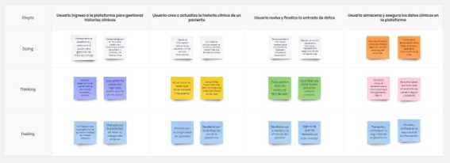

# Capítulo III: Requirements Specification

## 3.1. To-Be Scenario Mapping.

- **Primer segmento: Médicos Veterinarios**

  

- **Segundo segmento: Dueños de Mascotas**

  

## 3.2. User Stories
# Gestión de Usuarios
**EP01: Como responsable del sistema, quiero administrar los usuarios para garantizar que solo personas autorizadas accedan a la plataforma.**

| User Story ID | Título                     | Descripción                                                                                                                                                    |
|---------------|----------------------------|----------------------------------------------------------------------------------------------------------------------------------------------------------------|
| US01          | Registro de Usuario        | Como usuario externo, quiero crear una cuenta en la plataforma para acceder a las funciones que ofrece el sistema.|
| US02          | Como usuario, quiero restablecer mi contraseña si la olvido, para poder seguir accediendo a mi cuenta sin inconvenientes.|
| US03          | Gestión de Perfiles de Usuarios | Como administrador, quiero administrar los perfiles de los usuarios para asegurar que su información y permisos estén siempre actualizados.|

---

# Gestión de Mascotas
**EP02: Como usuario, quiero manejar la información de mis mascotas para mantener sus datos al día.**

| User Story ID | Título                     | Descripción                                                                                                                                                    |
|---------------|----------------------------|----------------------------------------------------------------------------------------------------------------------------------------------------------------|
| US04          | Creación de Perfil de Mascota | Como usuario, quiero registrar un perfil para mi mascota con el fin de guardar su información en la plataforma.|
| US05          | Edición de Perfil de Mascota | Como usuario, quiero modificar el perfil de mi mascota para mantener su información actualizada cuando sea necesario.|
| US06          | Visualización de Perfiles de Mascotas | Como usuario, quiero acceder a los perfiles de mis mascotas para consultar la información que he registrado sobre ellas.|
| US07          | Búsqueda de Mascotas por ID | Como administrador, quiero buscar mascotas utilizando su ID para acceder de forma rápida a su información en el sistema.|
| US08          | Gestión de Perfiles de Mascotas | Como administrador, quiero administrar los perfiles de las mascotas para garantizar que su información esté correctamente registrada y actualizada.|

---

# Gestión de Citas Veterinarias
**EP03: Como usuario, quiero organizar las citas médicas de mis mascotas para asegurar su atención oportuna.**

| User Story ID | Título                     | Descripción                                                                                                                                                    |
|---------------|----------------------------|----------------------------------------------------------------------------------------------------------------------------------------------------------------|
| US09          | Agendamiento de Citas      | Como usuario, quiero programar citas veterinarias para asegurar que mi mascota reciba atención médica cuando lo necesite.|
| US10          | Cancelación de Citas       | Como usuario, quiero cancelar una cita veterinaria si no puedo asistir, para evitar conflictos de horario y poder reprogramarla cuando sea conveniente.|
| US11          | Gestión de Citas Veterinarias | Como administrador, quiero gestionar las citas veterinarias para coordinar de manera eficiente la atención de las mascotas.|
| US12          | Búsqueda de Citas por ID   | Como administrador, quiero buscar citas utilizando su ID para acceder rápidamente a los detalles de la cita.|
| US13          | Edición de Citas Veterinarias | Como administrador, quiero editar las citas para modificar la fecha o el estado según sea necesario.|

---

# Gestión de Notificaciones
**EP04: Como usuario, quiero recibir alertas sobre eventos importantes relacionados con mis mascotas para estar siempre informado.**

| User Story ID | Título                     | Descripción                                                                                                                                                    |
|---------------|----------------------------|----------------------------------------------------------------------------------------------------------------------------------------------------------------|
| US14          | Notificación de Citas Veterinarias | Como usuario, quiero recibir notificaciones sobre mis citas veterinarias para recordar cuándo debo llevar a mi mascota al veterinario.|
| US15          | Notificación de Historial Médico | Como usuario, quiero recibir notificaciones sobre actualizaciones en el historial médico de mi mascota para estar informado sobre su salud.|
| US16          | Gestión de Notificaciones   | Como administrador, quiero gestionar el envío de notificaciones para asegurarme de que los usuarios reciban la información importante de manera oportuna.|

---

# Navegación y Funcionalidades de la Página Principal
**EP05: Como visitante, quiero explorar la página de inicio de PetNova para conocer sus servicios y funcionalidades.**

| User Story ID | Título                                     | Descripción                                                                                                                                                     |
|---------------|-------------------------------------------|-----------------------------------------------------------------------------------------------------------------------------------------------------------------|
| US17          | Barra de Navegación en la Landing Page     | Como visitante, quiero utilizar la barra de navegación para acceder de manera fácil y rápida a las distintas secciones de la plataforma.|
| US18          | Visualización de la Sección "Why Choose Us?" | Como visitante, quiero revisar la sección 'Why Choose Us?' para comprender los beneficios y servicios que ofrece la plataforma.|
| US19          | Gestión de Suscripciones en la Landing Page | Como visitante, quiero revisar los planes de suscripción en la página principal para poder elegir el plan que mejor se adapte a mis necesidades.|
| US20          | Revisión de Reseñas de Clientes           | Como visitante, quiero leer las reseñas de otros clientes para evaluar la experiencia que han tenido con la plataforma.|
| US21          | Envío de Mensajes de Contacto             | Como visitante, quiero enviar un mensaje de contacto a través de la página de aterrizaje para poder comunicarme con el equipo de PetNova.|
| US22          | Visualización de Videos en la Sección de Características | Como visitante, quiero ver los videos informativos sobre los productos y servicios para obtener más información sobre PetNova.|

---

# Gestión de Clientes
**EP06: Como responsable, quiero manejar la información de los clientes para mantener un registro ordenado y actualizado.**

| User Story ID | Título                     | Descripción                                                                                                                                                    |
|---------------|----------------------------|----------------------------------------------------------------------------------------------------------------------------------------------------------------|
| US24          | Como administrador, quiero crear perfiles de clientes para registrar su información de contacto y los detalles de sus mascotas.|
| US25          | Edición de Perfiles de Clientes | Como administrador, quiero crear perfiles de clientes para registrar su información de contacto y los detalles de sus mascotas.|
| US26          | Búsqueda de Clientes por ID | Como administrador, quiero buscar clientes por su ID para acceder rápidamente a su información y gestionar los datos de sus mascotas.|

---

# Gestión de Almacen
**EP07: Como administrador o veterinario, quiero manejar un registro interno de medicamentos y vacunas.**

| User Story ID | Título                     | Descripción                                                                                                                                                    |
|---------------|----------------------------|----------------------------------------------------------------------------------------------------------------------------------------------------------------|
| US27          | Creación de Nuevos Medicamentos | Como administrador, necesito poder ingresar información detallada de cada medicamento (nombre, dosis, fecha de caducidad, proveedor, etc.).|
| US28          | Control de Vacunas | Como médico veterinario,para llevar un control de las vacunas administradas, necesito registrar el tipo de vacuna, fecha de aplicación, dosis, y el animal tratado.|
| US29          | Generación de Reporte de Inventario | Como administrador, necesito generar reportes que muestren los medicamentos disponibles, próximos a caducar y agotados. |
| US30          | Historial de Medicamnetos | Como médico veterinario, necesito acceder al historial completo de tratamientos y vacunas de un animal en específico. |

---

# Gestión del Historial Médico de las Mascotas
**EP08: Como usuario o responsable, quiero gestionar el historial de salud de las mascotas para llevar un control de sus tratamientos.**

| User Story ID | Título                     | Descripción                                                                                                                                                    |
|---------------|----------------------------|----------------------------------------------------------------------------------------------------------------------------------------------------------------|
| US31          | Visualización del Historial Médico | Como usuario, quiero acceder al historial médico de mi mascota para poder consultar su estado de salud y los tratamientos que ha recibido anteriormente.|
| US32          | Actualización del Historial Médico | Como administrador o veterinario, quiero poder modificar y actualizar el historial médico de las mascotas para asegurar que los dueños cuenten con información actualizada sobre sus tratamientos y estado de salud.|

---

# Solución IOT
**EP09: Como usuario o responsable, quiero gestionar el historial de salud de las mascotas para llevar un control de sus tratamientos.**

| User Story ID | Título                     | Descripción                                                                                                                                                    |
|---------------|----------------------------|----------------------------------------------------------------------------------------------------------------------------------------------------------------|
| US33          | Monitoreo de signos vitales | Como dueño de mascotas o veterinario, quiero integrar dispositivos IoT para monitorear la salud de las mascotas en tiempo real.|
| US34          | Acceso remoto a datos de salud | Como veterinario, quiero visualizar los datos históricos de dispositivos IoT (actividad, sueño, ingesta de agua) para diagnosticar patrones anormales en mis pacientes.|
| US35          | Configuración de umbrales de alerta | Como médico veterinario, quiero definir umbrales personalizados (ej: fiebre >39°C) para que el sistema envíe notificaciones automáticas a dueños y veterinarios.|

---

# Funcionalidades de Idioma en la App Web
**EP010: Como usuario, quiero cambiar el idioma de la plataforma para utilizarla en español o inglés según mi preferencia.**

| User Story ID | Título                     | Descripción                                                                                                                                                    |
|---------------|----------------------------|----------------------------------------------------------------------------------------------------------------------------------------------------------------|
| US23          | Cambio de Idioma en la App Web | Como usuario, quiero tener la opción de cambiar el idioma de la aplicación web para poder utilizarla en inglés o español, de acuerdo con mi preferencia.|

---

  
# Historias de Usuario y Criterios de Aceptación
## US01: Registro de Usuario
**Relacionado con (Epic ID):** EP01

**Descripción:**  
Como administrador, deseo gestionar los usuarios para asegurar que solo personas autorizadas tengan acceso al sistema.

### Criterios de Aceptación:
- **Escenario 1:** El usuario desea crear una nueva cuenta en la plataforma  
  - **Dado que** el usuario se encuentra en la sección de registro,  
  - **Cuando** completa correctamente todos los datos solicitados (nombre completo, número telefónico, correo electrónico, dirección y contraseña),  
  - **Entonces** el sistema debe permitirle finalizar el registro y mostrar un mensaje de confirmación de cuenta creada.

- **Escenario 2:** El usuario utiliza un correo previamente registrado  
  - **Dado que** el usuario intenta registrarse con una dirección de correo que ya está vinculada a otra cuenta,  
  - **Cuando** introduce ese correo y envía el formulario de registro,  
  - **Entonces** el sistema debe emitir un mensaje de advertencia indicando que el correo ya ha sido utilizado.

- **Escenario 3:** El usuario omite campos obligatorios en el formulario  
  - **Dado que** el usuario intenta registrarse sin proporcionar toda la información requerida,  
  - **Cuando** presiona el botón de registro sin haber completado todos los campos necesarios,  
  - **Entonces** el sistema debe desplegar un mensaje de error solicitando completar los campos faltantes.

---

## US02: Recuperación de Contraseña
**Relacionado con (Epic ID):** EP01

**Descripción:**  
Como usuario, deseo recuperar mi contraseña en caso de olvidarla para no perder el acceso a mi cuenta.

### Criterios de Aceptación:
- **Escenario 1:** El usuario desea restablecer su contraseña  
  - **Dado que** el usuario ha olvidado su contraseña y accede a la sección de recuperación,  
  - **Cuando** introduce su correo electrónico registrado y solicita restablecerla,  
  - **Entonces** el sistema debe enviar un mensaje al correo con un enlace para crear una nueva contraseña.

- **Escenario 2:** El usuario proporciona un correo que no está registrado  
  - **Dado que** el usuario intenta recuperar el acceso usando un correo que no existe en la base de datos,  
  - **Cuando** envía el formulario con dicho correo,  
  - **Entonces** el sistema debe mostrar una notificación de error indicando que no se encontró ninguna cuenta con ese correo.

- **Escenario 3:** El usuario no recibe el mensaje de recuperación  
  - **Dado que** el usuario ha solicitado recuperar su contraseña,  
  - **Cuando** han transcurrido más de 10 minutos sin recibir el correo de restablecimiento,  
  - **Entonces** el sistema debe ofrecerle la opción de reenviar el correo o contactar al soporte técnico.

---

## US03: Gestión de Perfiles de Usuarios
**Relacionado con (Epic ID):** EP01

**Descripción:**  
Como administrador, deseo gestionar los perfiles de los usuarios para mantener la información y permisos actualizados.

### Criterios de Aceptación:
-- **Escenario 1:** El administrador modifica los datos de un usuario  
  - **Dado que** el administrador se encuentra en la sección destinada a la administración de usuarios,  
  - **Cuando** accede al perfil de un usuario y actualiza su información personal (nombre, correo electrónico, número telefónico y dirección),  
  - **Entonces** el sistema debe guardar los cambios realizados y mostrar un mensaje que confirme la actualización exitosa.

- **Escenario 2:** El administrador inhabilita una cuenta de usuario  
  - **Dado que** el administrador necesita suspender temporalmente el acceso de un usuario,  
  - **Cuando** selecciona la opción de desactivación en el listado de usuarios,  
  - **Entonces** el sistema debe marcar la cuenta como "inactiva", impidiendo que el usuario acceda hasta que sea reactivado.

- **Escenario 3:** El administrador elimina un usuario del sistema  
  - **Dado que** el administrador está realizando tareas de mantenimiento en los perfiles de usuario,  
  - **Cuando** elige la opción de eliminar un perfil específico,  
  - **Entonces** el sistema debe borrar de forma definitiva dicho perfil y toda su información relacionada, mostrando previamente una advertencia de confirmación.

---

## US04: Creación de Perfil de Mascota
**Relacionado con (Epic ID):** EP02

**Descripción:**  
Como usuario, deseo crear un perfil de mi mascota para tener su información almacenada en la plataforma.

### Criterios de Aceptación:

- **Escenario 1:** El usuario registra un nuevo perfil para su mascota  
  - **Dado que** el usuario se encuentra en la interfaz de creación de perfil de mascota,  
  - **Cuando** completa todos los campos requeridos (nombre, fecha de nacimiento, raza, género e historial médico),  
  - **Entonces** el sistema debe permitir guardar el nuevo perfil y mostrar un mensaje que confirme la creación exitosa.

- **Escenario 2:** El usuario omite campos obligatorios al registrar a su mascota  
  - **Dado que** el usuario intenta guardar un perfil sin llenar todos los campos necesarios,  
  - **Cuando** uno o más de estos campos quedan vacíos,  
  - **Entonces** el sistema debe mostrar un mensaje de error indicando que todos los campos requeridos deben ser completados.

- **Escenario 3:** El usuario asigna un nombre repetido a una mascota  
  - **Dado que** el usuario está por registrar una nueva mascota,  
  - **Cuando** introduce un nombre ya utilizado en otra mascota de su cuenta,  
  - **Entonces** el sistema debe emitir una advertencia indicando que el nombre ya existe y sugerir que elija otro o lo modifique para evitar confusiones.

---

## US05: Edición de Perfil de Mascota
**Relacionado con (Epic ID):** EP02

**Descripción:**  
Como usuario, deseo editar el perfil de mi mascota para actualizar su información cuando sea necesario.

### Criterios de Aceptación:
- **Escenario 1:** El usuario actualiza la información del perfil de su mascota  
  - **Dado que** el usuario se encuentra en la sección de edición del perfil de su mascota,  
  - **Cuando** modifica datos del perfil, como el historial clínico o la raza,  
  - **Entonces** el sistema debe permitir guardar las actualizaciones realizadas y mostrar un mensaje confirmando que los cambios se han aplicado correctamente.

- **Escenario 2:** El usuario intenta guardar el perfil sin completar la información obligatoria  
  - **Dado que** el usuario está realizando modificaciones en el perfil de su mascota,  
  - **Cuando** intenta guardar los cambios dejando uno o más campos obligatorios vacíos,  
  - **Entonces** el sistema debe desplegar un mensaje de error indicando que es necesario completar toda la información requerida para poder guardar.

  ---

## US11: Gestión de Citas Veterinarias
**Relacionado con (Epic ID):** EP03

**Descripción:**  
Como administrador, deseo gestionar las citas veterinarias para coordinar correctamente la atención de las mascotas.

### Criterios de Aceptación:
- **Escenario 1:** El administrador consulta todas las citas agendadas  
  - **Dado que** el administrador se encuentra en la sección de administración de citas,  
  - **Cuando** accede a la lista de citas programadas,  
  - **Entonces** el sistema debe mostrar un listado con todos los detalles de las citas, incluyendo la fecha, hora, veterinario asignado y el estado de cada cita (agendada, cancelada, etc.).

- **Escenario 2:** El administrador filtra las citas por estado o fecha  
  - **Dado que** el administrador está en la sección de gestión de citas,  
  - **Cuando** utiliza los filtros disponibles para buscar citas según su estado (agendada, cancelada, completada) o por fecha,  
  - **Entonces** el sistema debe mostrar únicamente las citas que cumplan con los criterios seleccionados.

---

## US12: Búsqueda de Citas por ID
**Relacionado con (Epic ID):** EP03

**Descripción:**  
Como administrador, deseo buscar citas por ID para acceder rápidamente a la información de la cita.

### Criterios de Aceptación:
- **Escenario 1:** El administrador localiza una cita mediante su ID  
  - **Dado que** el administrador se encuentra en la sección de gestión de citas,  
  - **Cuando** ingresa el ID de una cita en el campo de búsqueda,  
  - **Entonces** el sistema debe mostrar la cita correspondiente al ID ingresado.

- **Escenario 2:** El administrador ingresa un ID incorrecto  
  - **Dado que** el administrador está buscando una cita a través de su ID,  
  - **Cuando** introduce un ID que no corresponde a ninguna cita en el sistema,  
  - **Entonces** el sistema debe mostrar un mensaje de error indicando que no se ha encontrado ninguna cita con ese ID.

---

## US13: Edición de Citas Veterinarias
**Relacionado con (Epic ID):** EP03

**Descripción:**  
Como administrador, deseo editar las citas para hacer cambios en la fecha o estado cuando sea necesario.

### Criterios de Aceptación:
- **Escenario 1:** El administrador modifica la fecha de una cita  
  - **Dado que** el administrador se encuentra en la sección de gestión de citas,  
  - **Cuando** selecciona una cita y ajusta su fecha o hora,  
  - **Entonces** el sistema debe actualizar la cita con la nueva información y enviar una notificación al usuario afectado informándole del cambio.

- **Escenario 2:** El administrador actualiza el estado de una cita  
  - **Dado que** el administrador está gestionando las citas,  
  - **Cuando** selecciona una cita y cambia su estado (por ejemplo, de agendada a completada o cancelada),  
  - **Entonces** el sistema debe reflejar el nuevo estado y enviar una actualización al usuario de la cita.

---

## US14: Notificación de Citas Veterinarias
**Relacionado con (Epic ID):** EP04

**Descripción:**  
Como usuario, deseo recibir notificaciones de citas veterinarias para recordarme cuándo debo llevar a mi mascota al veterinario.

### Criterios de Aceptación:
- **Escenario 1:** El usuario recibe un recordatorio de su cita veterinaria  
  - **Dado que** el usuario ha agendado una cita con el veterinario,  
  - **Cuando** faltan 24 horas para la cita,  
  - **Entonces** el sistema debe enviar una notificación al usuario recordándole la cita, incluyendo los detalles como la fecha, hora y veterinario asignado.

- **Escenario 2:** El usuario recibe un recordatorio el día de la cita  
  - **Dado que** el usuario tiene una cita con el veterinario programada,  
  - **Cuando** es el mismo día de la cita, una hora antes de la hora establecida,  
  - **Entonces** el sistema debe enviar una notificación final de recordatorio.

---

## US15: Notificación de Historial Médico
**Relacionado con (Epic ID):** EP04

**Descripción:**  
Como usuario, deseo recibir notificaciones sobre actualizaciones en el historial médico de mi mascota para estar al tanto de su salud.

### Criterios de Aceptación:
- **Escenario 1:** El usuario recibe una notificación de cambios en el historial médico  
  - **Dado que** el veterinario ha realizado actualizaciones en el historial médico de la mascota,  
  - **Cuando** se añaden nuevos registros como vacunas, diagnósticos o tratamientos,  
  - **Entonces** el sistema debe enviar una notificación al usuario informándole que se han realizado actualizaciones en el historial médico de su mascota.

- **Escenario 2:** El usuario recibe una notificación sobre los resultados de exámenes médicos  
  - **Dado que** el usuario está esperando los resultados de un examen médico para su mascota,  
  - **Cuando** el veterinario sube los resultados al sistema,  
  - **Entonces** el sistema debe notificar al usuario que los resultados están disponibles para su revisión.

---

## US16: Gestión de Notificaciones
**Relacionado con (Epic ID):** EP04

**Descripción:**  
Como administrador, deseo gestionar el envío de notificaciones para asegurarme de que los usuarios reciban información importante a tiempo.

### Criterios de Aceptación:
- **Escenario 1:** El administrador configura el envío de notificaciones  
  - **Dado que** el administrador se encuentra en la sección de gestión de notificaciones,  
  - **Cuando** define los criterios para el envío de notificaciones (por ejemplo, recordatorios de citas 24 horas antes),  
  - **Entonces** el sistema debe programar el envío de las notificaciones de acuerdo con los criterios establecidos.

- **Escenario 2:** El administrador cancela una notificación programada  
  - **Dado que** el administrador ha programado una notificación para una cita,  
  - **Cuando** la cita es cancelada o reprogramada,  
  - **Entonces** el sistema debe cancelar la notificación previamente programada o ajustarla a la nueva fecha y hora de la cita.

---

## US27: Creación de Nuevos Medicamentos
**Relacionado con (Epic ID):** EP07

**Descripción:**  
Como administrador, necesito poder ingresar información detallada de cada medicamento (nombre, dosis, fecha de caducidad, proveedor, etc.).

### Criterios de Aceptación:
- **Escenario 1:** Registro exitoso de medicamento  
  - **Dado que** el administrador ingresa al módulo de registro de medicamentos,  
  - **Cuando** completa todos los campos obligatorios (nombre, dosis, fecha caducidad, proveedor) y guarda,  
  - **Entonces** el sistema debe almacenar el medicamento en la base de datos.

- **Escenario 2:** Intento de registro con campos incompletos  
  - **Dado que** el administrador deja vacío el campo "medicamento"
  - **Cuando** intenta guardar el formulario,  
  - **Entonces** el sistema debe mostrar una alerta: "Complete todos los campos obligatorios"

---

## US28: Control de Vacunas
**Relacionado con (Epic ID):** EP07

**Descripción:**  
Como médico veterinario,para llevar un control de las vacunas administradas, necesito registrar el tipo de vacuna, fecha de aplicación, dosis, y el animal tratado.

### Criterios de Aceptación:
- **Escenario 1:** Registro completo de vacunación 
  - **Dado que** el veterinario selecciona un animal en el sistema,  
  - **Cuando** ingresa tipo de vacuna, dosis, fecha y firma el registro,  
  - **Entonces** el sistema debe vincular la vacuna al historial médico del animal y actualizar el stock automáticamente.

- **Escenario 2:** Intento de registro con dosis inválida 
  - **Dado que** el veterinario ingresa "0.01" en dosis (mínimo requerido: 0.1), 
  - **Cuando** intenta guardar,  
  - **Entonces** el sistema debe mostrar un mensaje indicando que la fecha no es válida y debe ser corregida recordando la dosis mínima.

  - **Escenario 3:** Vacuna ya aplicada recientemente
  - **Dado que** el animal recibió la misma vacuna hace menso de 21 días,  
  - **Cuando** el veterinario intenta registrar otra dosis,  
  - **Entonces** el sistema debe mostrar un mensaje indicando la fecha de vacunación y un mensaje de confirmación.

---

## US29: Generación de Reporte de Inventario
**Relacionado con (Epic ID):** EP07

**Descripción:**  
Como administrador, necesito generar reportes que muestren los medicamentos disponibles, próximos a caducar y agotados.

### Criterios de Aceptación:
- **Escenario 1:** Generación de reporte general  
  - **Dado que** el administrador selecciona "Generar reporte",  
  - **Cuando** Cuando elige el filtro "Todos los medicamentos",  
  - **Entonces** Exportar un PDF con: stock actual, caducidades próximas (<30 días) y agotados.

- **Escenario 2:** Filtrado por caducidad 
  - **Dado que** el administrador activa el filtro "Próximos a caducar",
  - **Cuando** genera el reporte,  
  - **Entonces** Listar solo medicamentos con caducidad en los próximos 30 días.

---

## US30: Historial de Medicamentos
**Relacionado con (Epic ID):** EP07

**Descripción:**  
Como médico veterinario, necesito acceder al historial completo de tratamientos y vacunas de un animal en específico.

### Criterios de Aceptación:
- **Escenario 1:** Consulta exitosa del historial 
  - **Dado que** sel veterinario busca el animal por nombre de la mascota o del dueño,  
  - **Cuando** accede a la pestaña "Historial de medicamentos",  
  - **Entonces** el sistema debe Mostrar lista cronológica (vacunas, tratamientos, fechas, dosis).

- **Escenario 2:**  Mascota sin historial registrado
  - **Dado que** la mascota no tiene medicamentos registrados,  
  - **Cuando** el veterinario accede al historial,  
  - **Entonces** el sistema debe mostrar un mensaje: "No hay registros médicos".

---

## US31: Visualización del Historial Médico
**Relacionado con (Epic ID):** EP08

**Descripción:**  
Como usuario, deseo visualizar el historial médico de mi mascota para revisar su estado de salud y tratamientos previos.

### Criterios de Aceptación:
- **Escenario 1:** Consulta exitosa del historial médico de una mascota  
  - **Dado que** soy un usuario autenticado dentro de la plataforma,  
  - **Cuando** ingreso al perfil de mi mascota y selecciono la opción para ver su historial médico,  
  - **Entonces** el sistema debe mostrar todos los registros disponibles, incluyendo diagnósticos, tratamientos y citas anteriores.

- **Escenario 2:** Historial médico sin registros disponibles  
  - **Dado que** soy un usuario autenticado revisando el perfil de mi mascota,  
  - **Cuando** intento acceder a su historial médico y no hay datos registrados,  
  - **Entonces** el sistema debe mostrar un mensaje informando que aún no existe información médica registrada para la mascota.

---

## US32: Actualización del Historial Médico
**Relacionado con (Epic ID):** EP08

**Descripción:**  
Como administrador o doctor veterinario, deseo actualizar el historial médico de las mascotas para que los usuarios tengan la información más reciente sobre sus tratamientos.

### Criterios de Aceptación:
- **Escenario 1:** Modificación exitosa del historial médico de una mascota  
  - **Dado que** soy un administrador o un veterinario,  
  - **Cuando** realizo una modificación en el historial médico de una mascota, como agregar un nuevo diagnóstico o tratamiento,  
  - **Entonces** el sistema debe guardar los cambios y mostrar la información actualizada en el perfil de la mascota para que los usuarios puedan consultarla.

- **Escenario 2:** Intento fallido de actualización por campos incompletos  
  - **Dado que** soy un administrador o veterinario intentando modificar el historial médico,  
  - **Cuando** omito completar uno o más campos obligatorios (como la fecha del diagnóstico o tratamiento),  
  - **Entonces** el sistema debe mostrar un mensaje de error indicando que es necesario completar todos los campos requeridos antes de guardar.

- **Escenario 3:** Revisión del historial de actualizaciones médicas  
  - **Dado que** soy un administrador o veterinario,  
  - **Cuando** ingreso al historial médico de una mascota que ha sido editado anteriormente,  
  - **Entonces** el sistema debe permitir visualizar un registro detallado de todas las modificaciones, incluyendo las fechas y quién realizó cada cambio.

---

## US33: Monitoreo de signos vitales
**Relacionado con (Epic ID):** EP09

**Descripción:** 
Como dueño de mascotas o veterinario, quiero integrar dispositivos IoT para monitorear la salud de las mascotas en tiempo real.

### Criterios de Aceptación:
- **Escenario 1:** Visualización de datos en tiempo real  
  - **Dado que** un dispositivo IoT está conectado al sistema,  
  - **Cuando** el dispositivo envía datos de signos vitales (ej: frecuencia cardíaca, temperatura),  
  - **Entonces** el sistema debe mostrarlos en un panel actualizado cada 5 segundos.  

- **Escenario 2:** Conexión fallida de dispositivo  
  - **Dado que** el dispositivo IoT pierde conexión,  
  - **Cuando** el sistema detecta la desconexión por más de 10 segundos,  
  - **Entonces** debe mostrar una alerta al usuario y registrar el evento en el historial.  

  ---

  ## US34: Acceso remoto a datos de salud
**Relacionado con (Epic ID):** EP09

**Descripción:** 
Como veterinario, quiero visualizar los datos históricos de dispositivos IoT (actividad, sueño, ingesta de agua) para diagnosticar patrones anormales en mis pacientes.

### Criterios de Aceptación:
### Escenarios:  
- **Escenario 1:** Consulta de historial completo  
  - **Dado que** el veterinario selecciona una mascota y un rango de fechas,  
  - **Cuando** solicita el historial de salud (ej: últimos 7 días),  
  - **Entonces** el sistema debe mostrar gráficos y tablas con los datos almacenados.  

- **Escenario 2:** Filtrado de datos por métrica  
  - **Dado que** el veterinario necesita analizar solo la ingesta de agua,  
  - **Cuando** aplica un filtro para esa métrica específica,  
  - **Entonces** el sistema debe ocultar los datos no relevantes y resaltar tendencias anormales.

---

## US35: Configuración de umbrales de alerta
**Relacionado con (Epic ID):** EP09

**Descripción:** 
Como médico veterinario, quiero definir umbrales personalizados (ej: fiebre >39°C) para que el sistema envíe notificaciones automáticas a dueños y veterinarios.

### Criterios de Aceptación:
- **Escenario 1:** Creación de un umbral personalizado  
  - **Dado que** el veterinario accede a la configuración de alertas,  
  - **Cuando** define un nuevo umbral (ej: temperatura >39°C para perros),  
  - **Entonces** el sistema debe guardar la regla y aplicarla a las mascotas asociadas.  

- **Escenario 2:** Notificación por umbral excedido  
  - **Dado que** se ha configurado un umbral para "actividad física <30min/día",  
  - **Cuando** el dispositivo reporta un valor inferior,  
  - **Entonces** el sistema debe enviar una notificación push y por correo al dueño y veterinario. 

---

## 3.3. Impact Mapping.

Este Impact Map muestra cómo PetNova alinea sus objetivos de negocio con los impactos deseados. Detalla los entregables específicos y las user stories que abordan estos impactos, asegurando que cada aspecto del desarrollo de la plataforma mejore la eficiencia y la experiencia del usuario.

  

## 3.4. Product Backlog.

Con el fin de simplificar la complejidad de las tareas, hemos utilizado la escala de Fibonacci (1/2/3/5/8) para crear nuestro product backlog.
Historia de usuario base:
Tomamos como referencia US06: Como usuario, quiero agendar citas para que mi mascota reciba atención veterinaria a tiempo. (Posee 3 puntos de historia).
Asimismo, utilizamos la herramienta “Planning Poker Online” para poder votar en grupo y decidir la dificultad de cada historia de usuario, tomando como punto intermedio el User Story 06

<table>
  <thead>
    <tr>
      <th># Orden</th>
      <th>User Story ID</th>
      <th>Título</th>
      <th>Descripción</th>
      <th>Story Points (1/2/3/5/8)</th>
    </tr>
  </thead>
  <tbody>
    <tr>
      <td>1</td>
      <td>US01</td>
      <td>Creación de cuenta de usuario</td>
      <td>Como usuario externo, quiero registrarme en la plataforma para poder acceder a sus funcionalidades.</td>
      <td>3</td>
    </tr>
    <tr>
      <td>2</td>
      <td>US02</td>
      <td>Recuperación de contraseña</td>
      <td>Como usuario, quiero restablecer mi contraseña si la olvido para seguir accediendo a mi cuenta.</td>
      <td>2</td>
    </tr>
    <tr>
      <td>3</td>
      <td>US03</td>
      <td>Administración de perfiles de usuarios</td>
      <td>Como administrador, quiero gestionar los perfiles de usuario para mantener actualizada su información y permisos.</td>
      <td>5</td>
    </tr>
    <tr>
      <td>4</td>
      <td>US04</td>
      <td>Registro de perfil de mascota</td>
      <td>Como usuario, quiero registrar un perfil para mi mascota y guardar su información básica en el sistema.</td>
      <td>3</td>
    </tr>
    <tr>
      <td>5</td>
      <td>US05</td>
      <td>Actualización de perfil de mascota</td>
      <td>Como usuario, quiero editar el perfil de mi mascota para mantener sus datos siempre actualizados.</td>
      <td>3</td>
    </tr>
    <tr>
      <td>6</td>
      <td>US06</td>
      <td>Agendamiento de citas médicas</td>
      <td>Como usuario, quiero programar citas para que mi mascota reciba atención veterinaria cuando sea necesario.</td>
      <td>3</td>
    </tr>
    <tr>
      <td>7</td>
      <td>US07</td>
      <td>Cancelación de citas médicas</td>
      <td>Como usuario, quiero cancelar una cita si no puedo asistir para evitar conflictos de horario.</td>
      <td>2</td>
    </tr>
    <tr>
      <td>8</td>
      <td>US08</td>
      <td>Notificaciones de eventos importantes</td>
      <td>Como usuario, quiero recibir alertas sobre citas u otros eventos relevantes para estar siempre informado.</td>
      <td>2</td>
    </tr>
    <tr>
      <td>9</td>
      <td>US09</td>
      <td>Sección "Sobre nosotros"</td>
      <td>Como usuario, quiero leer quiénes somos para conocer mejor la misión y visión de la plataforma.</td>
      <td>2</td>
    </tr>
    <tr>
      <td>10</td>
      <td>US10</td>
      <td>Publicación de contenido en el foro</td>
      <td>Como usuario, quiero publicar en un foro para compartir experiencias y consejos con otros dueños de mascotas.</td>
      <td>5</td>
    </tr>
    <tr>
      <td>11</td>
      <td>US11</td>
      <td>Moderación de contenido en el foro</td>
      <td>Como moderador, quiero controlar las publicaciones en el foro para mantener un ambiente respetuoso y relevante.</td>
      <td>8</td>
    </tr>
    <tr>
      <td>12</td>
      <td>US12</td>
      <td>Barra de navegación en la landing page</td>
      <td>Como visitante, quiero navegar fácilmente entre las secciones principales de la aplicación desde la página de inicio.</td>
      <td>2</td>
    </tr>
    <tr>
      <td>13</td>
      <td>US13</td>
      <td>Sección "¿Por qué elegirnos?"</td>
      <td>Como visitante, quiero ver una sección que explique los beneficios de la plataforma para entender qué la hace única.</td>
      <td>2</td>
    </tr>
    <tr>
      <td>14</td>
      <td>US14</td>
      <td>Sección de planes y suscripciones</td>
      <td>Como visitante, quiero conocer los planes de suscripción disponibles para elegir el que más se adapte a mí.</td>
      <td>2</td>
    </tr>
    <tr>
      <td>15</td>
      <td>US15</td>
      <td>Lectura de reseñas de clientes</td>
      <td>Como visitante, quiero revisar opiniones de otros clientes para tener una referencia sobre el servicio.</td>
      <td>2</td>
    </tr>
    <tr>
      <td>16</td>
      <td>US16</td>
      <td>Notificaciones de historial médico</td>
      <td>Como usuario, quiero recibir alertas cuando se actualice el historial médico de mi mascota.</td>
      <td>3</td>
    </tr>
    <tr>
      <td>17</td>
      <td>US17</td>
      <td>Pago de servicios veterinarios</td>
      <td>Como usuario, quiero realizar pagos en línea de forma segura para citas y otros servicios de mi mascota.</td>
      <td>5</td>
    </tr>
    <tr>
      <td>18</td>
      <td>US18</td>
      <td>Visualización de perfiles de veterinarios</td>
      <td>Como usuario, quiero ver información de los veterinarios disponibles para elegir el más adecuado para mi mascota.</td>
      <td>3</td>
    </tr>
    <tr>
      <td>19</td>
      <td>US19</td>
      <td>Acceso al historial médico de mascotas</td>
      <td>Como usuario, quiero consultar el historial médico completo de mis mascotas en un solo lugar.</td>
      <td>3</td>
    </tr>
    <tr>
      <td>20</td>
      <td>US20</td>
      <td>Sección de preguntas frecuentes (FAQ)</td>
      <td>Como usuario, quiero acceder a una lista de preguntas frecuentes para resolver mis dudas de forma rápida.</td>
      <td>2</td>
    </tr>
    <tr>
      <td>21</td>
      <td>US21</td>
      <td>Generación de informes de citas</td>
      <td>Como administrador, quiero generar reportes de citas veterinarias para evaluar la frecuencia y demanda del servicio.</td>
      <td>5</td>
    </tr>
    <tr>
      <td>22</td>
      <td>US22</td>
      <td>Alertas de salud basadas en historial</td>
      <td>Como usuario, quiero recibir alertas relacionadas con la salud de mi mascota basadas en su historial médico.</td>
      <td>3</td>
    </tr>
    <tr>
      <td>23</td>
      <td>US23</td>
      <td>Filtro avanzado de búsqueda</td>
      <td>Como usuario, quiero buscar información de forma eficiente para encontrar veterinarios o servicios específicos rápidamente.</td>
      <td>5</td>
    </tr>
    <tr>
      <td>24</td>
      <td>US24</td>
      <td>Integración con redes sociales</td>
      <td>Como usuario, quiero compartir mis experiencias directamente en redes sociales para difundir el uso de la plataforma.</td>
      <td>3</td>
    </tr>
    <tr>
      <td>25</td>
      <td>US25</td>
      <td>Aplicación móvil para gestión de servicios</td>
      <td>Como usuario, quiero usar una app móvil para manejar todo lo relacionado a mis mascotas desde mi celular.</td>
      <td>8</td>
    </tr>
    <tr>
      <td>26</td>
      <td>US26</td>
      <td>Soporte en línea por chat</td>
      <td>Como usuario, quiero tener acceso a un chat de soporte para resolver mis dudas en tiempo real.</td>
      <td>5</td>
    </tr>
    <tr>
      <td>27</td>
      <td>US27</td>
      <td>Notificaciones push móviles</td>
      <td>Como usuario, quiero recibir notificaciones push para estar al tanto de citas, alertas o noticias relevantes.</td>
      <td>3</td>
    </tr>
    <tr>
      <td>28</td>
      <td>US28</td>
      <td>Seguimiento del estado de servicios</td>
      <td>Como usuario, quiero rastrear el progreso de los servicios contratados para saber en qué etapa se encuentran.</td>
      <td>5</td>
    </tr>
    <tr>
      <td>29</td>
      <td>US29</td>
      <td>Testimonios de clientes satisfechos</td>
      <td>Como usuario, quiero leer testimonios de otros para conocer su experiencia con la plataforma.</td>
      <td>2</td>
    </tr>
    <tr>
      <td>30</td>
      <td>US30</td>
      <td>Programa de fidelidad</td>
      <td>Como usuario, quiero participar en un programa de recompensas por el uso frecuente de los servicios.</td>
      <td>5</td>
    </tr>
    <tr>
      <td>31</td>
      <td>US31</td>
      <td>Encuestas de satisfacción</td>
      <td>Como administrador, quiero enviar encuestas a los usuarios para evaluar la calidad del servicio y mejorarlo.</td>
      <td>3</td>
    </tr>
    <tr>
      <td>32</td>
      <td>US32</td>
      <td>Integración con sistemas externos</td>
      <td>Como administrador, quiero conectar la plataforma con servicios externos para ampliar su funcionalidad.</td>
      <td>8</td>
    </tr>
      <tr>
      <td>33</td>
      <td>US33</td>
      <td>Monitoreo de signos vitales</td>
      <td>Como dueño de mascotas o veterinario, quiero integrar dispositivos IoT para monitorear la salud de las mascotas en tiempo real.</td>
      <td>5</td>
    </tr>
      <tr>
      <td>34</td>
      <td>US34</td>
      <td>Acceso remoto a datos de salud</td>
      <td>Como veterinario, quiero visualizar los datos históricos de dispositivos IoT (actividad, sueño, ingesta de agua) para diagnosticar patrones anormales en mis pacientes.</td>
      <td>3</td>
    </tr>
      <tr>
      <td>35</td>
      <td>US35</td>
      <td>Configuración de umbrales de alerta</td>
      <td>Como médico veterinario, quiero definir umbrales personalizados (ej: fiebre >39°C) para que el sistema envíe notificaciones automáticas a dueños y veterinarios.</td>
      <td>8</td>
    </tr>
  </tbody>
</table>

---
