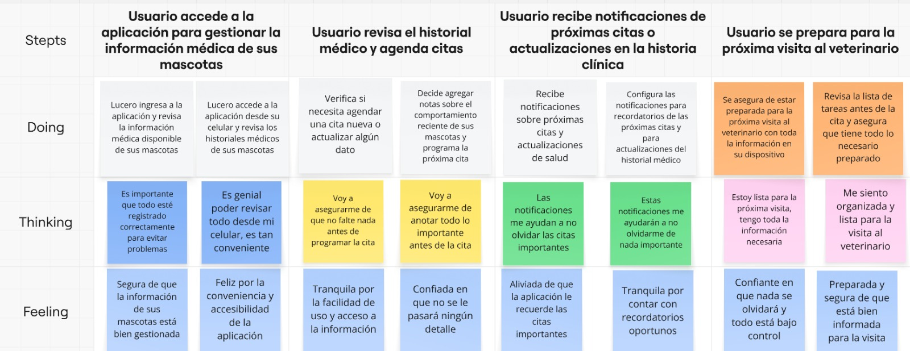
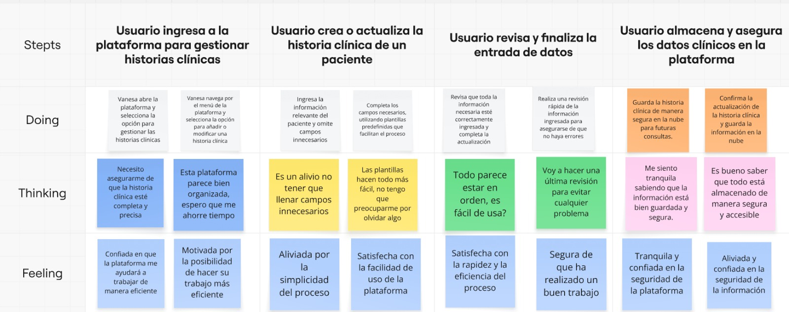

# Capítulo III: Requirements Specification

## 3.1. To-Be Scenario Mapping.

- **Primer segmento: Médicos Veterinarios**

  

- **Segundo segmento: Dueños de Mascotas**

  

## 3.2. User Stories

| User Story ID | Título | Descripción|Criterios de Aceptación|Relacionado con (Epic ID)|
|---------------|----------------------------|----------------------------------------------------------------------------------------------------------------------------------------------------------------|----------------------------------------------------------------------------------------------------------------------------------------------------------------|---|
| US01          | Registro de Usuario        | Como usuario externo, quiero crear una cuenta en la plataforma para acceder a las funciones que ofrece el sistema.|**Escenario 1:** El usuario desea crear una nueva cuenta en la plataforma  **Dado que** el usuario se encuentra en la sección de registro, **Cuando** completa correctamente todos los datos solicitados (nombre completo, número telefónico, correo electrónico, dirección y contraseña), **Entonces** el sistema debe permitirle finalizar el registro y mostrar un mensaje de confirmación de cuenta creada.  **Escenario 2:** El usuario utiliza un correo previamente registrado   **Dado que** el usuario intenta registrarse con una dirección de correo que ya está vinculada a otra cuenta,   **Cuando** introduce ese correo y envía el formulario de registro,  **Entonces** el sistema debe emitir un mensaje de advertencia indicando que el correo ya ha sido utilizado.  **Escenario 3:** El usuario omite campos obligatorios en el formulario **Dado que** el usuario intenta registrarse sin proporcionar toda la información requerida,   **Cuando** presiona el botón de registro sin haber completado todos los campos necesarios,   **Entonces** el sistema debe desplegar un mensaje de error solicitando completar los campos faltantes.|EP01|
| US02          |Recuperación de Contraseña |Como usuario del sistema, quiero restablecer mi contraseña si la olvido.|**Escenario 1:** El usuario desea restablecer su contraseña  **Dado que** el usuario ha olvidado su contraseña y accede a la sección de recuperación, **Cuando** introduce su correo electrónico registrado y solicita restablecerla,  **Entonces** el sistema debe enviar un mensaje al correo con un enlace para crear una nueva contraseña.  **Escenario 2:** El usuario proporciona un correo que no está registrado  **Dado que** el usuario intenta recuperar el acceso usando un correo que no existe en la base de datos,   **Cuando** envía el formulario con dicho correo,   **Entonces** el sistema debe mostrar una notificación de error indicando que no se encontró ninguna cuenta con ese correo.  **Escenario 3:** El usuario no recibe el mensaje de recuperación  **Dado que** el usuario ha solicitado recuperar su contraseña,  **Cuando** han transcurrido más de 10 minutos sin recibir el correo de restablecimiento,   **Entonces** el sistema debe ofrecerle la opción de reenviar el correo o contactar al soporte técnico.|EP01|
| US03          | Gestión de Perfiles de Usuarios | Como administrador del sistema, quiero administrar los perfiles de los usuarios para asegurar que su información y permisos estén siempre actualizados.|**Escenario 1:** El administrador modifica los datos de un usuario   **Dado que** el administrador se encuentra en la sección destinada a la administración de usuarios,  **Cuando** accede al perfil de un usuario y actualiza su información personal (nombre, correo electrónico, número telefónico y dirección),  **Entonces** el sistema debe guardar los cambios realizados y mostrar un mensaje que confirme la actualización exitosa.  **Escenario 2:** El administrador inhabilita una cuenta de usuario   **Dado que** el administrador necesita suspender temporalmente el acceso de un usuario,  **Cuando** selecciona la opción de desactivación en el listado de usuarios, **Entonces** el sistema debe marcar la cuenta como "inactiva", impidiendo que el usuario acceda hasta que sea reactivado.  **Escenario 3:** El administrador elimina un usuario del sistema   **Dado que** el administrador está realizando tareas de mantenimiento en los perfiles de usuario,   **Cuando** elige la opción de eliminar un perfil específico,  **Entonces** el sistema debe borrar de forma definitiva dicho perfil y toda su información relacionada, mostrando previamente una advertencia de confirmación.|EP01|
| US04          | Creación de Perfil de Mascota | Como usuario dueño de mascotas, quiero registrar un perfil para mi mascota con el fin de guardar su información en la plataforma.|**Escenario 1:** El usuario registra un nuevo perfil para su mascota  **Dado que** el usuario se encuentra en la interfaz de creación de perfil de mascota,  **Cuando** completa todos los campos requeridos (nombre, fecha de nacimiento, raza, género e historial médico),   **Entonces** el sistema debe permitir guardar el nuevo perfil y mostrar un mensaje que confirme la creación exitosa.  **Escenario 2:** El usuario omite campos obligatorios al registrar a su mascota   **Dado que** el usuario intenta guardar un perfil sin llenar todos los campos necesarios,   **Cuando** uno o más de estos campos quedan vacíos,  **Entonces** el sistema debe mostrar un mensaje de error indicando que todos los campos requeridos deben ser completados.  **Escenario 3:** El usuario asigna un nombre repetido a una mascota   **Dado que** el usuario está por registrar una nueva mascota,   **Cuando** introduce un nombre ya utilizado en otra mascota de su cuenta,  **Entonces** el sistema debe emitir una advertencia indicando que el nombre ya existe y sugerir que elija otro o lo modifique para evitar confusiones.|EP02|
| US05          | Edición de Perfil de Mascota | Como usuario dueño de mascota, quiero modificar el perfil de mi mascota para mantener su información actualizada cuando sea necesario.|**Escenario 1:** El usuario actualiza la información del perfil de su mascota **Dado que** el usuario se encuentra en la sección de edición del perfil de su mascota,  **Cuando** modifica datos del perfil, como el historial clínico o la raza,   **Entonces** el sistema debe permitir guardar las actualizaciones realizadas y mostrar un mensaje confirmando que los cambios se han aplicado correctamente.  **Escenario 2:** El usuario intenta guardar el perfil sin completar la información obligatoria   **Dado que** el usuario está realizando modificaciones en el perfil de su mascota,   **Cuando** intenta guardar los cambios dejando uno o más campos obligatorios vacíos,   **Entonces** el sistema debe desplegar un mensaje de error indicando que es necesario completar toda la información requerida para poder guardar.|EP02|
| US06          | Visualización de Perfiles de Mascotas | Como usuario dueño de mascota, quiero acceder a los perfiles de mis mascotas para consultar la información que he registrado sobre ellas.|**Escenario 1:** Acceso al perfil de mascota  **Dado que** el usuario ha iniciado sesión en el sistema,  **Cuando** selecciona una mascota de su lista de mascotas registradas,  **Entonces** el sistema debe mostrar toda la información registrada (nombre, especie, raza, historial médico, etc.).    **Escenario 2:** Visualización de historial médico  **Dado que** el usuario accede al perfil de su mascota,   **Cuando** navega a la sección de historial médico,  **Entonces** el sistema debe mostrar un listado cronológico de consultas, vacunas y tratamientos.|EP02|
| US07          | Búsqueda de Mascotas por ID | Como administrador del sistema o medico veterinario, quiero buscar mascotas utilizando su ID para acceder de forma rápida a su información en el sistema.|**Escenario 1:** Búsqueda exitosa por ID  **Dado que** el administrador ingresa el ID único de una mascota,   **Cuando** ejecuta la búsqueda,  **Entonces** el sistema debe mostrar el perfil completo de la mascota asociada a ese ID.  **Escenario 2:** Búsqueda con ID inexistente  **Dado que** el administrador ingresa un ID no registrado,  **Cuando** ejecuta la búsqueda,  **Entonces** el sistema debe mostrar un mensaje claro: "No se encontró ninguna mascota con este ID".|EP02|
| US08          | Gestión de Perfiles de Mascotas | Como administrador del sistema o medico veterinario, quiero administrar los perfiles de las mascotas para garantizar que su información esté correctamente registrada y actualizada.|**Escenario 1:** Actualización de información básica  **Dado que** el administrador selecciona una mascota,  **Cuando** modifica datos como peso o condición médica,  **Entonces** el sistema debe guardar los cambios y mostrar un mensaje de confirmación.   **Escenario 2:** Eliminación de perfil  **Dado que** el administrador elige eliminar un perfil,  **Cuando** confirma la acción,  **Entonces** el sistema debe borrar el perfil y mostrar un mensaje: "Perfil eliminado correctamente". |EP02|
| US09 | Agendamiento de Citas | Como usuario (veterinario o dueño de mascotas), quiero programar citas veterinarias para asegurar que la mascota reciba atención médica cuando lo necesite | - **Escenario 1:** Agendamiento exitoso de cita **Dado que** el usuario (veterinario o dueño de mascota) selecciona la opción "Nueva cita", **Cuando** completa los campos requeridos (mascota, veterinario, fecha, hora y motivo) y confirma, **Entonces** el sistema debe registrar la cita y mostrar un comprobante con los detalles.  **Escenario 2:** Intento de agendar en horario no disponible **Dado que** el usuario (veterinario o dueño de mascota) intenta agendar una cita, **Cuando** selecciona una fecha/hora ya ocupada, **Entonces** el sistema debe mostrar horarios alternativos disponibles y no permitir el registro de la cita en ese horario. | EP03 |
| US10 | Cancelación de Citas | Como usuario (veterinario o dueño de mascotas), quiero cancelar una cita veterinaria si no puedo asistir, para evitar conflictos de horario y poder reprogramarla cuando sea conveniente. | **Escenario 1:** Cancelación exitosa de cita **Dado que** el usuario (veterinario o dueño de mascota) accede a sus citas programadas, **Cuando** selecciona "Cancelar cita" y confirma la acción, **Entonces** el sistema debe eliminar el registro y liberar el horario.  **Escenario 2:** Intento de cancelar cita con menos de 24 horas de anticipación **Dado que** el usuario (veterinario o dueño de mascota) intenta cancelar una cita, **Cuando** faltan menos de 24 horas para la cita, **Entonces** el sistema debe mostrar advertencia sobre posible penalización pero permitir la cancelación. | EP03 |
| US11          | Gestión de Citas Veterinarias | Como administrador del sistema o medico veterinario, quiero gestionar las citas veterinarias para coordinar de manera eficiente la atención de las mascotas.|**Escenario 1:** El administrador consulta todas las citas agendadas  **Dado que** el administrador se encuentra en la sección de administración de citas,  **Cuando** accede a la lista de citas programadas,  **Entonces** el sistema debe mostrar un listado con todos los detalles de las citas, incluyendo la fecha, hora, veterinario asignado y el estado de cada cita (agendada, cancelada, etc.).  **Escenario 2:** El administrador filtra las citas por estado o fecha  **Dado que** el administrador está en la sección de gestión de citas,  **Cuando** utiliza los filtros disponibles para buscar citas según su estado (agendada, cancelada, completada) o por fecha,  **Entonces** el sistema debe mostrar únicamente las citas que cumplan con los criterios seleccionados.|EP03|
| US12          | Búsqueda de Citas por ID   | Como administrador del sistema o medico veterinario, quiero buscar citas utilizando su ID para acceder rápidamente a los detalles de la cita.|**Escenario 1:** El administrador localiza una cita mediante su ID   **Dado que** el administrador se encuentra en la sección de gestión de citas,  **Cuando** ingresa el ID de una cita en el campo de búsqueda,   **Entonces** el sistema debe mostrar la cita correspondiente al ID ingresado.  **Escenario 2:** El administrador ingresa un ID incorrecto  **Dado que** el administrador está buscando una cita a través de su ID,  **Cuando** introduce un ID que no corresponde a ninguna cita en el sistema,  **Entonces** el sistema debe mostrar un mensaje de error indicando que no se ha encontrado ninguna cita con ese ID.|EP03|
| US13          | Edición de Citas Veterinarias | Como administrador del sistema o medico veterinario, quiero editar las citas para modificar la fecha o el estado según sea necesario.|- **Escenario 1:** El administrador modifica la fecha de una cita  **Dado que** el administrador se encuentra en la sección de gestión de citas,   **Cuando** selecciona una cita y ajusta su fecha o hora,  **Entonces** el sistema debe actualizar la cita con la nueva información y enviar una notificación al usuario afectado informándole del cambio.  **Escenario 2:** El administrador actualiza el estado de una cita   **Dado que** el administrador está gestionando las citas,   **Cuando** selecciona una cita y cambia su estado (por ejemplo, de agendada a completada o cancelada),  **Entonces** el sistema debe reflejar el nuevo estado y enviar una actualización al usuario de la cita.|EP03|
| US14          | Notificación de Citas Veterinarias | Como usuario dueño de mascotas, quiero recibir notificaciones sobre mis citas veterinarias para recordar cuándo debo llevar a mi mascota al veterinario.|**Escenario 1:** El usuario recibe un recordatorio de su cita veterinaria  **Dado que** el usuario ha agendado una cita con el veterinario,   **Cuando** faltan 24 horas para la cita,  **Entonces** el sistema debe enviar una notificación al usuario recordándole la cita, incluyendo los detalles como la fecha, hora y veterinario asignado.  **Escenario 2:** El usuario recibe un recordatorio el día de la cita  **Dado que** el usuario tiene una cita con el veterinario programada,  **Cuando** es el mismo día de la cita, una hora antes de la hora establecida,  **Entonces** el sistema debe enviar una notificación final de recordatorio.|EP04
| US15          | Notificación de Historial Médico | Como usuario dueño de mascotas, quiero recibir notificaciones sobre actualizaciones en el historial médico de mi mascota para estar informado sobre su salud.|**Escenario 1:** El usuario recibe una notificación de cambios en el historial médico  **Dado que** el veterinario ha realizado actualizaciones en el historial médico de la mascota,  **Cuando** se añaden nuevos registros como vacunas, diagnósticos o tratamientos,  **Entonces** el sistema debe enviar una notificación al usuario informándole que se han realizado actualizaciones en el historial médico de su mascota.  **Escenario 2:** El usuario recibe una notificación sobre los resultados de exámenes médicos   **Dado que** el usuario está esperando los resultados de un examen médico para su mascota,  **Cuando** el veterinario sube los resultados al sistema,  **Entonces** el sistema debe notificar al usuario que los resultados están disponibles para su revisión.|EP04
| US16          | Gestión de Notificaciones   | Como administrador del sistema o medico veterinario, quiero gestionar el envío de notificaciones para asegurarme de que los usuarios reciban la información importante de manera oportuna.|**Escenario 1:** El administrador configura el envío de notificaciones  **Dado que** el administrador se encuentra en la sección de gestión de notificaciones,  **Cuando** define los criterios para el envío de notificaciones (por ejemplo, recordatorios de citas 24 horas antes),  **Entonces** el sistema debe programar el envío de las notificaciones de acuerdo con los criterios establecidos.  **Escenario 2:** El administrador cancela una notificación programada   **Dado que** el administrador ha programado una notificación para una cita,  **Cuando** la cita es cancelada o reprogramada,  **Entonces** el sistema debe cancelar la notificación previamente programada o ajustarla a la nueva fecha y hora de la cita.|EP04|
| US17          | Barra de Navegación en la Landing Page     | Como visitante, quiero utilizar la barra de navegación para acceder de manera fácil y rápida a las distintas secciones de la plataforma.|**Escenario 1:** Navegación a secciones principales **Dado que** el visitante está en la landing page, **Cuando** selecciona una opción de navegación, **Entonces** el sistema debe permitir el acceso a la sección correspondiente de la plataforma.  **Escenario 2:** Funcionamiento en dispositivos móviles **Dado que** el visitante accede desde un móvil, **Cuando** utiliza el menú de navegación, **Entonces** el sistema debe mostrar todas las opciones de navegación de forma legible y accesible.|EP05|
| US18          | Visualización de la Sección "Why Choose Us?" | Como visitante, quiero revisar la sección 'Why Choose Us?' para comprender los beneficios y servicios que ofrece la plataforma.|**Escenario 1:** Visualización de beneficios **Dado que** el visitante accede a la sección "Why Choose Us?", **Cuando** consulta la información de la sección, **Entonces** el sistema debe mostrar al menos 3 beneficios principales de la plataforma.  **Escenario 2:** Interacción con elementos **Dado que** el visitante revisa los beneficios, **Cuando** interactúa con la información de un beneficio, **Entonces** el sistema debe resaltar o mostrar información adicional sobre ese beneficio.|EP05|
| US19          | Gestión de Suscripciones en la Landing Page | Como visitante, quiero revisar los planes de suscripción en la página principal para poder elegir el plan que mejor se adapte a mis necesidades.|**Escenario 1:** Comparación de planes **Dado que** el visitante accede a la sección de suscripciones, **Cuando** revisa los diferentes planes disponibles, **Entonces** el sistema debe mostrar una tabla comparativa con precios y características clave.  **Escenario 2:** Selección de plan **Dado que** el visitante selecciona un plan de suscripción, **Cuando** confirma su elección, **Entonces** el sistema debe permitir el acceso al formulario de registro o pago correspondiente.|EP05|
| US20          | Revisión de Reseñas de Clientes           | Como visitante, quiero leer las reseñas de otros clientes para evaluar la experiencia que han tenido con la plataforma.|**Escenario 1:** Navegación entre reseñas **Dado que** el visitante accede a la sección de reseñas, **Cuando** revisa las diferentes opiniones de clientes, **Entonces** el sistema debe mostrar varias reseñas con su respectiva valoración.  **Escenario 2:** Verificación de autenticidad **Dado que** el visitante consulta una reseña, **Cuando** solicita información adicional sobre la reseña, **Entonces** el sistema debe mostrar el nombre y la fecha de la reseña.|EP05|
| US21          | Envío de Mensajes de Contacto             | Como visitante, quiero enviar un mensaje de contacto a través de la página de aterrizaje para poder comunicarme con el equipo de PetNova.|**Escenario 1:** Envío exitoso **Dado que** el visitante completa el formulario de contacto, **Cuando** envía la información con datos válidos, **Entonces** el sistema debe registrar el mensaje y mostrar una confirmación, además de limpiar los campos del formulario.  **Escenario 2:** Validación de campos **Dado que** el visitante omite campos requeridos, **Cuando** intenta enviar el formulario con información incompleta, **Entonces** el sistema debe indicar los errores y no registrar el mensaje hasta que se completen los campos obligatorios.|EP05|
| US22          | Visualización de Videos en la Sección de Características | Como visitante, quiero ver los videos informativos sobre los productos y servicios para obtener más información sobre PetNova.|**Escenario 1:** Reproducción básica **Dado que** el visitante accede a la sección de videos informativos, **Cuando** selecciona un video para reproducir, **Entonces** el sistema debe permitir la visualización del video con controles estándar (reproducir/pausar, volumen).  **Escenario 2:** Optimización de carga **Dado que** el visitante tiene una conexión lenta, **Cuando** accede a la sección de videos, **Entonces** el sistema debe mostrar miniaturas estáticas antes de reproducir el video.|EP05|
| US24          |Crear historia clínica |Como administrador del sistema o medico veterinario, quiero crear perfiles de clientes para registrar su información de contacto y los detalles de sus mascotas.|**Escenario 1:** Registro exitoso de nuevo cliente **Dado que** el administrador accede al formulario de creación, **Cuando** completa todos los campos obligatorios (nombre, teléfono, email) y guarda, **Entonces** el sistema debe generar un ID único y mostrar mensaje de confirmación.  **Escenario 2:** Registro con datos incompletos **Dado que** el administrador omite campos requeridos, **Cuando** intenta guardar, **Entonces** el sistema debe marcar los campos faltantes sin crear el perfil.|EP06|
| US25 | Edición de Perfiles de Clientes | Como usuario (veterinario o dueño de mascotas), quiero editar perfiles de clientes para registrar o actualizar su información de contacto y los detalles de sus mascotas. | **Escenario 1:** Actualización de información básica **Dado que** el usuario (veterinario o dueño de mascota) selecciona un cliente existente, **Cuando** modifica datos (ej: dirección o teléfono) y guarda, **Entonces** el sistema debe registrar la fecha/hora de modificación y mostrar confirmación.  **Escenario 2:** Adición de nueva mascota **Dado que** el usuario (veterinario o dueño de mascota) edita un perfil, **Cuando** agrega una nueva mascota con datos completos, **Entonces** debe vincularla automáticamente al cliente sin borrar mascotas existentes. | EP06 |
| US26          | Búsqueda de Clientes por ID | Como administrador del sistema o medico veterinario, quiero buscar clientes por su ID para acceder rápidamente a su información y gestionar los datos de sus mascotas.|**Escenario 1:** Búsqueda exacta por ID **Dado que** el administrador ingresa un ID completo (ej: "CLI-0123"), **Cuando** ejecuta la búsqueda, **Entonces** debe mostrar solo el perfil coincidente con botones de acción (editar/eliminar).  **Escenario 2:** Búsqueda parcial con sugerencias **Dado que** el administrador escribe "CLI-01", **Cuando** el sistema está procesando, **Entonces** debe mostrar lista desplegable con máx. 5 clientes que coincidan parcialmente.|EP06|
| US27          | Creación de Nuevos Medicamentos | Como administrador del sistema o medico veterinario, necesito poder ingresar información detallada de cada medicamento (nombre, dosis, fecha de caducidad, proveedor, etc.).|- **Escenario 1:** Registro exitoso de medicamento  **Dado que** el administrador ingresa al módulo de registro de medicamentos,  **Cuando** completa todos los campos obligatorios (nombre, dosis, fecha caducidad, proveedor) y guarda,  **Entonces** el sistema debe almacenar el medicamento en la base de datos.  **Escenario 2:** Intento de registro con campos incompletos   **Dado que** el administrador deja vacío el campo "medicamento" **Cuando** intenta guardar el formulario,  **Entonces** el sistema debe mostrar una alerta: "Complete todos los campos obligatorios"|EP07|
| US28          | Control de Vacunas | Como médico veterinario, para llevar un control de las vacunas administradas, necesito registrar el tipo de vacuna, fecha de aplicación, dosis, y el animal tratado.|- **Escenario 1:** Registro completo de vacunación  **Dado que** el veterinario selecciona un animal en el sistema,  **Cuando** ingresa tipo de vacuna, dosis, fecha y firma el registro,  **Entonces** el sistema debe vincular la vacuna al historial médico del animal y actualizar el stock automáticamente.  **Escenario 2:** Intento de registro con dosis inválida  **Dado que** el veterinario ingresa "0.01" en dosis (mínimo requerido: 0.1),  **Cuando** intenta guardar,  **Entonces** el sistema debe mostrar un mensaje indicando que la fecha no es válida y debe ser corregida recordando la dosis mínima.  **Escenario 3:** Vacuna ya aplicada recientemente **Dado que** el animal recibió la misma vacuna hace menso de 21 días,  **Cuando** el veterinario intenta registrar otra dosis,   **Entonces** el sistema debe mostrar un mensaje indicando la fecha de vacunación y un mensaje de confirmación.|EP07|
| US29          | Historial de Medicamnetos | Como médico veterinario, necesito acceder al historial completo de tratamientos y vacunas de un animal en específico. |- **Escenario 1:** Consulta exitosa del historial  **Dado que** sel veterinario busca el animal por nombre de la mascota o del dueño,  **Cuando** accede a la pestaña "Historial de medicamentos",   **Entonces** el sistema debe Mostrar lista cronológica (vacunas, tratamientos, fechas, dosis).  **Escenario 2:**  Mascota sin historial registrado  **Dado que** la mascota no tiene medicamentos registrados,  **Cuando** el veterinario accede al historial,   **Entonces** el sistema debe mostrar un mensaje: "No hay registros médicos".|EP07|
| US30          | Visualización del Historial Médico | Como administrador del sistema o medico veterinario, quiero acceder al historial médico de mi mascota para poder consultar su estado de salud y los tratamientos que ha recibido anteriormente.|**Escenario 1:** Consulta exitosa del historial médico de una mascota  **Dado que** soy un usuario autenticado dentro de la plataforma, **Cuando** ingreso al perfil de mi mascota y selecciono la opción para ver su historial médico,   **Entonces** el sistema debe mostrar todos los registros disponibles, incluyendo diagnósticos, tratamientos y citas anteriores.  **Escenario 2:** Historial médico sin registros disponibles   **Dado que** soy un usuario autenticado revisando el perfil de mi mascota,  **Cuando** intento acceder a su historial médico y no hay datos registrados,  **Entonces** el sistema debe mostrar un mensaje informando que aún no existe información médica registrada para la mascota.|EP08|
| US31          | Actualización del Historial Médico | Como administrador o veterinario, quiero poder modificar y actualizar el historial médico de las mascotas para asegurar que los dueños cuenten con información actualizada sobre sus tratamientos y estado de salud.|**Escenario 1:** Modificación exitosa del historial médico de una mascota  **Dado que** soy un administrador o un veterinario,  **Cuando** realizo una modificación en el historial médico de una mascota, como agregar un nuevo diagnóstico o tratamiento,  **Entonces** el sistema debe guardar los cambios y mostrar la información actualizada en el perfil de la mascota para que los usuarios puedan consultarla.  **Escenario 2:** Intento fallido de actualización por campos incompletos  **Dado que** soy un administrador o veterinario intentando modificar el historial médico,  **Cuando** omito completar uno o más campos obligatorios (como la fecha del diagnóstico o tratamiento),  **Entonces** el sistema debe mostrar un mensaje de error indicando que es necesario completar todos los campos requeridos antes de guardar.  **Escenario 3:** Revisión del historial de actualizaciones médicas  **Dado que** soy un administrador o veterinario,  **Cuando** ingreso al historial médico de una mascota que ha sido editado anteriormente,  **Entonces** el sistema debe permitir visualizar un registro detallado de todas las modificaciones, incluyendo las fechas y quién realizó cada cambio.|EP08|
| US32          | Monitoreo de signos vitales | Como dueño de mascotas o veterinario, quiero integrar dispositivos IoT para monitorear la salud de las mascotas en tiempo real.|**Escenario 1:** Visualización de datos en tiempo real  **Dado que** un dispositivo IoT está conectado al sistema,   **Cuando** el dispositivo envía datos de signos vitales (ej: frecuencia cardíaca, temperatura),  **Entonces** el sistema debe mostrarlos en un panel actualizado cada 5 segundos.    **Escenario 2:** Conexión fallida de dispositivo  **Dado que** el dispositivo IoT pierde conexión,  **Cuando** el sistema detecta la desconexión por más de 10 segundos,   **Entonces** debe mostrar una alerta al usuario y registrar el evento en el historial.  |EP09|
| US33          | Acceso remoto a datos de salud | Como veterinario, quiero visualizar los datos históricos de dispositivos IoT (actividad, sueño, ingesta de agua) para diagnosticar patrones anormales en mis pacientes.|**Escenario 1:** Consulta de historial completo  **Dado que** el veterinario selecciona una mascota y un rango de fechas,  **Cuando** solicita el historial de salud (ej: últimos 7 días),  **Entonces** el sistema debe mostrar gráficos y tablas con los datos almacenados.   **Escenario 2:** Filtrado de datos por métrica  **Dado que** el veterinario necesita analizar solo la ingesta de agua,  **Cuando** aplica un filtro para esa métrica específica,  **Entonces** el sistema debe ocultar los datos no relevantes y resaltar tendencias anormales.|EP09|
| US34          | Configuración de umbrales de alerta | Como médico veterinario, quiero definir umbrales personalizados (ej: fiebre >39°C) para que el sistema envíe notificaciones automáticas a dueños y veterinarios.|**Escenario 1:** Creación de un umbral personalizado  **Dado que** el veterinario accede a la configuración de alertas,  **Cuando** define un nuevo umbral (ej: temperatura >39°C para perros), **Entonces** el sistema debe guardar la regla y aplicarla a las mascotas asociadas.   **Escenario 2:** Notificación por umbral excedido **Dado que** se ha configurado un umbral para "actividad física <30min/día",  **Cuando** el dispositivo reporta un valor inferior,  **Entonces** el sistema debe enviar una notificación push y por correo al dueño y veterinario.|EP09|
| US35 | Gestión de Incidencias Técnicas | Como usuario Soporte Técnico, quiero registrar y gestionar incidencias **técnicas** reportadas para resolver problemas de la plataforma. | **Escenario 1:** Registro de **incidencia**   **Dado que** un usuario reporta un problema,   **Cuando** el soporte técnico crea un **ticket** de incidencia con los detalles,   **Entonces** el sistema debe guardar la incidencia y notificar al equipo técnico.    **Escenario 2:** Actualización del **estado** de incidencia   **Dado que** el soporte técnico está trabajando en una incidencia,   **Cuando** actualiza el estado (ej: en proceso, resuelto),   **Entonces** el sistema debe registrar el cambio y notificar al usuario afectado. | EP09 |
| US36 | Mantenimiento y Backup de Datos | Como Administrador DevOps, quiero realizar backups y mantenimiento de la base de datos para asegurar la integridad y disponibilidad de la información. | **Escenario 1:** Realización de backup periódico   **Dado que** el sistema está en producción,   **Cuando** se programa una tarea automática de backup,   **Entonces** se debe crear una copia de seguridad sin afectar la disponibilidad.    **Escenario 2:** Restauración de datos   **Dado que** ocurre una pérdida o corrupción de datos,   **Cuando** se utiliza un backup para restaurar,   **Entonces** el sistema debe recuperar la información al estado previo al incidente.|EP10|
| US37 | Revisión de Logs y Accesos | Como auditor de seguridad, quiero revisar los registros de accesos y cambios en el sistema para asegurar el cumplimiento de políticas y detectar anomalías. | **Escenario 1:** Acceso a logs de usuario   **Dado que** un auditor accede al sistema,   **Cuando** solicita los registros de acceso de un usuario,   **Entonces** el sistema debe mostrar el historial completo de accesos.    **Escenario 2:** Detección de actividad sospechosa   **Dado que** el sistema analiza patrones de acceso,   **Cuando** detecta múltiples intentos fallidos de login,   **Entonces** debe generar una alerta para revisión inmediata.|EP11|
| US38 | Configuración de Fake API | Como integrador, quiero configurar la fake API para simular respuestas y facilitar el desarrollo y pruebas del sistema. | **Escenario 1:** Definición de endpoints falsos   **Dado que** se requiere simular la API,   **Cuando** se configuran endpoints con respuestas predefinidas,   **Entonces** el sistema debe devolver datos simulados para pruebas.    **Escenario 2:** Actualización de respuestas simuladas   **Dado que** cambian los requisitos,   **Cuando** se modifican las respuestas de la fake API,   **Entonces** las pruebas deben reflejar los nuevos datos simulados.|EP12|
| US39 | Desarrollo y Despliegue de API Interna | Como desarrollador/integrador, quiero crear y desplegar la API interna para conectar la base de datos con la aplicación. | **Escenario 1:** Implementación de endpoints   **Dado que** se tiene una base de datos funcional,   **Cuando** se desarrollan endpoints REST para CRUD,   **Entonces** la aplicación debe poder consumir y manipular datos correctamente.    **Escenario 2:** Despliegue en ambiente de prueba   **Dado que** la API está lista,   **Cuando** se despliega en ambiente de staging,   **Entonces** debe estar disponible para pruebas integradas con la app web.|EP12|
| US23          | Cambio de Idioma en la App Web | Como usuario dueño de mascota o medico veterinario, quiero tener la opción de cambiar el idioma de la aplicación web para poder utilizarla en inglés o español, de acuerdo con mi preferencia.|**Escenario 1:** Cambio exitoso de idioma **Dado que** el usuario accede a la configuración de idioma, **Cuando** selecciona "Español" o "Inglés" y guarda la preferencia, **Entonces** la interfaz debe actualizarse inmediatamente al idioma seleccionado, incluyendo menús, botones y contenido estático.  **Escenario 2:** Persistencia de preferencia **Dado que** el usuario ha cambiado el idioma anteriormente, **Cuando** cierra sesión y vuelve a ingresar, **Entonces** el sistema debe mantener el último idioma seleccionado.|EP10|
 TS01 | Configuración de Entorno de Desarrollo | Como desarrollador, quiero configurar un entorno de desarrollo local estandarizado para asegurar que todos los miembros del equipo trabajen bajo las mismas condiciones y evitar problemas de compatibilidad. | **Criterios de Aceptación:** **Dado que** un nuevo desarrollador se une al equipo, **Cuando** sigue la guía de configuración del entorno, **Entonces** debe poder ejecutar el proyecto localmente sin errores y con las mismas dependencias que el resto del equipo. |
| TS02 | Integración Continua (CI) | Como equipo de desarrollo, queremos implementar un pipeline de integración continua para automatizar la ejecución de pruebas y el despliegue en ambientes de staging, asegurando la calidad del código antes de pasar a producción. | **Criterios de Aceptación:** **Dado que** se realiza un push a la rama principal, **Cuando** el pipeline de CI se ejecuta, **Entonces** debe correr las pruebas unitarias y de integración, y desplegar automáticamente en el entorno de staging si todas pasan. |
| TS03 | Gestión de Variables de Entorno | Como desarrollador, quiero gestionar variables sensibles mediante archivos de entorno (.env) para proteger credenciales y configuraciones críticas del sistema. | **Criterios de Aceptación:** **Dado que** se requiere una variable sensible, **Cuando** se define en el archivo .env, **Entonces** el sistema debe leerla correctamente y nunca exponerla en el código fuente ni en el repositorio. |
| TS04 | Configuración de Linter y Formateador | Como equipo, queremos establecer reglas de linting y formateo automático para mantener la calidad y consistencia del código en todo el proyecto. | **Criterios de Aceptación:** **Dado que** un desarrollador realiza un commit, **Cuando** ejecuta el linter y el formateador, **Entonces** el código debe ajustarse automáticamente a las reglas definidas y no debe haber errores de estilo en el repositorio. |
| TS05 | Automatización de Backups de Base de Datos | Como administrador DevOps, quiero automatizar los backups de la base de datos para garantizar la recuperación de información ante fallos o pérdidas de datos. | **Criterios de Aceptación:** **Dado que** el sistema está en producción, **Cuando** se ejecuta la tarea programada de backup, **Entonces** debe generarse una copia de seguridad y almacenarse en un lugar seguro, notificando al equipo en caso de error. |
| TS06 | Monitoreo de Logs y Errores | Como equipo de soporte, quiero implementar un sistema de monitoreo de logs y errores para detectar y solucionar problemas en tiempo real. | **Criterios de Aceptación:** **Dado que** ocurre un error en producción, **Cuando** el sistema lo registra, **Entonces** debe enviarse una alerta al equipo y quedar registrado en un dashboard accesible para su análisis. |
| TS07 | Configuración de Pruebas Unitarias y de Integración | Como desarrollador, quiero contar con un entorno de pruebas unitarias y de integración para validar el correcto funcionamiento de los módulos del sistema. | **Criterios de Aceptación:** **Dado que** se desarrolla un nuevo módulo, **Cuando** se ejecutan las pruebas, **Entonces** todas deben pasar y cubrir al menos el 80% del código relevante. |
| TS08 | Despliegue Automatizado a Producción | Como equipo de desarrollo, quiero automatizar el despliegue a producción para reducir errores humanos y acelerar la entrega de nuevas funcionalidades. | **Criterios de Aceptación:** **Dado que** se aprueba una nueva versión, **Cuando** se ejecuta el pipeline de despliegue, **Entonces** la aplicación debe actualizarse en producción sin intervención manual y notificar al equipo del éxito o fallo del proceso. |
| TS01 | Configuración de Entorno de Desarrollo | Como desarrollador, quiero configurar un entorno de desarrollo local estandarizado para asegurar que todos los miembros del equipo trabajen bajo las mismas condiciones y evitar problemas de compatibilidad. | **Criterios de Aceptación:** **Dado que** un nuevo desarrollador se une al equipo, **Cuando** sigue la guía de configuración del entorno, **Entonces** debe poder ejecutar el proyecto localmente sin errores y con las mismas dependencias que el resto del equipo. |
| TS02 | Integración Continua (CI) | Como equipo de desarrollo, queremos implementar un pipeline de integración continua para automatizar la ejecución de pruebas y el despliegue en ambientes de staging, asegurando la calidad del código antes de pasar a producción. | **Criterios de Aceptación:** **Dado que** se realiza un push a la rama principal, **Cuando** el pipeline de CI se ejecuta, **Entonces** debe correr las pruebas unitarias y de integración, y desplegar automáticamente en el entorno de staging si todas pasan. |
| TS03 | Gestión de Variables de Entorno | Como desarrollador, quiero gestionar variables sensibles mediante archivos de entorno (.env) para proteger credenciales y configuraciones críticas del sistema. | **Criterios de Aceptación:** **Dado que** se requiere una variable sensible, **Cuando** se define en el archivo .env, **Entonces** el sistema debe leerla correctamente y nunca exponerla en el código fuente ni en el repositorio. |
| TS04 | Configuración de Linter y Formateador | Como equipo, queremos establecer reglas de linting y formateo automático para mantener la calidad y consistencia del código en todo el proyecto. | **Criterios de Aceptación:** **Dado que** un desarrollador realiza un commit, **Cuando** ejecuta el linter y el formateador, **Entonces** el código debe ajustarse automáticamente a las reglas definidas y no debe haber errores de estilo en el repositorio. |
| TS05 | Automatización de Backups de Base de Datos | Como administrador DevOps, quiero automatizar los backups de la base de datos para garantizar la recuperación de información ante fallos o pérdidas de datos. | **Criterios de Aceptación:** **Dado que** el sistema está en producción, **Cuando** se ejecuta la tarea programada de backup, **Entonces** debe generarse una copia de seguridad y almacenarse en un lugar seguro, notificando al equipo en caso de error. |
| TS06 | Monitoreo de Logs y Errores | Como equipo de soporte, quiero implementar un sistema de monitoreo de logs y errores para detectar y solucionar problemas en tiempo real. | **Criterios de Aceptación:** **Dado que** ocurre un error en producción, **Cuando** el sistema lo registra, **Entonces** debe enviarse una alerta al equipo y quedar registrado en un dashboard accesible para su análisis. |
| TS07 | Configuración de Pruebas Unitarias y de Integración | Como desarrollador, quiero contar con un entorno de pruebas unitarias y de integración para validar el correcto funcionamiento de los módulos del sistema. | **Criterios de Aceptación:** **Dado que** se desarrolla un nuevo módulo, **Cuando** se ejecutan las pruebas, **Entonces** todas deben pasar y cubrir al menos el 80% del código relevante. |
| TS08 | Despliegue Automatizado a Producción | Como equipo de desarrollo, quiero automatizar el despliegue a producción para reducir errores humanos y acelerar la entrega de nuevas funcionalidades. | **Criterios de Aceptación:** **Dado que** se aprueba una nueva versión, **Cuando** se ejecuta el pipeline de despliegue, **Entonces** la aplicación debe actualizarse en producción sin intervención manual y notificar al equipo del éxito o fallo del proceso. |
---

## Historias de Usuario para Artefactos de Análisis

Para facilitar la integración y trazabilidad, a continuación se presentan historias de usuario para artefactos de análisis y modelado, en el mismo formato y estructura del cuadro de User Stories funcionales de arriba. Así, puedes copiar y pegar estas filas directamente en el cuadro principal si deseas integrarlas, o mantenerlas como referencia vinculada.

| User Story ID | Título | Descripción | Criterios de Aceptación | Relacionado con (Artefacto) | Relacionado con (User Story ID) |
|---------------|----------------------------|----------------------------------------------------------------------------------------------------------------------------------------------------------------|----------------------------------------------------------------------------------------------------------------------------------------------------------------|----------------------|-----------------------|
| UA01 | Realización de entrevistas a usuarios | Como equipo de producto, quiero realizar entrevistas a usuarios potenciales y actuales para identificar necesidades, problemas y oportunidades de mejora. | **Dado que** se busca comprender a los usuarios, **Cuando** se realizan al menos 5 entrevistas grabadas o documentadas, **Entonces** los hallazgos deben ser sintetizados y compartidos con el equipo. | Entrevistas | US01, US04, US09 |
| UA02 | Documentación de Artefactos de Needfinding | Como analista de UX, quiero documentar los artefactos de Needfinding (User Personas, User Task Matrix, User Journey Maps, Empathy Mapping, As-Is Scenario Mapping) para asegurar que el diseño del sistema esté centrado en el usuario. | **Dado que** se recopilan datos reales de usuarios, **Cuando** se documentan y presentan los artefactos en sesiones de equipo, **Entonces** estos deben servir como insumo para la definición de requerimientos y diseño de soluciones. | Needfinding | US04, US06, US09, US14 |
| UA03 | Creación de User Personas | Como analista de UX, quiero crear User Personas basadas en datos reales para representar los diferentes tipos de usuarios y sus necesidades principales. | **Dado que** se han realizado entrevistas y recopilado datos, **Cuando** se crean User Personas que incluyan objetivos, frustraciones y contexto de uso, **Entonces** deben ser validadas por el equipo de producto. | User Personas | US01, US04, US06 |
| UA04 | Elaboración de User Journey Maps | Como analista de UX, quiero crear User Journey Maps para visualizar la experiencia de los usuarios a lo largo de los principales flujos del sistema. | **Dado que** se han realizado entrevistas y definido User Personas, **Cuando** se elaboran los Journey Maps incluyendo etapas, emociones, puntos de dolor y oportunidades, **Entonces** deben ser revisados por el equipo de diseño. | User Journey Maps | US06, US09, US14 |
| UA05 | Mapeo de Empatía (Empathy Map) | Como equipo de UX, quiero crear mapas de empatía para profundizar en lo que los usuarios piensan, sienten, ven y escuchan respecto al producto. | **Dado que** se cuenta con datos de entrevistas, **Cuando** se identifican insights clave para el diseño, **Entonces** los mapas deben ser presentados en talleres de equipo. | Empathy Map | US04, US06 |
| UA06 | Mapeo de Escenario AS-IS | Como analista de procesos, quiero documentar el escenario actual (AS-IS) para entender cómo los usuarios resuelven sus necesidades antes de usar la plataforma. | **Dado que** se analiza el flujo actual de los usuarios, **Cuando** se incluyen diagramas, descripciones, puntos de dolor y oportunidades, **Entonces** el escenario debe ser validado con usuarios reales. | AS-IS Scenario Mapping | US01, US04 |
| UA07 | Elaboración de Diagrama de Clases | Como arquitecto de software, quiero crear un diagrama de clases para visualizar la estructura y relaciones entre los objetos principales del sistema, facilitando el diseño y la comunicación técnica. | **Dado que** se requiere documentar la estructura del sistema, **Cuando** se elabora un diagrama que incluya las clases principales, atributos y relaciones, **Entonces** el diagrama debe estar alineado con los requerimientos funcionales y ser revisado por el equipo de desarrollo. | Diagrama de Clases | US03, US04, US05, US06, US08 |
| UA08 | Creación de Diagrama C4 | Como arquitecto de soluciones, quiero desarrollar diagramas C4 (Contexto, Contenedores, Componentes, Código) para representar los diferentes niveles de abstracción del sistema y su interacción con actores externos. | **Dado que** se requiere visualizar la arquitectura a diferentes niveles, **Cuando** se crean al menos los diagramas de Contexto y Contenedores mostrando límites y dependencias externas, **Entonces** los diagramas deben ser validados con stakeholders técnicos. | Diagrama C4 | US01, US09, US11, US40 |
| UA9 | Sección "About the Team" | Como usuario, quiero conocer al equipo detrás del producto para generar confianza y transparencia. | **Dado que** el usuario desea conocer al equipo, **Cuando** accede a la sección con fotos, roles y biografías desde la landing page, **Entonces** la información debe ser actualizada periódicamente. | About Team | US17 |
| UA10 | Sección "About the Product" | Como usuario, quiero acceder a una sección que explique claramente de qué trata el producto, sus beneficios y casos de uso. | **Dado que** el usuario accede a la landing page, **Cuando** consulta la sección "About the Product" con texto claro, imágenes y ejemplos, **Entonces** la información debe ser revisada por el equipo de marketing. | About Product | US17, US18 |
| UA11 | Documentación de arquitectura técnica | Como arquitecto, quiero documentar la arquitectura técnica del sistema, incluyendo diagramas de componentes, despliegue y dependencias. | **Dado que** se requiere documentar la arquitectura, **Cuando** se incluyen diagramas actualizados alineados con los requerimientos técnicos y de negocio, **Entonces** la documentación debe ser accesible para el equipo de desarrollo. | Documentación Técnica | US03, US40 |
| UA12 | Validación y actualización de artefactos | Como responsable de calidad, quiero asegurar que todos los artefactos de análisis y modelado estén actualizados y validados periódicamente. | **Dado que** existen múltiples artefactos de análisis y modelado, **Cuando** se realiza un proceso de revisión y registro de actualizaciones, **Entonces** los artefactos obsoletos deben ser archivados. | Todos los artefactos | Todas |

## 3.3. Impact Mapping.

Este Impact Map muestra cómo PetNova alinea sus objetivos de negocio con los impactos deseados. Detalla los entregables específicos y las user stories que abordan estos impactos, asegurando que cada aspecto del desarrollo de la plataforma mejore la eficiencia y la experiencia del usuario.

  

## 3.4. Product Backlog.

Con el fin de simplificar la complejidad de las tareas, hemos utilizado la escala de Fibonacci (1/2/3/5/8) para crear nuestro product backlog.
Historia de usuario base:
Tomamos como referencia US06: Como usuario, quiero agendar citas para que mi mascota reciba atención veterinaria a tiempo. (Posee 3 puntos de historia).
Asimismo, utilizamos la herramienta “Planning Poker Online” para poder votar en grupo y decidir la dificultad de cada historia de usuario, tomando como punto intermedio el User Story 06

| # Orden | User Story ID | Título | Descripción | Story Points |
|---------|--------------|--------|-------------|--------------|
| 1 | UA01 | Realización de entrevistas a usuarios | Como equipo de producto, quiero realizar entrevistas a usuarios potenciales y actuales para identificar necesidades, problemas y oportunidades de mejora. | - |
| 2 | UA02 | Documentación de Artefactos de Needfinding | Como analista de UX, quiero documentar los artefactos de Needfinding (User Personas, User Task Matrix, User Journey Maps, Empathy Mapping, As-Is Scenario Mapping) para asegurar que el diseño del sistema esté centrado en el usuario. | - |
| 3 | UA03 | Creación de User Personas | Como analista de UX, quiero crear User Personas basadas en datos reales para representar los diferentes tipos de usuarios y sus necesidades principales. | - |
| 4 | UA04 | Elaboración de User Journey Maps | Como analista de UX, quiero crear User Journey Maps para visualizar la experiencia de los usuarios a lo largo de los principales flujos del sistema. | - |
| 5 | UA05 | Mapeo de Empatía (Empathy Map) | Como equipo de UX, quiero crear mapas de empatía para profundizar en lo que los usuarios piensan, sienten, ven y escuchan respecto al producto. | - |
| 6 | UA06 | Mapeo de Escenario AS-IS | Como analista de procesos, quiero documentar el escenario actual (AS-IS) para entender cómo los usuarios resuelven sus necesidades antes de usar la plataforma. | - |
| 7 | UA07 | Elaboración de Diagrama de Clases | Como arquitecto de software, quiero crear un diagrama de clases para visualizar la estructura y relaciones entre los objetos principales del sistema, facilitando el diseño y la comunicación técnica. | - |
| 8 | UA08 | Creación de Diagrama C4 | Como arquitecto de soluciones, quiero desarrollar diagramas C4 (Contexto, Contenedores, Componentes, Código) para representar los diferentes niveles de abstracción del sistema y su interacción con actores externos. | - |
| 9 | UA11 | Documentación de arquitectura técnica | Como arquitecto, quiero documentar la arquitectura técnica del sistema, incluyendo diagramas de componentes, despliegue y dependencias. | - |
| 10 | UA12 | Validación y actualización de artefactos | Como responsable de calidad, quiero asegurar que todos los artefactos de análisis y modelado estén actualizados y validados periódicamente. | - |
| 11 | US17 | Barra de Navegación en la Landing Page | Como visitante, quiero utilizar la barra de navegación para acceder de manera fácil y rápida a las distintas secciones de la plataforma. | 5 |
| 12 | US18 | Visualización de la Sección "Why Choose Us?" | Como usuario, quiero ver información de los veterinarios disponibles para elegir el más adecuado para mi mascota. | 3 |
| 13 | US19 | Gestión de Suscripciones en la Landing Page | Como visitante, quiero revisar los planes de suscripción en la página principal para poder elegir el plan que mejor se adapte a mis necesidades. | 3 |
| 14 | US20 | Revisión de Reseñas de Clientes | Como visitante, quiero leer las reseñas de otros clientes para evaluar la experiencia que han tenido con la plataforma. | 2 |
| 15 | US21 | Envío de Mensajes de Contacto | Como visitante, quiero enviar un mensaje de contacto a través de la página de aterrizaje para poder comunicarme con el equipo de PetNova. | 5 |
| 16 | US22 | Visualización de Videos en la Sección de Características | Como visitante, quiero ver los videos informativos sobre los productos y servicios para obtener más información sobre PetNova. | 3 |
| 17 | US23 | Cambio de Idioma en la App Web | Como usuario dueño de mascota o medico veterinario, quiero tener la opción de cambiar el idioma de la aplicación web para poder utilizarla en inglés o español, de acuerdo con mi preferencia. | 5 |
| 38 | US01 | Registro de Usuario | Como usuario externo, quiero crear una cuenta en la plataforma para acceder a las funciones que ofrece el sistema. | 3 |
| 39 | US02 | Recuperación de Contraseña | Como usuario del sistema, quiero restablecer mi contraseña si la olvido. | 2 |
| 40 | US03 | Gestión de Perfiles de Usuarios | Como administrador del sistema, quiero administrar los perfiles de los usuarios para asegurar que su información y permisos estén siempre actualizados. | 5 |
| 18 | US04 | Creación de Perfil de Mascota | Como usuario dueño de mascotas, quiero registrar un perfil para mi mascota con el fin de guardar su información en la plataforma. | 3 |
| 19 | US05 | Edición de Perfil de Mascota | Como usuario dueño de mascota, quiero modificar el perfil de mi mascota para mantener su información actualizada cuando sea necesario. | 3 |
| 20 | US06 | Visualización de Perfiles de Mascotas | Como usuario dueño de mascota, quiero acceder a los perfiles de mis mascotas para consultar la información que he registrado sobre ellas. | 3 |
| 21 | US07 | Búsqueda de Mascotas por ID | Como administrador del sistema o medico veterinario, quiero buscar mascotas utilizando su ID para acceder de forma rápida a su información en el sistema. | 2 |
| 22 | US08 | Gestión de Perfiles de Mascotas | Como administrador del sistema o medico veterinario, quiero administrar los perfiles de las mascotas para garantizar que su información esté correctamente registrada y actualizada. | 2 |
| 23 | US09 | Agendamiento de Citas | Como usuario (veterinario o dueño de mascotas), quiero programar citas veterinarias para asegurar que la mascota reciba atención médica cuando lo necesite. | 2 |
| 24 | US10 | Cancelación de Citas | Como usuario (veterinario o dueño de mascotas), quiero cancelar una cita veterinaria si no puedo asistir, para evitar conflictos de horario y poder reprogramarla cuando sea conveniente. | 5 |
| 25 | US11 | Gestión de Citas Veterinarias | Como administrador del sistema o medico veterinario, quiero gestionar las citas veterinarias para coordinar de manera eficiente la atención de las mascotas. | 8 |
| 26 | US12 | Búsqueda de Citas por ID | Como administrador del sistema o medico veterinario, quiero buscar citas utilizando su ID para acceder rápidamente a los detalles de la cita. | 2 |
| 27 | US13 | Edición de Citas Veterinarias | Como administrador del sistema o medico veterinario, quiero editar las citas para modificar la fecha o el estado según sea necesario. | 2 |
| 28 | US14 | Notificación de Citas Veterinarias | Como usuario dueño de mascotas, quiero recibir notificaciones sobre mis citas veterinarias para recordar cuándo debo llevar a mi mascota al veterinario. | 2 |
| 29 | US15 | Notificación de Historial Médico | Como usuario dueño de mascotas, quiero recibir notificaciones sobre actualizaciones en el historial médico de mi mascota para estar informado sobre su salud. | 2 |
| 30 | US16 | Gestión de Notificaciones | Como administrador del sistema o medico veterinario, quiero gestionar el envío de notificaciones para asegurarme de que los usuarios reciban la información importante de manera oportuna. | 3 |
| 34 | US24 | Crear historia clínica | Como administrador del sistema o medico veterinario, quiero crear perfiles de clientes para registrar su información de contacto y los detalles de sus mascotas. | 3 |
| 35 | US25 | Edición de Perfiles de Clientes | Como usuario (veterinario o dueño de mascotas), quiero editar perfiles de clientes para registrar o actualizar su información de contacto y los detalles de sus mascotas. | 8 |
| 36 | US26 | Búsqueda de Clientes por ID | Como administrador del sistema o medico veterinario, quiero buscar clientes por su ID para acceder rápidamente a su información y gestionar los datos de sus mascotas. | 5 |
| 37 | US27 | Creación de Nuevos Medicamentos | Como administrador del sistema o medico veterinario, necesito poder ingresar información detallada de cada medicamento (nombre, dosis, fecha de caducidad, proveedor, etc.). | 3 |
| 38 | US28 | Control de Vacunas | Como médico veterinario, para llevar un control de las vacunas administradas, necesito registrar el tipo de vacuna, fecha de aplicación, dosis, y el animal tratado. | 5 |
| 39 | US30 | Historial de Medicamentos | Como médico veterinario, necesito acceder al historial completo de tratamientos y vacunas de un animal en específico. | 5 |
| 40 | US31 | Visualización del Historial Médico | Como administrador del sistema o medico veterinario, quiero acceder al historial médico de mi mascota para poder consultar su estado de salud y los tratamientos que ha recibido anteriormente. | 3 |
| 41 | US32 | Actualización del Historial Médico | Como administrador o veterinario, quiero poder modificar y actualizar el historial médico de las mascotas para asegurar que los dueños cuenten con información actualizada sobre sus tratamientos y estado de salud. | 8 |
| 42 | US33 | Monitoreo de signos vitales | Como dueño de mascotas o veterinario, quiero integrar dispositivos IoT para monitorear la salud de las mascotas en tiempo real. | 5 |
| 43 | US34 | Acceso remoto a datos de salud | Como veterinario, quiero visualizar los datos históricos de dispositivos IoT (actividad, sueño, ingesta de agua) para diagnosticar patrones anormales en mis pacientes. | 3 |
| 44 | US35 | Configuración de umbrales de alerta | Como médico veterinario, quiero definir umbrales personalizados (ej: fiebre >39°C) para que el sistema envíe notificaciones automáticas a dueños y veterinarios. | 8 |
| 45 | US36 | Gestión de Incidencias Técnicas | Como usuario Soporte Técnico, quiero registrar y gestionar incidencias técnicas reportadas para resolver problemas de la plataforma. | 5 |
| 46 | US37 | Mantenimiento y Backup de Datos | Como Administrador DevOps, quiero realizar backups y mantenimiento de la base de datos para asegurar la integridad y disponibilidad de la información. | 5 |
| 47 | US38 | Revisión de Logs y Accesos | Como auditor de seguridad, quiero revisar los registros de accesos y cambios en el sistema para asegurar el cumplimiento de políticas y detectar anomalías. | 5 |
| 48 | US39 | Configuración de Fake API | Como integrador, quiero configurar la fake API para simular respuestas y facilitar el desarrollo y pruebas del sistema. | 5 |
| 49 | US40 | Desarrollo y Despliegue de API Interna | Como desarrollador/integrador, quiero crear y desplegar la API interna para conectar la base de datos con la aplicación. | 5 |
 TS01 | Configuración de Entorno de Desarrollo | Como desarrollador, quiero configurar un entorno de desarrollo local estandarizado para asegurar que todos los miembros del equipo trabajen bajo las mismas condiciones y evitar problemas de compatibilidad. | **Criterios de Aceptación:** **Dado que** un nuevo desarrollador se une al equipo, **Cuando** sigue la guía de configuración del entorno, **Entonces** debe poder ejecutar el proyecto localmente sin errores y con las mismas dependencias que el resto del equipo. |
| TS02 | Integración Continua (CI) | Como equipo de desarrollo, queremos implementar un pipeline de integración continua para automatizar la ejecución de pruebas y el despliegue en ambientes de staging, asegurando la calidad del código antes de pasar a producción. | **Criterios de Aceptación:** **Dado que** se realiza un push a la rama principal, **Cuando** el pipeline de CI se ejecuta, **Entonces** debe correr las pruebas unitarias y de integración, y desplegar automáticamente en el entorno de staging si todas pasan. |
| TS03 | Gestión de Variables de Entorno | Como desarrollador, quiero gestionar variables sensibles mediante archivos de entorno (.env) para proteger credenciales y configuraciones críticas del sistema. | **Criterios de Aceptación:** **Dado que** se requiere una variable sensible, **Cuando** se define en el archivo .env, **Entonces** el sistema debe leerla correctamente y nunca exponerla en el código fuente ni en el repositorio. |
| TS04 | Configuración de Linter y Formateador | Como equipo, queremos establecer reglas de linting y formateo automático para mantener la calidad y consistencia del código en todo el proyecto. | **Criterios de Aceptación:** **Dado que** un desarrollador realiza un commit, **Cuando** ejecuta el linter y el formateador, **Entonces** el código debe ajustarse automáticamente a las reglas definidas y no debe haber errores de estilo en el repositorio. |
| TS05 | Automatización de Backups de Base de Datos | Como administrador DevOps, quiero automatizar los backups de la base de datos para garantizar la recuperación de información ante fallos o pérdidas de datos. | **Criterios de Aceptación:** **Dado que** el sistema está en producción, **Cuando** se ejecuta la tarea programada de backup, **Entonces** debe generarse una copia de seguridad y almacenarse en un lugar seguro, notificando al equipo en caso de error. |
| TS06 | Monitoreo de Logs y Errores | Como equipo de soporte, quiero implementar un sistema de monitoreo de logs y errores para detectar y solucionar problemas en tiempo real. | **Criterios de Aceptación:** **Dado que** ocurre un error en producción, **Cuando** el sistema lo registra, **Entonces** debe enviarse una alerta al equipo y quedar registrado en un dashboard accesible para su análisis. |
| TS07 | Configuración de Pruebas Unitarias y de Integración | Como desarrollador, quiero contar con un entorno de pruebas unitarias y de integración para validar el correcto funcionamiento de los módulos del sistema. | **Criterios de Aceptación:** **Dado que** se desarrolla un nuevo módulo, **Cuando** se ejecutan las pruebas, **Entonces** todas deben pasar y cubrir al menos el 80% del código relevante. |
| TS08 | Despliegue Automatizado a Producción | Como equipo de desarrollo, quiero automatizar el despliegue a producción para reducir errores humanos y acelerar la entrega de nuevas funcionalidades. | **Criterios de Aceptación:** **Dado que** se aprueba una nueva versión, **Cuando** se ejecuta el pipeline de despliegue, **Entonces** la aplicación debe actualizarse en producción sin intervención manual y notificar al equipo del éxito o fallo del proceso. |
| TS01 | Configuración de Entorno de Desarrollo | Como desarrollador, quiero configurar un entorno de desarrollo local estandarizado para asegurar que todos los miembros del equipo trabajen bajo las mismas condiciones y evitar problemas de compatibilidad. | **Criterios de Aceptación:** **Dado que** un nuevo desarrollador se une al equipo, **Cuando** sigue la guía de configuración del entorno, **Entonces** debe poder ejecutar el proyecto localmente sin errores y con las mismas dependencias que el resto del equipo. |
| TS02 | Integración Continua (CI) | Como equipo de desarrollo, queremos implementar un pipeline de integración continua para automatizar la ejecución de pruebas y el despliegue en ambientes de staging, asegurando la calidad del código antes de pasar a producción. | **Criterios de Aceptación:** **Dado que** se realiza un push a la rama principal, **Cuando** el pipeline de CI se ejecuta, **Entonces** debe correr las pruebas unitarias y de integración, y desplegar automáticamente en el entorno de staging si todas pasan. |
| TS03 | Gestión de Variables de Entorno | Como desarrollador, quiero gestionar variables sensibles mediante archivos de entorno (.env) para proteger credenciales y configuraciones críticas del sistema. | **Criterios de Aceptación:** **Dado que** se requiere una variable sensible, **Cuando** se define en el archivo .env, **Entonces** el sistema debe leerla correctamente y nunca exponerla en el código fuente ni en el repositorio. |
| TS04 | Configuración de Linter y Formateador | Como equipo, queremos establecer reglas de linting y formateo automático para mantener la calidad y consistencia del código en todo el proyecto. | **Criterios de Aceptación:** **Dado que** un desarrollador realiza un commit, **Cuando** ejecuta el linter y el formateador, **Entonces** el código debe ajustarse automáticamente a las reglas definidas y no debe haber errores de estilo en el repositorio. |
| TS05 | Automatización de Backups de Base de Datos | Como administrador DevOps, quiero automatizar los backups de la base de datos para garantizar la recuperación de información ante fallos o pérdidas de datos. | **Criterios de Aceptación:** **Dado que** el sistema está en producción, **Cuando** se ejecuta la tarea programada de backup, **Entonces** debe generarse una copia de seguridad y almacenarse en un lugar seguro, notificando al equipo en caso de error. |
| TS06 | Monitoreo de Logs y Errores | Como equipo de soporte, quiero implementar un sistema de monitoreo de logs y errores para detectar y solucionar problemas en tiempo real. | **Criterios de Aceptación:** **Dado que** ocurre un error en producción, **Cuando** el sistema lo registra, **Entonces** debe enviarse una alerta al equipo y quedar registrado en un dashboard accesible para su análisis. |
| TS07 | Configuración de Pruebas Unitarias y de Integración | Como desarrollador, quiero contar con un entorno de pruebas unitarias y de integración para validar el correcto funcionamiento de los módulos del sistema. | **Criterios de Aceptación:** **Dado que** se desarrolla un nuevo módulo, **Cuando** se ejecutan las pruebas, **Entonces** todas deben pasar y cubrir al menos el 80% del código relevante. |
| TS08 | Despliegue Automatizado a Producción | Como equipo de desarrollo, quiero automatizar el despliegue a producción para reducir errores humanos y acelerar la entrega de nuevas funcionalidades. | **Criterios de Aceptación:** **Dado que** se aprueba una nueva versión, **Cuando** se ejecuta el pipeline de despliegue, **Entonces** la aplicación debe actualizarse en producción sin intervención manual y notificar al equipo del éxito o fallo del proceso. |
| 50 | UA09 | About the Product | Como usuario, quiero acceder a una sección que explique claramente de qué trata el producto, sus beneficios y casos de uso. | - |
| 51 | UA10 | About the Team | Como usuario, quiero conocer al equipo detrás del producto para generar confianza y transparencia. | - |