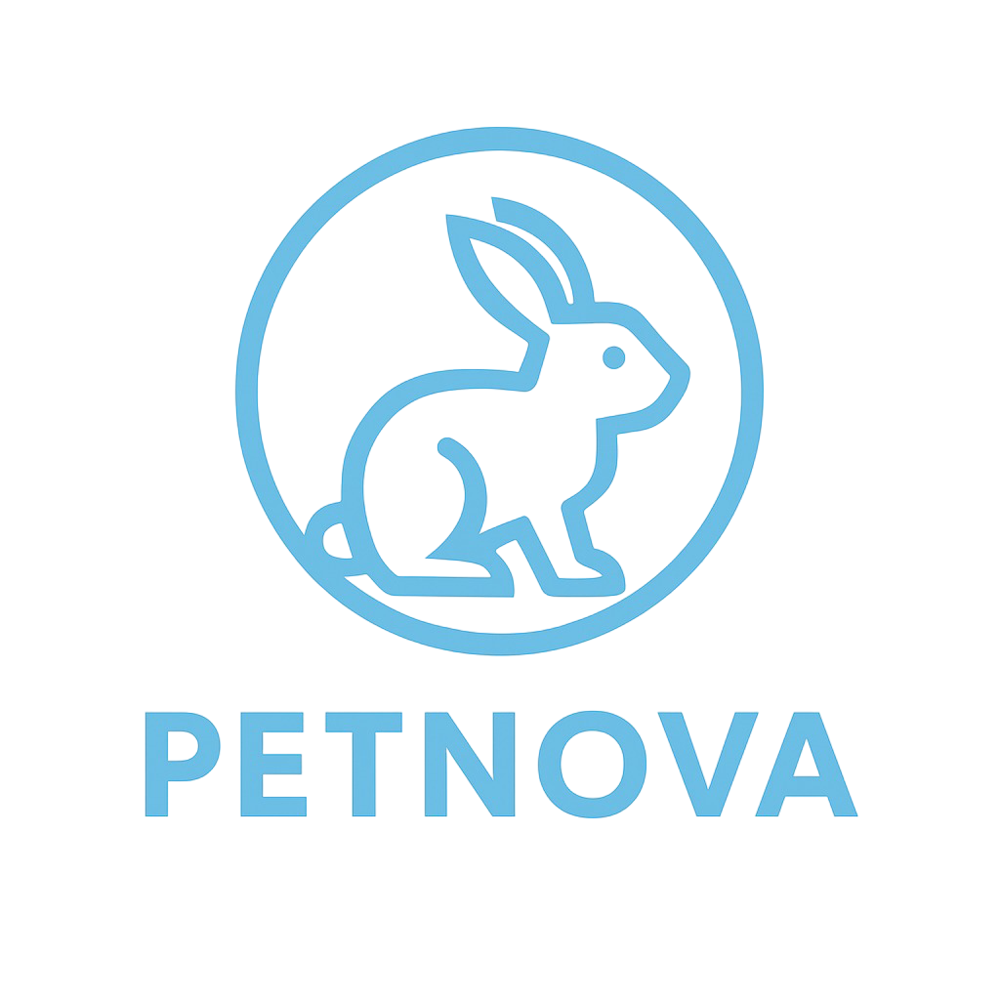
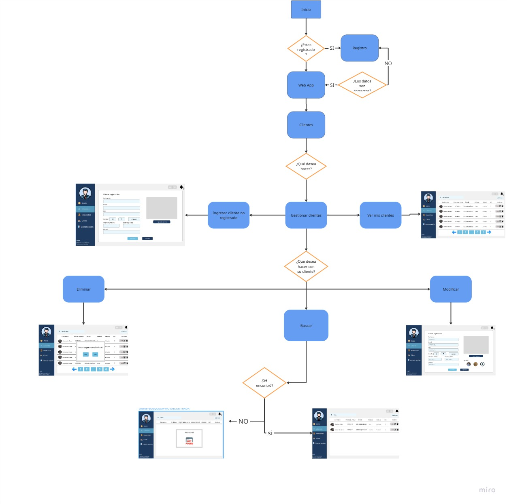

# **CAPÍTULO IV: PRODUCT DESIGN**
El objetivo principal de esta sección es definir el diseño funcional y visual de la plataforma, transformando los requerimientos en interfaces intuitivas y accesibles para veterinarios y dueños de mascotas. A través de flujos de usuario, wireframes y lineamientos visuales, se asegura una experiencia coherente y fluida, facilitando la gestión de historiales, productos y servicios. Este diseño mejora la eficiencia operativa, apoya la misión de mejorar la calidad de vida de las mascotas y sus dueños, y contribuye a la visión de convertir a la plataforma en la herramienta líder en gestión veterinaria, optimizando el cuidado de las mascotas y fortaleciendo la relación entre veterinarios y propietarios.

## 4.1. Style Guidelines.
Es una serie de normas que definen la identidad visual y la interacción estética de un producto.Funciona como una guía de estilo que asegura la coherencia visual en todos los componentes del diseño, incluyendo colores, tipografías, íconos e imágenes, manteniéndolos en sintonía con la identidad visual y la esencia de la marca. A continuación, se presentan las pautas de estilo definidas para nuestro proyecto.

## 4.1.1 General Style Guidelines

### Branding

La identidad visual de la marca **PETNOVA** representa el compromiso con el cuidado animal moderno e integral. El logotipo presenta la figura de un conejo dentro de un círculo, proyectando cercanía, agilidad y confianza. El nombre **PETNOVA** se muestra en una tipografía clara y moderna, lo que refuerza la imagen tecnológica y accesible de la plataforma.

### Typography

Se utilizará la tipografía **Poppins**, ideal por su estilo limpio, amigable y altamente legible en distintos dispositivos. Se empleará en todos los niveles de texto: títulos, subtítulos, etiquetas e información dentro de formularios, garantizando una jerarquía visual clara y coherente.

### Colors

La paleta de colores está basada en tonos azules claros, los cuales transmiten confianza, tranquilidad y tecnología amigable. Estos colores permiten una navegación intuitiva, sin causar fatiga visual, y mantienen un entorno accesible tanto para veterinarios como para usuarios frecuentes.

**Principal:**  
`#6ABFE3` – Celeste claro: Botones principales, títulos destacados y acciones clave.

**Secundario:**  
`#1E3A5F` – Azul profundo: Encabezados, fondo de navbar, pie de página o énfasis visual.

**Fondo:**  
- `#EAF7FC` – Celeste muy claro: Fondo de secciones, formularios, y contenedores suaves.  
- `#FFFFFF` – Blanco puro: Fondo base de pantallas, tarjetas, inputs y elementos limpios.

**Neutro:**  
`#A0AAB2` – Gris suave: Texto secundario, íconos, bordes, descripciones.

### Tone of Communication

- **Amigable:** Para mensajes generales y explicaciones dentro de la plataforma, buscando cercanía con los usuarios.
- **Profesional:** Aplicado en las descripciones de servicios, reportes médicos y perfiles de mascotas, manteniendo claridad y precisión.
- **Empático:** Para comunicar situaciones sensibles como alertas de salud o historial médico.
- **Informativo:** En mensajes de ayuda, tutoriales o recomendaciones veterinarias.
- **Motivador:** Para celebrar logros como revisiones completas o mejoras en la salud de las mascotas.
- **Formal:** En secciones legales como términos, condiciones y políticas de privacidad.
  
### 4.1.2. Web Style Guidelines

**Elementos Visuales:**
Se emplearán imágenes y videos con distintas finalidades. Las imágenes incluirán desde íconos hasta fotos de perfil, mientras que los videos formarán parte de la explicación del contenido, especialmente en la sección de características, facilitando el aprendizaje visual.
**Botones:**
Los botones permitirán al usuario ejecutar acciones como enviar formularios o navegar por la plataforma. Su diseño seguirá las pautas de estilo establecidas, destacándose claramente entre los demás elementos visuales para garantizar una interacción fluida.
**Formularios:**
Se implementarán formularios para usuarios que deseen registrarse ingresando sus datos personales. Su estructura estará pensada para facilitar la experiencia del usuario durante estos procesos clave.
**Interfaz Web Responsiva:**
La aplicación presentará un diseño adaptable a distintos dispositivos, gracias al uso de Flexbox y CSS Grid. Se prioriza la usabilidad mediante una interfaz clara e intuitiva, compatible con navegadores como Chrome, Firefox y Safari. Además, las imágenes estarán optimizadas para asegurar una carga rápida incluso con conexiones lentas.

## 4.2. Information Architecture

La arquitectura de la información es fundamental para organizar y estructurar el contenido de forma que sea fácil de entender y navegar. En este apartado, abordaremos cómo se han definido las categorías, las etiquetas, la optimización SEO, las metaetiquetas, y los sistemas de búsqueda y navegación que construyen la base de nuestro producto.

## 4.2.1. Organization Systems

El objetivo del sistema de organización de la página es definir una estructura visual clara que facilite tanto la presentación del contenido como la navegación del usuario. En el caso de **PetNova**, el diseño del contenido está segmentado en módulos y se centra en los siguientes elementos:

### Página principal (Homepage)

Esta se estructura en varias secciones, entre las que se encuentran:
- Home
- Why Choose Us?
- Contact
- Service Features
- Sign In
- Sign Up

Los sistemas de organización desempeñan un papel fundamental en la presentación clara y coherente del contenido, ya que favorecen tanto la navegación como la comprensión. Para lograrlo, se aplican distintos métodos.

### 4.2.2. Labeling Systems

**Sistemas de Etiquetado**
Los sistemas de etiquetado cumplen un rol clave en la organización del contenido, ya que permiten mejorar la navegación y facilitar la búsqueda de información dentro del producto. Según el contexto y el tipo de usuario, se han definido diferentes enfoques de etiquetado:

- **Etiquetado Descriptivo:** Se utilizan términos claros y precisos que describen directamente el contenido, permitiendo que el usuario entienda rápidamente su propósito y lo localice fácilmente mediante el buscador.

    - Ejemplos antes de iniciar sesión: Inicio, Why choose us?, Contact, Service feature.

- **Etiquetado por Perfil de Usuario:** Las etiquetas se adaptan a las características o necesidades del usuario según su rol o nivel de acceso, mejorando así la relevancia de la información mostrada.

    - Ejemplos después de iniciar sesión: Mis mascotas, Citas, Historial de mascotas, Notificaciones de citas, Perfil, Cerrar sesión.

- **Etiquetado Basado en Relevancia:** Aquí, las etiquetas se asignan considerando la popularidad o utilidad del contenido. Esto puede basarse en estadísticas de uso o en la interacción de los usuarios, como clics, valoraciones o frecuencia de acceso.

### 4.2.3. SEO Tags and Meta Tags

En **PETNOVA**, los SEO Tags y Meta Tags forman parte de la estrategia para mejorar la visibilidad, el posicionamiento y la accesibilidad de la plataforma, tanto en la **Landing Page** como en la **Web Application**. A pesar de que el proyecto se encuentra en proceso de desarrollo, ya se ha definido su planificación SEO principal.

## Landing Page

- **Title:** Pet Nova | Gestión Veterinaria y Cuidado de Mascotas
- **Meta Description:** Plataforma integral que simplifica el acceso a historiales clínicos, productos y servicios veterinarios para mejorar la calidad de vida de las mascotas y sus dueños.
- **Meta Keywords:** gestión veterinaria, historial clínico de mascotas, servicios veterinarios, cuidado de mascotas, plataforma veterinaria digital
- **Meta Author:** Equipo de Pet Nova

## Web Application

- **Title:** Pet Nova | Portal de Gestión Clínica Veterinaria
- **Meta Description:** Plataforma web para la administración eficiente de historiales de salud, gestión de clientes, productos y servicios en clínicas veterinarias.
- **Meta Keywords:** aplicación veterinaria, historial médico de mascotas, servicios clínicos veterinarios, administración de clínicas veterinarias
- **Meta Author:** Equipo de Pet Nova

## Adicionalmente

- **Etiquetas de encabezado (Header Tags):** Se utilizarán etiquetas H1, H2 y H3 para organizar jerárquicamente el contenido, mejorando la estructura y navegación.
- **Etiqueta de idioma (Language Tag):** Se configurará la plataforma para soportar tanto español como inglés, optimizando la experiencia de usuarios locales e internacionales.
- **Metaetiqueta de robots (Meta Robots Tag):** Se permitirá la indexación de las páginas y el seguimiento de los enlaces relevantes por parte de los motores de búsqueda.

Estas configuraciones estarán integradas a nivel de código HTML y tienen como objetivo fortalecer la presencia digital de **Pet Nova** desde su lanzamiento.

### 4.2.4. Searching Systems

 **Sistemas de Búsqueda**

Contar con un sistema de búsqueda eficiente es clave para que los usuarios puedan acceder rápidamente a la información que necesitan. A continuación, se presentan los distintos métodos de búsqueda implementados:

- **Búsqueda por Términos Clave:** El usuario puede ingresar palabras específicas para localizar contenido relacionado. El sistema muestra los resultados más cercanos a esos términos.

- **Búsqueda con Filtros:** Permite acotar los resultados aplicando criterios como categoría, fecha o tipo de contenido, lo que mejora la exactitud de lo que se busca.

- **Búsqueda Facetada:** Esta opción ayuda a refinar los resultados utilizando distintas propiedades del contenido, como ubicación, temática o tipo, ideal para manejar grandes volúmenes de datos.

- **Búsqueda por Relevancia:** Ordena los resultados según qué tan útiles o relacionados son con lo buscado, gracias a algoritmos que priorizan la información más pertinente.

### 4.2.5. Navigation Systems
En Pet Nova, la navegación en el Landing Page y las aplicaciones se ha diseñado cuidadosamente para guiar al usuario a través de una experiencia fluida y eficaz, asegurando que puedan cumplir sus metas sin complicaciones. A continuación, se detallan las principales acciones y técnicas que facilitarán el recorrido del contenido:

## Navegación Intuitiva:
La navegación en el Landing Page y en las aplicaciones está estructurada para ser clara y accesible, permitiendo que los usuarios encuentren lo que buscan sin esfuerzo. Se emplean menús desplegables en la parte superior de la página y enlaces fáciles de identificar en el pie de página. Estos menús están diseñados para dirigir al usuario a las áreas principales:

## Servicios
## Historial clínico
## Productos y servicios veterinarios
## Soporte

## Llamadas a la Acción (CTA):
Las llamadas a la acción están estratégicamente ubicadas para motivar a los usuarios a realizar tareas clave, como registrarse para crear una cuenta, consultar servicios veterinarios o agendar una cita. Los botones de CTA son visibles, con colores contrastantes para atraer la atención y facilitar la interacción.

## Navegación con Pestañas:
En la Web Application, se implementa un sistema de navegación por pestañas que permite a los usuarios moverse entre secciones clave sin necesidad de recargar la página. Esto incluye:

## Historial de Salud de las Mascotas
## Agenda de Citas
## Productos

Esto facilita una experiencia rápida y sin interrupciones, especialmente útil para los veterinarios que necesitan acceder a la información de manera eficiente.

## Desplazamiento Fluido:
El scroll infinito en las secciones de información o artículos dentro de la Web Application permite que los usuarios sigan explorando el contenido sin tener que hacer clic en varios enlaces. Esto es especialmente útil para las secciones de artículos educativos o productos relacionados, permitiendo que el contenido se cargue de manera continua conforme el usuario se desplaza hacia abajo.

## Visualización Clara de Información:
Los usuarios pueden visualizar el historial clínico de sus mascotas de manera sencilla. Cada sección está claramente dividida y etiquetada, lo que les permite encontrar rápidamente las estadísticas de salud y los detalles de sus visitas anteriores a la clínica. Los gráficos y resúmenes visuales permiten una comprensión más rápida y eficaz de la información.

## Adaptabilidad y Soporte Multilingüe:
La plataforma está adaptada para ofrecer una experiencia fluida tanto en español como en inglés, lo que permite que los usuarios, independientemente de su ubicación o idioma, puedan navegar y comprender fácilmente todas las funciones disponibles.

## Proceso de Registro Simplificado:
Para facilitar la creación de cuentas, hemos diseñado un proceso de registro rápido con formularios fáciles de completar. Los usuarios pueden empezar a interactuar con la plataforma sin tener que llenar formularios largos, simplificando su experiencia desde el primer momento.

## Asistencia al Usuario:
El soporte por correo electrónico estará disponible para los usuarios en todo momento. Además, se ofrecerán tutoriales dentro de la aplicación para guiar a los usuarios nuevos a través de las funciones clave de la plataforma.

## 4.3. Landing Page UI Design
La **Landing Page** cumple la función de atraer la atención del usuario y dirigirlo hacia una acción concreta, como completar un registro, adquirir un producto o explorar un servicio. 

En este apartado, se analizará el diseño de su interfaz, haciendo énfasis en los componentes esenciales que optimizan la experiencia del usuario y contribuyen a construir una página atractiva, funcional y fácil de usar.

### 4.3.1. Landing Page Wireframe
El **wireframe** de la landing page de **PetNova** representa la estructura base sobre la que se construirá el diseño final, permitiendo visualizar la disposición de cada sección y la experiencia del usuario de manera ordenada. La página estará compuesta por los siguientes bloques:

**Encabezado Principal:**  
Incluye el logo de PetNova, un menú de navegación simple, y una imagen principal donde se destaca el propósito de la marca: cuidar la salud y bienestar de las mascotas. Un breve mensaje de bienvenida y un botón de llamada a la acción (CTA) invitan a conocer más.

**¿Por qué elegirnos?:**  
Una sección de fondo sólido donde se resumen las principales razones para confiar en PetNova, apoyadas en imágenes pequeñas y texto breve que destaca nuestros valores y ventajas competitivas.

**Planes de Suscripción:**  
Mostramos tres opciones principales de servicios para mascotas, cada una presentada en una tarjeta visual, con nombre, imagen, descripción breve y un botón para más información o contratación.

**Nuestros Aliados:**  
Un bloque con los logos de marcas reconocidas en el sector veterinario, demostrando el respaldo y la calidad de los productos y servicios que ofrecemos.

**Testimonios de Clientes:**  
Sección de tres columnas donde mostramos experiencias reales de nuestros clientes, acompañadas de imágenes y citas cortas, reforzando la confianza de nuevos visitantes.

**Invitación para Veterinarios:**  
Una llamada especial para que veterinarios se unan a PetNova, con imagen destacada, texto motivador y un botón de contacto.

**Preguntas Frecuentes (FAQ):**  
Despejamos las dudas más comunes mediante una sección de preguntas y respuestas rápidas, haciendo que el usuario encuentre información relevante sin dificultad.

**Formulario de Contacto:**  
Un formulario sencillo y visible para que los usuarios puedan enviar sus consultas, suscribirse o solicitar información adicional de manera rápida y cómoda.

**Pie de Página:**  
Sección final con datos de contacto, accesos a redes sociales, mapa de navegación básico y un pequeño recordatorio de nuestra misión: “Comprometidos con la vida y felicidad de las mascotas”.

### Imágenes:

1. 
2. 
3. 
4. 
5. 
6. 
7. 
8. 

### 4.3.2. Landing Page Mock-up
## 4.4. Web Applications UX/UI Design

Crear una experiencia de usuario efectiva en aplicaciones web requiere planificar cuidadosamente cada interacción del usuario. En esta sección se muestran los wireframes, flujos de navegación y mockups que aseguran una interfaz clara y fácil de usar.

### 4.4.1. Web Applications Wireframes
### 4.4.2. Web Applications Wireflow Diagrams
### 4.4.3. Web Applications Mock-ups

### 4.4.4. Web Applications User Flow Diagrams

## Interacción cuando un cliente gestiona su perfil

## Interacción cuando un cliente se registra y procede a gestionar una cita

## Interaccion cuando el cliente gestiona un historial de mascotas

## Interaccion cuando el cliente gestiona una mascota

## Interaccion cuando el usuario gestiona un cliente

## 4.5. Web Applications Prototyping
## 4.6. Domain-Driven Software Architecture

Este enfoque resalta la importancia de comprender profundamente el dominio del negocio para el cual se desarrolla el software. Su objetivo es diseñar soluciones alineadas de manera precisa con las necesidades y particularidades del negocio, garantizando que el sistema aporte verdadero valor y responda eficazmente a sus requerimientos.

### 4.6.1. Software Architecture Context Diagram 
### 4.6.2. Software Architecture Container Diagrams
### 4.6.3. Software Architecture Components Diagrams
## 4.7. Software Object-Oriented Design
### 4.7.1. Class Diagrams

### 4.7.2. Class Dictionary
## 4.8. Database Design
### 4.8.1. Database Diagram 

###

###

###

###

###
