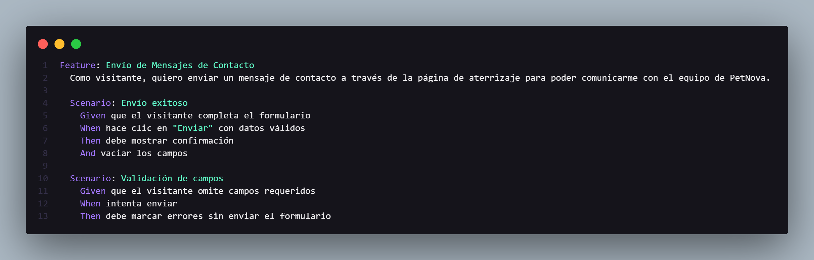
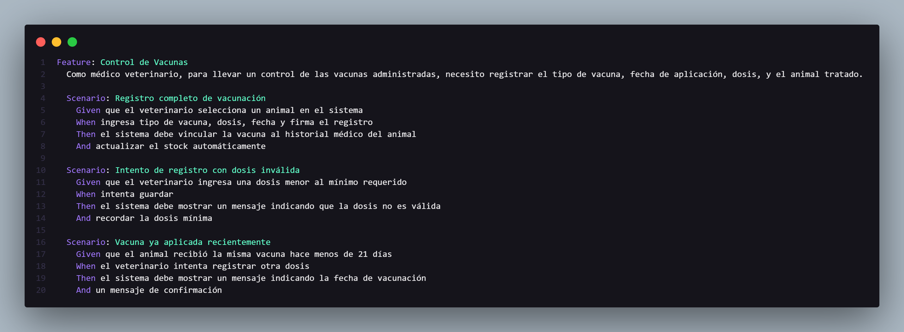
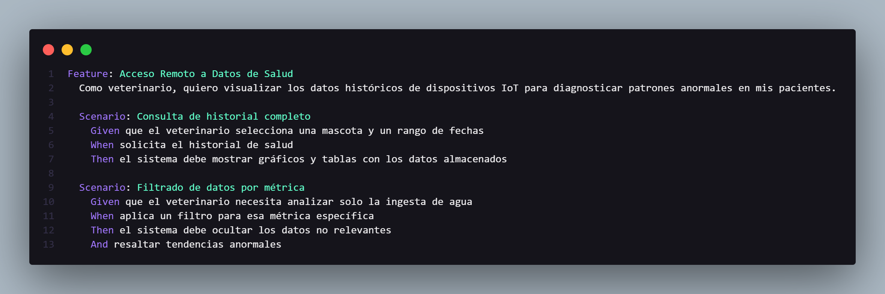
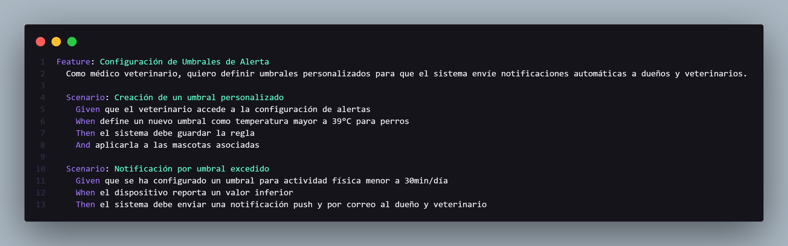

# COURSE PROJECT

---

    <strong>Universidad Peruana de Ciencias Aplicadas (UPC)</strong>     
    </img> 
    <strong>Carrera de Ingeniería de Software - Ciclo V</strong>  
    <strong>Aplicaciónes Web - 4370</strong> 
     <strong>Profesor: Alberto Wilmer Sanchez Seña</strong> 
     <strong><b>INFORME DEL TRABAJO FINAL</strong></b> 

    <strong>Startup del Proyecto: WebWarriors</strong> 
    <strong>Producto: Pet Nova</strong> 

    <h3 align="center">Team Members:</h3>

    <table align="center">
        <tr>
            <th style="text-align:center;">Member</th>
            <th style="text-align:center;">Code</th>
        </tr>
        <tr>
            <td>Bastidas Bastidas, Diego Martin</td>
            <td>U20221A301</td>
        </tr>
        <tr>
            <td>Belahonia Miranda, Fabrisio  </td>
            <td>U202220219</td>
        </tr>
        <tr>
            <td>Choquehuanca Núñez, Luciana Carolina</td>
            <td>U202319431</td>
        </tr>
        <tr>
            <td>Escobar Palomino, Sebastian Matias</td>
            <td>U202220219</td>
        </tr>
        <tr>
            <td>Prado Vargas, Mario Benjamín</td>
            <td>U202115357</td>
        </tr>
    </table>
    

</body>

 <strong>2025-01</strong>

 

---

# Registro de Versiones del Informe

| Versión | Fecha      | Autor       | Descripción de la modificación                                                                                                                                                                |
| ------- | ---------- | ----------- | --------------------------------------------------------------------------------------------------------------------------------------------------------------------------------------------- |
| TB1     | 26/04/2025 | WebWarriors | Redacción de los Capítulos I: Introduction, II: Requirements Elicitation & Analysis, III: Requirements Specification, IV: Product Design, V: Product Implementation, Validation & Deployment. |
| TP      | 15/05/2025 | WebWarriors | Correción de los Capítulos I, II, III, IV y V. Capítulo V: 5.2.2., 5.2.2.1., 5.2.2.2., 5.2.2.3., 5.2.2.4., 5.2.2.5., 5.2.2.6., 5.2.2.7., 5.2.2.8.                                             |
| TB2     | 20/06/2025 | WebWarriors | Correccion de los Capítulos V:Sprint Planning,Sprint Backlog,Development Evidence for Sprint Review. |

# Project Report Collaboration Insights

**TB1** Las tareas asignadas a la TB1 han sido finalizadas y se encuentran correctamente documentadas en el repositorio de GitHub de PetNova-Report. Puedes acceder al repositorio mediante el siguiente enlace: [https://github.com/1ASI0730-2510-4370-G4-PetNova/Report-Pet-Nova](https://github.com/1ASI0730-2510-4370-G4-PetNova/Report-Pet-Nova)

Durante la fase de preparación del informe, se llevaron a cabo las siguientes actividades:

- Se redactaron y crearon los contenidos asignados a cada miembro utilizando formato Markdown, y se realizaron "Conventional Commits" para documentar el avance en el repositorio.

- Se generaron los recursos necesarios y se añadieron las imágenes al repositorio en la carpeta "assets" correspondiente a cada rama del informe.

- Se organizaron reuniones para coordinar el progreso de los componentes del informe y para proporcionar actualizaciones sobre los avances del Sprint 1, el cual estuvo enfocado en el desarrollo de la Landing Page.

  

  

  

  

 
 

**TP1** Las tareas asignadas para la entrega del TP1 han sido completadas y documentadas de manera exhaustiva en el repositorio de GitHub de la organización del equipo: [https://github.com/1ASI0730-2510-4370-G4-PetNova/Report-Pet-Nova](https://github.com/1ASI0730-2510-4370-G4-PetNova/Report-Pet-Nova)

Se redactaron y diagramaron los contenidos asignados a cada integrante en formato Markdown, con commits regulares para mantener un seguimiento preciso del progreso en el repositorio.

Además, se han generado los artefactos necesarios utilizando las herramientas recomendadas, y se llevaron a cabo reuniones periódicas para coordinar el avance de los elementos del informe y comunicar los progresos del Sprint 2, centrado en el desarrollo de la aplicación web.

  

  

  

  

# Contenido

## Tabla de contenidos

- [**Registro de Versiones del Informe**](#registro-de-versiones-del-informe)
- [**Project Report Collaboration Insights**](#project-report-collaboration-insights)
- [**Contenido**](#contenido)
  - [Tabla de contenidos](#tabla-de-contenidos)
- [**Student Outcome**](#student-outcome)
- ## [ **Capítulo I: Introducción** ](#-capítulo-i-introducción-)
  - [**1.1. Startup Profile**](#11-startup-profile)
    - [**1.1.1. Descripción de la Startup**](#111-descripción-de-la-startup)
    - [**1.1.2. Perfiles de integrantes del equipo**](#112-perfiles-de-integrantes-del-equipo)
  - [**1.2. Solution Profile**](#12-solution-profile)
    - [**1.2.1 Antecedentes y problemática**](#121-antecedentes-y-problemática)
    - [What (¿Qué?)](#what-qué)
    - [Who (¿Quién?)](#who-quién)
    - [Where (¿Dónde?)](#where-dónde)
    - [When (¿Cuándo?)](#when-cuándo)
    - [Why (¿Por qué?)](#why-por-qué)
    - [How (¿Cómo?)](#how-cómo)
    - [How much (¿Cuánto?)](#how-much-cuánto)
    - [**1.2.2 Lean UX Process**](#122-lean-ux-process)
    - [**1.2.2.1. Lean UX Problem Statements**](#1221-lean-ux-problem-statements)
    - [**1.2.2.2. Lean UX Assumptions**](#1222-lean-ux-assumptions)
    - [**1.2.2.3. Lean UX Hypothesis Statements**](#1223-lean-ux-hypothesis-statements)
    - [**1.2.2.4. Lean UX Canvas**](#1224-lean-ux-canvas)
  - [**1.3. Segmentos objetivo**](#13-segmentos-objetivo)
- ## [ **Capítulo II: Requirements Elicitation \& Analysis**](#-capítulo-ii-requirements-elicitation--analysis)
  - [**2.1. Competidores**](#21-competidores)
    - [**2.1.1. Análisis competitivo**](#211-análisis-competitivo)
    - [**2.1.2. Estrategias y tácticas frente a competidores**](#212-estrategias-y-tácticas-frente-a-competidores)
  - [**2.2. Entrevistas**](#22-entrevistas)
    - [**2.2.1. Diseño de entrevistas**](#221-diseño-de-entrevistas)
    - [**2.2.2. Registro de entrevistas**](#222-registro-de-entrevistas)
    - [**2.2.3. Análisis de entrevistas**](#223-análisis-de-entrevistas)
  - [**2.3. Needfinding**](#23-needfinding)
    - [**2.3.1. User Personas**](#231-user-personas)
    - [**2.3.2. User Task Matrix**](#232-user-task-matrix)
    - [**2.3.3. User Journey Mapping**](#233-user-journey-mapping)
    - [**2.3.4. Empathy Mapping**](#234-empathy-mapping)
    - [**2.3.5. As-is Scenario Mapping**](#235-as-is-scenario-mapping)
  - [**2.4. Ubiquitous Language**](#24-ubiquitous-language)
- ## [ **Capítulo III: Requirements Specification**](#-capítulo-iii-requirements-specification)
  - [**3.1. To-Be Scenario Mapping**](#31-to-be-scenario-mapping)
  - [**3.2. User Stories**](#32-user-stories)
  - [**3.3. Impact Mapping**](#33-impact-mapping)
  - [**3.4. Product Backlog**](#34-product-backlog)
- ## [**Capítulo IV: Product Design**](#capítulo-iv-product-design)
  - [**4.1. Style Guidelines**](#41-style-guidelines)
    - [**4.1.1. General Style Guidelines**](#411-general-style-guidelines)
    - [**4.1.2. Web Style Guidelines**](#412-web-style-guidelines)
  - [**4.2. Information Architecture**](#42-information-architecture)
    - [**4.2.1. Organization Systems**](#421-organization-systems)
    - [**4.2.2. Labeling Systems**](#422-labeling-systems)
    - [**4.2.3. SEO Tags and Meta Tags**](#423-seo-tags-and-meta-tags)
    - [**4.2.4. Searching Systems**](#424-searching-systems)
    - [**4.2.5. Navigation Systems**](#425-navigation-systems)
  - [**4.3. Landing Page UI Design**](#43-landing-page-ui-design)
    - [**4.3.1. Landing Page Wireframe**](#431-landing-page-wireframe)
    - [**4.3.2. Landing Page Mock-up**](#432-landing-page-mock-up)
  - [**4.4. Web Applications UX/UI Design**](#44-web-applications-uxui-design)
    - [**4.4.1. Web Applications Wireframes**](#441-web-applications-wireframes)
    - [**4.4.2. Web Applications Wireflow Diagrams**](#442-web-applications-wireflow-diagrams)
    - [**4.4.3. Web Applications Mock-ups**](#443-web-applications-mock-ups)
    - [**4.4.4. Web Applications User Flow Diagrams**](#444-web-applications-user-flow-diagrams)
  - [**4.5. Web Applications Prototyping**](#45-web-applications-prototyping)
  - [**4.6. Domain-Driven Software Architecture**](#46-domain-driven-software-architecture)
    - [**4.6.1. Software Architecture Context Diagram**](#461-software-architecture-context-diagram)
    - [**4.6.2. Software Architecture Container Diagrams**](#462-software-architecture-container-diagrams)
    - [**4.6.3. Software Architecture Components Diagrams**](#463-software-architecture-components-diagrams)
  - [**4.7. Software Object-Oriented Design**](#47-software-object-oriented-design)
    - [**4.7.1. Class Diagrams**](#471-class-diagrams)
    - [**4.7.2. Class Dictionary**](#472-class-dictionary)
  - [**4.8. Database Design**](#48-database-design)
    - [**4.8.1. Database Diagram**](#481-database-diagram)
- ## [**Capítulo V: Product Implementation, Validation \& Deployment**](#capítulo-v-product-implementation-validation--deployment)
  - [**5.1. Software Configuration Management**](#51-software-configuration-management)
    - [**5.1.1. Software Development Environment Configuration**](#511-software-development-environment-configuration)
    - [**5.1.2. Source Code Management**](#512-source-code-management)
    - [**5.1.3. Source Code Style Guide \& Conventions**](#513-source-code-style-guide--conventions)
    - [**5.1.4. Software Deployment Configuration**](#514-software-deployment-configuration)
  - [**5.2. Landing Page, Services \& Applications Implementation**](#52-landing-page-services--applications-implementation)
    - [**5.2.1. Sprint 1**](#521-sprint-1)
    - [**5.2.1.1. Sprint Planning 1**](#5211-sprint-planning-1)
    - [**5.2.1.2. Sprint Backlog 1**](#5212-sprint-backlog-1)
    - [**5.2.1.3. Development Evidence for Sprint Review**](#5213-development-evidence-for-sprint-review)
    - [**5.2.1.4. Testing Suite Evidence for Sprint Review**](#5214-testing-suite-evidence-for-sprint-review)
    - [**5.2.1.5. Execution Evidence for Sprint Review**](#5215-execution-evidence-for-sprint-review)
    - [**5.2.1.6. Services Documentation Evidence for Sprint Review**](#5216-services-documentation-evidence-for-sprint-review)
    - [**5.2.1.7. Software Deployment Evidence for Sprint Review**](#5217-software-deployment-evidence-for-sprint-review)
    - [**5.2.1.8. Team Collaboration Insights during Sprint**](#5218-team-collaboration-insights-during-sprint)

# Student Outcome

| Criterio específico                                              | Acciones realizadas                                                                                                                                                                                                                                                                                                                                                                                                                                                                                                                                                                                                                                                                                                                                                                                                                                                                                                                                                                                                                                                                                                                                                                                                                                                                                                                                                                                                                                                                                                                                                                                                                                                                                                                                                                                                                                                                                                                                                                                                                                                                                                                                                                                                                                                                                                                                                                                                                                                                                                                                                                                                                                                                                                                                                                                                                                                                                                                                                                                                                                                                                                                                                                                                                                                                                                                                                                                                                                                                                                                                                                                                                                                                                                                                                                                                                                                                                                                                                                                                                                                                                                                                                                                                                                                                                                                                                                                                                                                                                                                                                                                                                                                                 | Conclusiones                                                                                                                                                                                                                                                                                                                                                                                                                                                                                                                                                                                                                                                                                                                                                                                                                                                                                                                                                                                                                                                                                                                                                                                                                                                                                                                 |
| ---------------------------------------------------------------- | ----------------------------------------------------------------------------------------------------------------------------------------------------------------------------------------------------------------------------------------------------------------------------------------------------------------------------------------------------------------------------------------------------------------------------------------------------------------------------------------------------------------------------------------------------------------------------------------------------------------------------------------------------------------------------------------------------------------------------------------------------------------------------------------------------------------------------------------------------------------------------------------------------------------------------------------------------------------------------------------------------------------------------------------------------------------------------------------------------------------------------------------------------------------------------------------------------------------------------------------------------------------------------------------------------------------------------------------------------------------------------------------------------------------------------------------------------------------------------------------------------------------------------------------------------------------------------------------------------------------------------------------------------------------------------------------------------------------------------------------------------------------------------------------------------------------------------------------------------------------------------------------------------------------------------------------------------------------------------------------------------------------------------------------------------------------------------------------------------------------------------------------------------------------------------------------------------------------------------------------------------------------------------------------------------------------------------------------------------------------------------------------------------------------------------------------------------------------------------------------------------------------------------------------------------------------------------------------------------------------------------------------------------------------------------------------------------------------------------------------------------------------------------------------------------------------------------------------------------------------------------------------------------------------------------------------------------------------------------------------------------------------------------------------------------------------------------------------------------------------------------------------------------------------------------------------------------------------------------------------------------------------------------------------------------------------------------------------------------------------------------------------------------------------------------------------------------------------------------------------------------------------------------------------------------------------------------------------------------------------------------------------------------------------------------------------------------------------------------------------------------------------------------------------------------------------------------------------------------------------------------------------------------------------------------------------------------------------------------------------------------------------------------------------------------------------------------------------------------------------------------------------------------------------------------------------------------------------------------------------------------------------------------------------------------------------------------------------------------------------------------------------------------------------------------------------------------------------------------------------------------------------------------------------------------------------------------------------------------------------------------------------------------------------------------------- | ---------------------------------------------------------------------------------------------------------------------------------------------------------------------------------------------------------------------------------------------------------------------------------------------------------------------------------------------------------------------------------------------------------------------------------------------------------------------------------------------------------------------------------------------------------------------------------------------------------------------------------------------------------------------------------------------------------------------------------------------------------------------------------------------------------------------------------------------------------------------------------------------------------------------------------------------------------------------------------------------------------------------------------------------------------------------------------------------------------------------------------------------------------------------------------------------------------------------------------------------------------------------------------------------------------------------------- |
| Trabaja en equipo para proporcionar liderazgo en forma conjunta. | **Bastidas Bastidas, Diego Martin** _TB1_   Como líder del equipo, coordiné el desarrollo del proyecto, personalmente centrándome en los Capítulos I al III. Para la introducción y análisis de la problemática, facilitamos sesiones colaborativas donde definimos el perfil de la startup, los miembros y aplicamos Lean UX. Aseguré la alineación grupal mediante revisiones y retroalimentación continua.También organicé talleres para estructurar el Impact Mapping, las User Stories y el Product Backlog, integrando múltiples perspectivas. Además hice la primera versión de la Landing Page. Finalmente, gestioné la documentación en Markdown como recurso abierto para su mejora colectiva.   _TP_  Como líder del equipo, organicé sesiones de sincronización para priorizar tareas y resolver bloqueos. Delegué roles según habilidades, fomentando la autonomía y el liderazgo. Además como responsable del componente del código base, coordiné con el equipo de frontend y diseño para garantizar una integración fluida. Facilité reuniones de retroalimentación para alinear las expectativas técnicas y de UX, demostrando liderazgo al mediar entre área.  _TB2_  Lideré el desarrollo del backend, diseñando la arquitectura y coordinando su integración con el frontend.  **Belahonia Miranda, Fabrisio** _TB1_ Desarrolle el Capítulo IV, centrado en el diseño de la landing page y el prototipo de la aplicación. Coordiné con diseñadores, desarrolladores y miembros no técnicos para ajustar wireframes, mockups y sistemas de etiquetado, asegurando un contenido claro y accesible para toda la audiencia. A través de revisiones iterativas, mejoramos el flujo de navegación y la presentación visual, logrando un diseño alineado con los objetivos técnicos y comunicativos del proyecto.  _TP_    _TB2_  Solucioné errores en la versión final del backend, enfocándome en la integridad de la base de datos.   **Choquehuanca Núñez, Luciana Carolina** _TB1_ Trabajé en el Capítulo IV en la parte del Figma realizando los wireframes, mockups y sistemas de etiquetado para diferentes niveles de audiencia también realice la arquitectura de software y el diseño orientado a objetos. Redacté los diagramas de contexto, contenedores y componentes, así como los diagramas de clases y la base de datos. Utilicé un lenguaje técnico adecuado para los ingenieros, pero también me aseguré de que los conceptos complejos fueran comprensibles para una audiencia más amplia.  _TP_  En el componente de edición de perfiles (US05), promoví la colaboración entre desarrolladores y testers mediante pruebas piloto. Lideré la creación de un repositorio compartido de feedback para iteraciones rápidas, integrando aportes de todos. _TB2_ Corregí errores en la primera versión del backend. Organicé talleres para explicar las mejoras al equipo.  **Escobar Palomino, Sebastian Matias** _TB1_  Me encargué del Capítulo V, que trataba sobre la implementación y validación del producto. Redacté la configuración del entorno de desarrollo y la gestión del código de la Landing Page, utilizando un lenguaje técnico pero comprensible para audiencias menos familiarizadas con estos temas. Realice las modificacines debidas al Landing Page llegando así a su ultima versión.  _TP_ Al desarrollar el módulo de gestión de auth, lideré la estandarización de código en colaboración con el equipo. Propuse soluciones técnicas compartidas que optimizaron el trabajo grupal y documenté guías para mantener la coherencia.  _TB2_  Implementé frontend corrigiendo errores anteriores y actualizando las partes faltantes.  **Prado Vargas, Mario Benjamín** _TB1_ En el Capítulo V, apoyé la implementación del Sprint y la gestión del Product Backlog, priorizando tareas y clarificando responsabilidades con el equipo. Lideré la creación de los Acceptance Tests, validando criterios de aceptación. También coordiné mejoras en la Landing Page con mi compañero, integrando feedback y métricas para optimizar la usabilidad y alinear el diseño con los objetivos de negocio.  _TP_ Para esta entrega pude colaborar en la actualización de información y correción en el documento principal, asi mismo pude implementar algunas funcionalidades en el frontend como la búsqueda de mascotas por nombre.   _TB2_  Gestioné la priorización de tareas para corrección de errores. Facilité la integración del backend.   | TB1: Como equipo, demostramos que el liderazgo compartido y la colaboración transversal fueron claves para el éxito del proyecto. Cada integrante aportó desde su especialidad con visión alineada: Diego coordinó el uso de Lean UX y lideró talleres de Impact Mapping y User Stories; Fabrisio dirigió el prototipado y aseguró la accesibilidad del diseño; Luciana estructuró la arquitectura del sistema, simplificando conceptos técnicos; y Sebastián y Mario implementaron el Sprint, gestionaron el Product Backlog y validaron las funcionalidades, mejorando además la Landing Page con feedback y métricas.  _TP_ El equipo demostró liderazgo colaborativo al: **Distribuir roles estratégicamente**: Cada miembro asumió responsabilidades de coordinación en su área **Fomentar comunicación**: Se implementaron canales abiertos (meet, discord) para decisiones consensuadas. **Documentar procesos compartidos**: Crearon un manual de estándares técnicos accesible para todos.   _TB2_  En esta entrega se procuro la arquitectura del backend y la integración con frontend, asegurando estándares técnicos. Optimizaron el backend y la base de datos, resolviendo errores críticos se coordinó la ejecución, priorizando tareas y facilitando la comunicación entre Front y Back |

| Criterio específico                                                                            | Acciones realizadas                                                                                                                                                                                                                                                                                                                                                                                                                                                                                                                                                                                                                                                                                                                                                                                                                                                                                                                                                                                                                                                                                                                                                                                                                                                                                                                                                                                                                                                                                                                                                                                                                                                                                                                                                                                                                                                                                                                                                                                                                                                                                                                                                                                                                                                                                                                                                                                                                                                                                                                                                                                                                                                                                                                                                                                                                                                                                                                                                                                                                                                                                                                                                                                                                                                                                                                                                                                                                                                                                                                                                                                                                                                                                                                                                                                                                                                                                                                                                                                                                                                                                                                                                                                                                                                                                                                                                                                                                                                  | Conclusiones                                                                                                                                                                                                                                                                                                                                                                                                                                                                                                                                                                                                                                                                                                                                                                                                                                                                                                                                                             |
| ---------------------------------------------------------------------------------------------- | -------------------------------------------------------------------------------------------------------------------------------------------------------------------------------------------------------------------------------------------------------------------------------------------------------------------------------------------------------------------------------------------------------------------------------------------------------------------------------------------------------------------------------------------------------------------------------------------------------------------------------------------------------------------------------------------------------------------------------------------------------------------------------------------------------------------------------------------------------------------------------------------------------------------------------------------------------------------------------------------------------------------------------------------------------------------------------------------------------------------------------------------------------------------------------------------------------------------------------------------------------------------------------------------------------------------------------------------------------------------------------------------------------------------------------------------------------------------------------------------------------------------------------------------------------------------------------------------------------------------------------------------------------------------------------------------------------------------------------------------------------------------------------------------------------------------------------------------------------------------------------------------------------------------------------------------------------------------------------------------------------------------------------------------------------------------------------------------------------------------------------------------------------------------------------------------------------------------------------------------------------------------------------------------------------------------------------------------------------------------------------------------------------------------------------------------------------------------------------------------------------------------------------------------------------------------------------------------------------------------------------------------------------------------------------------------------------------------------------------------------------------------------------------------------------------------------------------------------------------------------------------------------------------------------------------------------------------------------------------------------------------------------------------------------------------------------------------------------------------------------------------------------------------------------------------------------------------------------------------------------------------------------------------------------------------------------------------------------------------------------------------------------------------------------------------------------------------------------------------------------------------------------------------------------------------------------------------------------------------------------------------------------------------------------------------------------------------------------------------------------------------------------------------------------------------------------------------------------------------------------------------------------------------------------------------------------------------------------------------------------------------------------------------------------------------------------------------------------------------------------------------------------------------------------------------------------------------------------------------------------------------------------------------------------------------------------------------------------------------------------------------------------------------------------------------------------------------------- | ------------------------------------------------------------------------------------------------------------------------------------------------------------------------------------------------------------------------------------------------------------------------------------------------------------------------------------------------------------------------------------------------------------------------------------------------------------------------------------------------------------------------------------------------------------------------------------------------------------------------------------------------------------------------------------------------------------------------------------------------------------------------------------------------------------------------------------------------------------------------------------------------------------------------------------------------------------------------ |
| Crea un entorno colaborativo e inclusivo, establece metas, planifica tareas y cumple objetivos | **Bastidas Bastidas, Diego Martin** _TB1_ Como líder del equipo, creé un entorno colaborativo mediante sesiones participativas para desarrollar los Capítulos I al III. Definimos el perfil de la startup, los roles del equipo y aplicamos Lean UX, integrando distintas perspectivas. Implementé revisiones continuas, organicé talleres inclusivos para construir el Impact Mapping, las User Stories y el Product Backlog, y lancé la Landing Page como base para iteraciones colectivas. También gestioné la documentación en Markdown como recurso abierto para mejoras continuas.  _TP_ Como líder, implementé: Sesiones de planning con metas, retrospectivas inclusivas donde todos podían compartir feedback, Un sistema de mentoría cruzada  _TB2_ Establecí metas semanales para el backend. Implementé el backend y reuniones cortas explicando el avance y los puntos importantes.  **Belahonia Miranda, Fabrisio** _TB1_ En el Capítulo IV, promoví la colaboración activa en el diseño de la Landing Page y el prototipo. Definimos objetivos de usabilidad y claridad, iterando semanalmente sobre wireframes, mockups y sistemas de etiquetado. Traducimos necesidades técnicas a lenguaje accesible y, tras pruebas de usuario y ajustes basados en feedback, logramos un diseño alineado con los objetivos del proyecto.  _TP_ Organice un tablero de doc compartido para gestionar las tareas del módulo de usuarios, asignando responsabilidades según habilidades. Establecí retos para asegurar el avance coordinado y la inclusión de todos los miembros.  _TB2_ Realice actualizaciones de codigo mediante whatsApp para reportar los avances de la base de datos. Facilité reuniones inclusivas para discutir soluciones.  **Choquehuanca Núñez, Luciana Carolina** _TB1_ En el Capítulo IV, fomenté la colaboración interdisciplinaria en el desarrollo de wireframes, mockups y la arquitectura de software. Definimos criterios comunes para el diseño orientado a objetos y los diagramas (contexto, contenedores, clases y base de datos), y planifiqué sesiones explicativas para asegurar que tanto ingenieros como no técnicos comprendieran los conceptos. Los entregables técnicos se validaron en equipo, integrando los ajustes de todos los miembros.  _TP_ Implementé un sistema de revisión por para la documentación del perfil de mascota, donde cada miembro podía sugerir mejoras. Organicé reuniones semanales para alinear expectativas y crear metas semanales medibles para el equipo.  _TB2_ Organicé "sprints de corrección" con metas diarias para resolver errores.  **Escobar Palomino, Sebastian Matias** _TB1_ En el Capítulo V, coordiné un entorno de desarrollo inclusivo, explicando la configuración técnica y el código de la Landing Page en un lenguaje accesible. Planifiqué tareas con metas escalables y prioricé la accesibilidad. Cumplimos los objetivos mediante pruebas colaborativas y ajustes iterativos, logrando la versión final de la Landing Page con aportes de diseñadores, desarrolladores y el área de negocio.  _TP_ Desarrollé parte de la documentación, asegurando que todos los miembros pudieran contribuir. Además modifique el landing agey arregle los puntos necesarios para esta entrega  _TB2_ Diseñé un plan para poder ver los avances de cada integrante. Expliqué los resultados al equipo para saber cuales eran los puntos faltantes.  **Prado Vargas, Mario Benjamín** _TB1_ En el Capítulo V, facilité la colaboración en la implementación del Sprint y la gestión del Product Backlog, definiendo metas claras y asignando tareas según habilidades. Organicé sesiones diarias para alinear prioridades y validar los Acceptance Tests con el equipo. Junto a Sebastián, optimizamos la Landing Page, integrando métricas y feedback transversal para cumplir con los plazos y estándares de calidad establecidos.  _TP_ Propuse sesiones rápidas, donde explicaba cada punto necesario para esta entrega, adicional a eso corregí errores de la entrega pasada  _TB2_ Para esta entrega pude revisar los avances hechos en el frontend, asi mismo establecí tiempos límites para poder comprender mejor como funciona el producto y pude corregir algunos errores en la documentación.  | TB1: Como equipo TB1, logramos el éxito gracias a la colaboración activa, inclusión y objetivos comunes. Cada miembro lideró su área, trabajando de manera transversal. Definimos metas claras, utilizamos herramientas abiertas y validamos entregables en equipo. La diversidad de habilidades fue clave, y aprendimos que el liderazgo compartido, la inclusión y la comunicación clara son esenciales. Replicaremos este modelo en futuros proyectos, documentando buenas prácticas colaborativas.  _TP_ Coordinamos el diseño de interfaces con el equipo, realizando sesiones de co-creación con los demás integrantes. Implementamos un sistema donde cada desarrollador revisaba el trabajo de otro. Establecimos horarios de colaboración para incluir a todos los miembros.  _TB2_ Se logró un entorno inclusivo mediante herramientas accesibles y metas. La diversidad de habilidades se aprovechó para cumplir objetivos comunicativos. |

---

# **Capítulo I: Introducción**

## 1.1. Startup Profile

### 1.1.1. Descripción de la Startup

"Pet Nova" es un sistema integral para la administración veterinaria y consulta de expedientes médicos. Su principal labor radica en agilizar y mejorar la gestión de todo lo relacionado con el cuidado de mascotas, incluyendo usuarios, clientes, productos, servicios y registros clínicos. El objetivo es ofrecer una herramienta eficiente que facilite el manejo de información y tareas diarias tanto a dueños como a veterinarios.

- **Misión:** Mejorar el bienestar animal mediante tecnología innovadora, optimizando la gestión veterinaria y promoviendo la adopción responsable. Ofrecemos herramientas digitales avanzadas, monitoreo en tiempo real y soluciones integrales para dueños, veterinarios y rescatistas, fomentando el cuidado preventivo y la tenencia consciente de mascotas.

- **Visión:** Ser la plataforma líder en gestión veterinaria inteligente, transformando la manera en que se administran clínicas, se adoptan mascotas y se monitorea su salud. Integrando IoT y datos en tiempo real, buscamos revolucionar el sector pet-tech, creando un ecosistema conectado que garantice mayor calidad de vida para los animales.

### 1.1.2. Perfiles de integrantes del equipo

|                       Photo                       |                                                                                                                                                                 Description                                                                                                                                                                  |
| :-----------------------------------------------: | :------------------------------------------------------------------------------------------------------------------------------------------------------------------------------------------------------------------------------------------------------------------------------------------------------------------------------------------: |
|     | Soy estudiante del 7to ciclo de la carrera de Ingeniería de Software. Decidí estudiar esta carrera porque desde pequeño me llamaba la atención el funcionamiento de una computadora y los procesos que conlleva. Me gusta practicar deportes de contacto, salir a pasear y sobre todo me encanta ser Groomer canino y trabajar con mascotas. |
|      |  Mi nombre es Fabrisio Belahonia, estudiante de Ing. de software. Voy cursando el 6to ciclo de mi carrera, y me considero una persona responsable, ordenado, empático. Me interesa el área de Ciberseguridad y tengo experiencia con Linux, Redes, Cloud, etc.          |
|                    |Soy Luciana, tengo 19 años y actualmente curso el quinto ciclo de Ingeniería de Software. Me entusiasman los proyectos innovadores que buscan transformar la experiencia del usuario en diversos entornos. Disfruto participar en propuestas desafiantes, especialmente aquellas que combinan creatividad, diseño centrado en el usuario y un impacto tangible en la vida real.|
|  |                     Como estudiante de ingeniería de software, me comprometo a contribuir al máximo en el grupo y a cumplir con las entregas dentro del plazo establecido, manteniendo una comunicación efectiva con mis compañeros y aplicando mis habilidades para desarrollar las tareas asignadas en este proyecto.                      |
|         |                             Soy estudiante del 9no ciclo de Ingeniería de Software. Me interesa la tecnología como herramienta para generar impacto social. Disfruto crear soluciones que integren hardware y software, y en mi tiempo libre me gusta la música, el deporte y emprender proyectos tecnológicos.                              |

## 1.2. Solution Profile

Pet Nova es una plataforma digital diseñada para transformar la gestión de clínicas veterinarias mediante un sistema integral que combina administración médica, comunicación con dueños y tecnología IoT. Nuestra solución está específicamente desarrollada para optimizar todas las operaciones diarias de las veterinarias, desde la gestión de historiales clínicos hasta el control de inventarios, mientras mejora la experiencia de los dueños de mascotas con acceso transparente a la información de salud de sus animales.
La plataforma ofrece herramientas avanzadas para profesionales veterinarios, incluyendo un sistema completo de historiales médicos digitales, agenda inteligente con recordatorios automatizados, módulo financiero integrado y control de inventario en tiempo real. Para los dueños de mascotas, Pet Nova proporciona acceso 24/7 a los expedientes médicos de sus animales, notificaciones personalizadas sobre cuidados preventivos y la opción de integrar dispositivos IoT para monitorear signos vitales y actividad física.
Con una interfaz intuitiva y segura, Pet Nova no solo simplifica la gestión veterinaria, sino que también crea un ecosistema conectado que mejora la comunicación entre profesionales, dueños y protectores de animales. Nuestra tecnología está diseñada para elevar los estándares de cuidado animal, haciendo que la gestión sea más eficiente, la información más accesible y la prevención más efectiva.

### 1.2.1. Antecedentes y problemática

Para identificar y analizar de manera más precisa los requerimientos de nuestros usuarios universitarios, hemos realizado una investigación utilizando la metodología 5W's & 2H's. De acuerdo con Rockcontent (2019), esta técnica es una de las herramientas de gestión empresarial más empleadas debido a su versatilidad. Su aplicación es ampliamente útil en diversos contextos organizacionales y proyectos, ya que permite responder preguntas clave que ayudan a optimizar y focalizar estratégicamente las iniciativas de negocio. A continuación, presentamos los hallazgos obtenidos mediante esta técnica de investigación:

#### Uso de la técnica The 5'W's w Y 2'H's

| LAS 5W y 2H | Pregunta                                                             | Descripción                                                                                                                                                                                                                                                                                                                                                                                                                                                                                                                                                                                                                                                         |
| ----------- | -------------------------------------------------------------------- | ------------------------------------------------------------------------------------------------------------------------------------------------------------------------------------------------------------------------------------------------------------------------------------------------------------------------------------------------------------------------------------------------------------------------------------------------------------------------------------------------------------------------------------------------------------------------------------------------------------------------------------------------------------------- |
| What?       | ¿Cuál es el problema?                                                | El desafío principal consiste en que actualmente no existe un software veterinario que combine usabilidad sencilla con funcionalidades integrales para gestionar holísticamente las diversas áreas que comprende la práctica clínica.                                                                                                                                                                                                                                                                                                                                                                                                                               |
| When?       | ¿Cuándo sucede el problema?                                          | La problema ocurre cuando al no existir una plataforma verdaderamente intuitiva para clínicas veterinarias, lo que impide una gestión coordinada y eficaz de sus múltiples procesos cotidianos.                                                                                                                                                                                                                                                                                                                                                                                                                                                                     |
| Where?      | ¿Dónde sucede el problema?                                           | El desafío central en las clínicas veterinarias actuales es la carencia de un sistema integrado que simplifique la administración de sus diferentes áreas operativas. Esta situación genera ineficiencias tanto para los veterinarios, como para los propietarios de mascotas que requieren un acceso rápido y sencillo a los datos médicos y servicios de sus mascotas.                                                                                                                                                                                                                                                                                            |
| Why?        | ¿Por qué sucede el problema?                                         | El problema radica en la falta de aplicaciones especializadas que cubran las necesidades integrales de las clínicas veterinarias. Aunque existen múltiples opciones, ninguna logra gestionar eficientemente las historias médicas, inventarios y comunicación con dueños de mascotas. Esto obliga a los veterinarios a usar varias herramientas simultáneas, mientras los propietarios enfrentan dificultades para acceder a información clave sobre sus animales. Los veterinarios pierden tiempo coordinando sistemas dispersos, y los dueños no reciben atención óptima.                                                                                         |
| Who?        | ¿Qué llevara a las personas a usar nuestro producto?                 | Los usuarios elegirán Pet Nova por su sencillez para registrar información esencial, su destacada presencia en plataformas digitales y, principalmente, por la practicidad al gestionar expedientes médicos sin requerimientos engorrosos.                                                                                                                                                                                                                                                                                                                                                                                                                          |
| How?        | ¿En qué condiciones los clientes usaran nuestro producto?            | Los clientes recurrirán a nuestro producto cuando necesiten una solución práctica y eficaz para gestionar su clínica veterinaria, especialmente en situaciones que demanden simplificar el manejo de historiales médicos, controlar el inventario de medicamentos y mantener una comunicación ágil con los dueños de las mascotas.                                                                                                                                                                                                                                                                                                                                  |
| How Much?   | ¿Con qué frecuencia o en qué cantidad se utilizará nuestro producto? | Pet Nova está creado para integrarse en la rutina diaria de las clínicas veterinarias. La plataforma será fundamental en prácticamente todos los procesos clínicos, desde el ingreso de pacientes hasta el monitoreo posterior al tratamiento. Al ser el acceso a datos médicos y la organización de citas actividades constantes, anticipamos que el equipo veterinario usará el sistema de forma continua durante su jornada. Asimismo, los propietarios de animales tendrán acceso permanente a los registros de sus mascotas, lo que fomentará un uso habitual de la aplicación para consultar historiales médicos y gestionar próximas visitas al veterinario. |

## 1.2.2. Lean UX Process.

#### 1.2.2.1. Lean UX Problem Statements.

La aplicación Pet Nova tiene como objetivo brindar una solución integral para simplificar la gestión diaria en las clínicas veterinarias. Con una interfaz amigable y de fácil navegación, busca reducir las complicaciones que suelen surgir al manejar diversos aspectos de la práctica veterinaria, centralizando todo en una sola plataforma. De esta manera, tanto los profesionales veterinarios como los dueños de mascotas pueden acceder de forma rápida y sencilla a la información que necesitan.

#### 1.2.2.2. Lean UX Assumptions.

El desarrollo de la aplicación Pet Nova se fundamenta en una serie de suposiciones clave que orientan tanto el diseño como la implementación del proyecto. Estas suposiciones surgen de una comprensión preliminar sobre las necesidades y dificultades de nuestros usuarios principales, así como de los objetivos que se esperan alcanzar a nivel empresarial. A lo largo del proceso, dichas suposiciones serán evaluadas y ajustadas mediante pruebas constantes y retroalimentación, con el fin de garantizar que la solución ofrecida cumpla con las expectativas y aborde de manera efectiva los retos identificados.

**Features:**

- Plataforma de administración de citas para optimizar la planificación del tiempo en consultorios veterinarios.
- Almacenamiento y consulta expedientes clínicos de las mascotas de manera eficiente y protegida.
- Alertas automáticas para recordar fechas de vacunación, terapias o chequeos médicos.
- Área dedicada a la comercialización de artículos veterinarios, con un catálogo disponible para los clientes.
- Módulo de generación de informes financieros, manejo de stock y evaluación de datos para incrementar la productividad administrativa.
- Diseño amigable y flexible, compatible con smartphones, tablets y equipos de escritorio.

**Business Outcomes:**

- Optimización de los procesos en las clínicas, disminuyendo el tiempo invertido en labores de gestión.
- Mayor satisfacción de los clientes, al brindarles un acceso sencillo a los registros de salud de sus mascotas y agilizando la comunicación con el centro veterinario.
- Creación de nuevas fuentes de ingresos mediante planes premium con funcionalidades exclusivas y ganancias por la comercialización de insumos veterinarios.
- Minimización de equivocaciones y demoras en la operativa clínica, favoreciendo la fidelización de clientes y captando nuevos usuarios.

**Users:**
- **Segmento 1 – Médicos Veterinarios:** Establecimientos veterinarios de diferentes escalas, desde consultorios individuales hasta hospitales con varios especialistas. Este grupo necesita agilizar la administración cotidiana de sus instalaciones, mejorando el control de datos médicos, existencias y agendas, para incrementar su rendimiento y brindar una atención más calificada.

- **Segmento 2 – Dueños de Mascotas:** Personas que requieren administrar efectivamente el bienestar de sus animales, incluyendo usuarios jóvenes habituados a plataformas digitales y aquellos con menor experiencia tecnológica pero que buscan un método más práctico para gestionar los registros de salud de sus mascotas.

**User Outcomes & Benefits:**

- Ahorro de tiempo en la programación de citas y mantenimiento de expedientes veterinarios.
- Mayor control en la administración de inventarios y artículos.
- Fortalecimiento del vínculo con los clientes, proporcionando un acceso inmediato a los datos de salud de sus animales.
- Agilización de los procesos administrativos en las clínicas, reduciendo fallos y demoras.

**User Assumptions:**

- **¿Quién es el usuario?**
  Los usuarios principales son las clínicas veterinarias y los dueños de mascotas. 

- **¿Dónde encaja la aplicación en su vida?**
  La solución se incorpora en el día a día de los centros veterinarios y en la gestión del cuidado de las mascotas, simplificando su atención y seguimiento médico. 

- **¿Qué problemas tienen nuestros usuarios y como se puede resolver?**
  Los usuarios carecen de un sistema especializado para la administración completa de consultorios veterinarios y de un espacio centralizado donde consultar fácilmente el historial médico de un animal. Nuestra plataforma soluciona estas necesidades ofreciendo un entorno unificado para gestionar todos los aspectos de la clínica y agilizar el acceso a los registros de salud. 

- **¿Dónde y cuándo es usada nuestra aplicación?**
  La herramienta se emplea principalmente en centros veterinarios. Los momentos críticos de uso son durante las consultas médicas y cuando los propietarios cambian de veterinario y requieren transferir el historial clínico o el registro de vacunas a otra clínica. 

- **¿Qué características son importantes?**
  Los elementos clave incluyen una interfaz intuitiva en móviles, PCs y portátiles. Asimismo, es fundamental evitar campos redundantes u obligatorios que puedan dificultar el proceso de ingreso de datos. 

- **¿Cómo debe verse nuestra aplicación y como debe comportarse?**
 Nuestro sistema debe presentar un diseño práctico y accesible, tanto para profesionales como para dueños de mascotas. Debe posibilitar un registro ágil de pacientes y la actualización de expedientes, eliminando requisitos innecesarios que no contribuyan al proceso de atención. 

**Business Assumptions**

- Los veterinarios y su equipo adoptarán soluciones digitales si estas mejoran la productividad en sus instalaciones.
- Los propietarios de animales apreciarán una plataforma que les permita consultar la información de salud de sus mascotas en cualquier momento.
- Las clínicas veterinarias estarán abiertas a contratar suscripciones premium o funcionalidades avanzadas si estas mejoran su eficiencia.
- El sector veterinario aún emplea métodos tradicionales o obsoletos, generando ineficiencias que la plataforma puede solucionar.
- Existirá una buena recepción de la herramienta tanto por usuarios jóvenes con alta afinidad tecnológica como por aquellos con menor familiaridad con soluciones digitales.

#### 1.2.2.3. Lean UX Hypothesis Statements.

Con el fin de garantizar que nuestra solución responda adecuadamente a las necesidades y expectativas de los usuarios, hemos planteado una serie de hipótesis siguiendo el enfoque Lean UX. Esta metodología nos facilita validar nuestras suposiciones mediante ciclos iterativos y adaptaciones continuas basadas en la retroalimentación de los usuarios.

**Creemos** que si desarrollamos una aplicación intuitiva que permita a los veterinarios administrar historiales clínicos y recordatorios de forma ágil,

**sabremos** que hemos alcanzado nuestro objetivo cuando identifiquemos una mejora en la eficiencia operativa y una disminución del tiempo dedicado a tareas administrativas en las clínicas,

**cuando** estas empiecen a utilizar nuestra aplicación y reporten avances en su rutina diaria, confirmaremos que nuestra propuesta es efectiva.

**Creemos** que al proporcionar una plataforma que ofrezca a los dueños de mascotas un acceso sencillo a la información médica de sus animales,

**sabremos** que nuestra solución es útil cuando los usuarios nos brinden comentarios positivos sobre la facilidad de acceso y la relevancia de los datos compartidos,

**cuando** los propietarios consulten y gestionen sin dificultades la salud de sus mascotas mediante la aplicación, podremos afirmar que estamos cubriendo una necesidad concreta.

**Creemos** que al eliminar campos obligatorios innecesarios y hacer más simple el proceso de registro en la app,

**sabremos** que lo hemos logrado cuando los usuarios expresen una mayor satisfacción y notemos una disminución en los errores de ingreso de datos,

**cuando** tanto veterinarios como dueños de mascotas describan una experiencia fluida y sin obstáculos, habremos comprobado que la aplicación cumple con los estándares de facilidad y funcionalidad.

#### 1.2.2.4. Lean UX Canvas

<table border="1" cellpadding="10" cellspacing="0">
    <tr>
        <td><strong>Lean UX Canvas</strong></td>
        <td><strong>Primera Iteración</strong></td>
    </tr>
    <tr>
        <td>
            <strong>Business Problem</strong> 
            Las clínicas veterinarias se enfrentan a importantes retos debido a la utilización de sistemas obsoletos o procedimientos manuales, generando problemas de eficiencia, errores documentales y experiencias negativas para profesionales veterinarios y dueños de animales. La ausencia de un sistema integrado dificulta considerablemente la correcta gestión de agendas, expedientes médicos y comercialización de productos para mascotas.
        </td>
        <td>
            <strong>Solutions</strong> 
            - Administración y organización de horarios y consultas 
            - Archivo y acceso a expedientes médicos de pacientes 
            - Sistema de alertas para recordar vacunaciones y seguimiento de terapias 
            - Comercialización de artículos y medicamentos para animales 
            - Informes financieros y supervisión de existencias en almacén 
        </td>
        <td>
            <strong>Business Outcomes</strong> 
            - Optimización de los procesos operativos en consultorios veterinarios 
            - Mayor satisfacción entre los clientes gracias al acceso inmediato a historiales médicos 
            - Obtención de beneficios adicionales mediante planes premium y comercialización de productos 
            - Disminución de fallos administrativos y tiempos de espera en el manejo de la clínica 
        </td>
    </tr>
    <tr>
        <td>
            <strong>Users</strong> 
            - <strong>Segmento 1 – Médicos Veterinarios:</strong> Clínicas diversas dimensiones que requieren optimizar la administración de datos clínicos, agendamiento y control de productos.
           
            - <strong>Segmento 2 – Dueños de Mascotas:</strong> Personas con mascotas que desean un método eficaz para supervisar la salud de sus animales y consultar sus registros médicos digitalmente.
        </td>
        <td>
            <strong>Hypotheses</strong> 
            - Consideramos que el desarrollo de una aplicación de uso sencillo para veterinarios optimizará la administración de sus consultorios.
            - Confirmaremos nuestro éxito al verificar mejoras en la productividad operativa y disminución del tiempo consumido en labores administrativas.
            - Estamos convencidos de que una plataforma que ofrezca acceso simplificado a expedientes médicos será valorada positivamente por los propietarios de mascotas.
            - Validaremos la efectividad de nuestra solución mediante las opiniones favorables sobre la facilidad para consultar información clínica.
            - Sostenemos que simplificar el proceso de inscripción, eliminando campos superfluos, enriquecerá la experiencia del usuario.
            - Sabremos que hemos alcanzado nuestra meta cuando los usuarios reporten una navegación fluida y libre de complicaciones.
        </td>
        <td>
            <strong>User Outcomes & Benefits</strong> 
            - Disminución del tiempo requerido para administrar citas y mantener expedientes clínicos actualizados.            
            - Mayor eficiencia en la organización y control de inventarios y mercancía.
            - Fortalecimiento de la relación con clientes al proporcionarles acceso directo a información médica de sus mascotas.
            - Administración más sencilla de los establecimientos veterinarios, minimizando errores y reduciendo tiempos de espera.
        </td>
    </tr>
    <tr>
        <td>
            <strong>What's the most important thing we need to learn first?</strong> 
            Verificar si la aplicación efectivamente incrementa la eficiencia en las operaciones de las clínicas veterinarias y mejora la accesibilidad de la información médica para los dueños de las mascotas.
        </td>
        <td colspan="2">
            <strong>What's the least amount of work we need to do to learn the next most important?</strong> 
           Crear un prototipo operativo que posibilite a un grupo específico de usuarios, incluyendo veterinarios y dueños de mascotas, experimentar las funciones principales de la aplicación y brindar comentarios sobre su utilidad para aumentar la eficiencia y mejorar la experiencia del usuario.
        </td>
    </tr>
</table>

## 1.3. Segmentos objetivo.

Para garantizar el éxito de Pet Nova, hemos identificado dos grupos clave que serán el centro de nuestras estrategias de desarrollo y marketing. Estos grupos representan a nuestros usuarios ideales, lo que nos permitirá ajustar nuestras funcionalidades y servicios a sus necesidades particulares, optimizando así el impacto de la plataforma.

**Segmento Objetivo 1 - Clínicas Veterinarias**

El primer grupo objetivo está conformado por clínicas veterinarias de distintos tamaños, desde establecimientos independientes hasta centros especializados con varios profesionales. Pet Nova les proporciona una solución que agiliza la gestión interna de sus actividades, mejorando la eficiencia en la organización de citas, el manejo de historiales clínicos y la comunicación con los propietarios de mascotas. Estas clínicas buscan una herramienta que les permita acceder fácilmente a la información médica y administrar mejor sus recursos, todo dentro de una interfaz simple e intuitiva. El valor principal de Pet Nova está en su capacidad para optimizar los procesos, lo que contribuye a ofrecer una atención de mayor calidad a los animales.

**Segmento Objetivo 2 - Dueño de Mascotas:**

El segundo segmento está conformado por los propietarios de mascotas, encargados de velar por la salud y el bienestar de sus animales. Este grupo busca herramientas prácticas que les permitan gestionar de forma eficiente aspectos como la programación de citas, el acceso a historiales clínicos y los recordatorios de vacunación. Pet Nova les ofrece una plataforma que centraliza toda esta información y la hace accesible desde cualquier dispositivo, brindándoles mayor control y tranquilidad en el cuidado de sus mascotas. Para este segmento, la facilidad de uso y la comodidad son fundamentales, ya que esperan una experiencia intuitiva y adaptada a sus necesidades.

---

# **Capítulo II: Requirements Elicitation & Analysis**

## 2.1. Competidores.

| Plataforma | Descripción |
|------------|-------------|
| **VetPraxis**    | VetPraxis es una herramienta enfocada en la gestión integral de clínicas veterinarias, pensada para facilitar la administración de sus actividades diarias. Entre sus principales funciones se encuentran el manejo de citas, la digitalización de historias clínicas, el control de inventario y la facturación. Además, incorpora recursos para mejorar la comunicación con los clientes y el monitoreo de tratamientos.   **Página web:** [https://vetpraxis.net/](https://vetpraxis.net/) |
| **VetApp**    | VetApp es una plataforma orientada a la administración de clínicas veterinarias. Ofrece funcionalidades como la organización de citas, el registro de historias clínicas electrónicas y el control del inventario.   **Página web:** [https://vetapp.app/en](https://vetapp.app/en) |
| **PetClinic**    | PetClinic es una solución digital creada para la administración de clínicas veterinarias y atención a mascotas. Sus herramientas permiten coordinar citas, gestionar historias clínicas electrónicas, y controlar tanto el inventario como los procesos de facturación. Esta plataforma busca mejorar la eficiencia interna de las clínicas y reforzar la comunicación con los clientes. Está especialmente adaptada al contexto veterinario del Perú.   **Página web:** [https://petclinic.es/](https://petclinic.es/) |

### 2.1.1. Análisis competitivo.
# Análisis Comparativo

<table><tr><th colspan="2">¿Por qué llevar a cabo este análisis? </th><th colspan="5" valign="top">Para comparar las características tanto internas como externas de los productos que compiten con nosotros. </th></tr>
<tr><td colspan="1"></td><td colspan="1"></td><td colspan="1">Pet Nova </td><td colspan="1">VetPraxis </td><td colspan="1">VetApp </td><td colspan="1">PetClinic </td></tr>
<tr><td colspan="1" rowspan="2">Perfil </td><td colspan="1" valign="top">Overview </td><td colspan="1">Plataforma enfocada en clínicas veterinarias, facilita la administració n de historiales clínicos, recordatorios y control de inventario a través de una interfaz sencilla. </td><td colspan="1" valign="top">Solución digital para clínicas veterinarias que centraliza la gestión de citas, registros médicos y facturación, todo en una interfaz fácil de manejar. </td><td colspan="1" valign="top">App móvil que permite gestionar citas y registros médicos, facilitando la interacción entre veterinarios y tutores de mascotas. </td><td colspan="1" valign="top">
Sistema integral que combina administració n de historiales, citas e inventario, con el objetivo de optimizar el funcionamient

o de clínicas veterinarias. 
</td></tr>
<tr><td colspan="1" valign="top">Ventaja competitive ¿Qué valor ofrece a los clientes? </td><td colspan="1" valign="top">Manejo simplificado de funciones clave mediante una interfaz amigable. </td><td colspan="1">Administració n completa de aspectos clínicos y administrativo s, ideal para clínicas de mayor tamaño. </td><td colspan="1">Gestión móvil accesible que favorece la comunicació n con los clientes. </td><td colspan="1" valign="top">Herramienta todo-en-uno adaptada para clínicas pequeñas y medianas. </td></tr>
<tr><td colspan="1" rowspan="2">Perfil de Marketin g </td><td colspan="1" valign="top">Mercado objetivo </td><td colspan="1" valign="top">Clínicas veterinarias y personas con mascotas. </td><td colspan="1" valign="top">Clínicas medianas a grandes. </td><td colspan="1">Dueños de mascotas y veterinarios que trabajan de forma móvil. </td><td colspan="1" valign="top">Clínicas de menor y mediano tamaño. </td></tr>
<tr><td colspan="1" valign="top">Estrategias de marketing </td><td colspan="1">Presencia en redes sociales y alianzas estratégicas con clínicas veterinarias. </td><td colspan="1" valign="top">Marketing educativo (contenido, webinars). </td><td colspan="1" valign="top">Promoción vía redes sociales. </td><td colspan="1" valign="top">Promociones y anuncios segmentados. </td></tr>
<tr><td colspan="1">Perfil del Producto </td><td colspan="1" valign="top">Productos & Servicios </td><td colspan="1">Administració n de historias clínicas, recordatorios y control de stock. </td><td colspan="1" valign="top">Herramientas para agendar citas, gestionar historiales y facturación. </td><td colspan="1" valign="top">App para manejar citas y datos clínicos. </td><td colspan="1" valign="top">Sistema que centraliza historiales, citas e inventario. </td></tr>
</table>

<table><tr><th colspan="1" rowspan="2"></th><th colspan="1" valign="top">Precios & Costos </th><th colspan="1">Modelo de suscripción mensual con distintos planes. </th><th colspan="1" valign="top">Licencia anual con tarifas según funciones. </th><th colspan="1">Aplicación gratuita con opciones de pago dentro de la app. </th><th colspan="1">Suscripción que varía según el tamaño de la clínica. </th></tr>
<tr><td colspan="1">Canales de distribución (Web y/o Móvil) </td><td colspan="1">Disponible en versión web y aplicación móvil. </td><td colspan="1">Accesible desde navegador web. </td><td colspan="1">Distribuida a través de tiendas de aplicaciones. </td><td colspan="1" valign="top">Uso vía plataforma web. </td></tr>
<tr><td colspan="1" rowspan="4">Análisis SWOT </td><td colspan="1" valign="top">Fortalezas </td><td colspan="1" valign="top">Interfaz clara y funcional; combina múltiples servicios en un solo lugar. </td><td colspan="1" valign="top">Gestión eficiente y adaptable a clínicas de tamaño medio/grande. </td><td colspan="1">Acceso desde el móvil; mejora la comunicació n con el cliente. </td><td colspan="1" valign="top">Sistema integral fácil de manejar para clínicas más pequeñas. </td></tr>
<tr><td colspan="1" valign="top">Debilidades </td><td colspan="1">Requiere adopción activa por parte de las clínicas veterinarias. </td><td colspan="1" valign="top">Puede resultar costoso para centros pequeños. </td><td colspan="1">Funciones limitadas frente a soluciones más completas. </td><td colspan="1" valign="top">No tan adecuada para grandes clínicas. </td></tr>
<tr><td colspan="1" valign="top">Oportunidad es </td><td colspan="1">Oportunidad de crecer en el segmento de clínicas pequeñas y medianas. </td><td colspan="1">Mayor posicionamien to entre clínicas grandes y asociaciones. </td><td colspan="1">Expansión en el mercado móvil de dueños de mascotas. </td><td colspan="1" valign="top">Potencial para captar más clínicas pequeñas. </td></tr>
<tr><td colspan="1" valign="top">Amenazas </td><td colspan="1" valign="top">Competencia con plataformas similares. </td><td colspan="1" valign="top">Existencia de opciones gratuitas o de bajo costo. </td><td colspan="1" valign="top">Alta competencia en el sector de apps para mascotas. </td><td colspan="1">Presión de sistemas más avanzados para grandes centros veterinarios. </td></tr>
</table>

### 2.1.2. Estrategias y tácticas frente a competidores.

**Estrategias:**

- **Interfaz Amigable y Fácil de Usar:** Pawfect Care se destacará por su diseño intuitivo y fácil navegación, lo que facilita la gestión diaria tanto para veterinarios como para propietarios de mascotas. Esto la hace más accesible en comparación con otras soluciones que suelen ser complicadas o difíciles de manejar.

- **Funcionalidades Únicas:** La aplicación ofrecerá funciones exclusivas como la personalización de historiales clínicos y recordatorios específicos para cada clínica y propietario de mascota, lo cual no es común en otras plataformas.

- **Valor Añadido:** Se concentrará en ofrecer valor mediante un sistema completo que integra la gestión de citas, control de inventarios, notificaciones automáticas y una sección para la venta de productos veterinarios, cubriendo diversas necesidades en una sola plataforma.

- **Adaptabilidad:** Pawfect Care será compatible con clínicas de diferentes tamaños y estará disponible tanto en dispositivos móviles como en computadoras, lo que la convierte en una solución flexible y adecuada para diferentes tipos de necesidades.

**Tácticas:**

- **Demostraciones Personalizadas:** Se llevarán a cabo presentaciones en vivo en clínicas veterinarias para mostrar de manera práctica cómo la plataforma mejora la eficiencia y simplifica la gestión clínica. Estas demostraciones permitirán a los posibles clientes ver cómo funciona Pawfect Care en su entorno laboral.

- **Períodos de Prueba Gratuita:** Se ofrecerán pruebas gratuitas para que las clínicas puedan experimentar las ventajas de la aplicación sin compromiso. Esto permitirá a los usuarios evaluar su utilidad e impacto en la operación diaria.

- **Testimonios y Casos de Éxito:** Se recopilarán y compartirán testimonios de usuarios satisfechos que hayan notado mejoras significativas en su gestión veterinaria. Estos testimonios se usarán en campañas de marketing, en el sitio web y en materiales promocionales para generar confianza y atraer nuevos clientes.

- **Soporte Proactivo y Capacitación:** Se brindará soporte activo y formación personalizada para ayudar a las clínicas a integrar la plataforma de manera eficiente. Esto garantizará que los usuarios aprovechen al máximo sus características avanzadas y minimicen el tiempo de adaptación.

- **Mejora Continua:** Se implementará un proceso de retroalimentación constante para identificar áreas de mejora y responder rápidamente a las necesidades cambiantes del mercado, lo que permitirá a Pawfect Care mantenerse innovadora y adaptarse a nuevas tendencias.

- **Alianzas Estratégicas:** Se buscarán asociaciones con proveedores de productos veterinarios y organizaciones de salud animal para expandir la red de distribución y aumentar la visibilidad de la plataforma.

## 2.2. Entrevistas.

El propósito de las entrevistas es adquirir un conocimiento detallado sobre las vivencias, puntos de vista y opiniones de los grupos de mercado elegidos. Buscamos recolectar información significativa que nos permita conocer a fondo a nuestro público objetivo y profundizar en el entendimiento de sus comportamientos. A través de estas conversaciones, obtendremos una perspectiva más precisa de sus necesidades y expectativas, lo cual nos permitirá ajustar nuestros productos o servicios de forma más adecuada a sus demandas.

### 2.2.1. Diseño de entrevistas.

En esta sección, se han planteado diversas preguntas dirigidas a nuestros grupos de interés para obtener información cualitativa, como opiniones o descripciones. Estos datos serán fundamentales para el desarrollo de nuestra solución.

**Preguntas Generales:**

- ¿Cuál es tu nombre?
- ¿Cuántos años tienes?
- ¿Donde resides?
- ¿Cuál es tu ocupación?

**Preguntas para el Segmento Objetivo 1 - Médicos Veterinarios:**

- ¿Conoces alguna aplicación de gestión veterinaria? ¿Cuál es?
- ¿Lo escogieron por alguna razón es especial?
- ¿Fue la primera aplicación que usaron?
- ¿Qué es lo que te gusta de esa aplicación?
- ¿Qué te disgusta de esa aplicación?
- ¿Qué sería una de las cosas que si o si cambiarias?

**Preguntas para el Segmento Objetivo 2 - Dueños de Mascotas:**

- ¿Con que frecuencia vas al veterinario?
- ¿Qué método usas para llevar el control de tu mascota?
- ¿Alguna vez perdiste los documentos?
- ¿En medio de algún tratamiento cambiaste de veterinario?
- ¿Qué opinas de tener la historia clínica en una aplicación?
- ¿Usarías una aplicación como la descrita?

### 2.2.2. Registro de entrevistas.

**Entrevista para el Segmento Objetivo 1 - Médicos Veterinarios:**

---

Entrevista N°1:

**Entrevistada:** Jasmin Flores  
**Sexo:** Femenino  
**Edad:** 26 años 
**Domicilio:** San Miguel 
**Inicio de la Entrevista:** 0:03 
**Duración de la Entrevista:** 4:49 

**Enlace:** <a href="https://n9.cl/entrevista_1_segmento1"> https://n9.cl/entrevista_1_segmento1</a> 

**Resumen de la Entrevista:** La doctora Jasmín menciona que en la clínica veterinaria donde labora, utilizan una cuenta única que puede abrirse en varios dispositivos para llenar las historias clínicas. Destaca como aspecto positivo que la aplicación está pensada específicamente para el entorno veterinario, ya que cuenta con campos adaptados según la especie o raza del animal. Sin embargo, señala como punto negativo que, aunque ciertos campos no son obligatorios, debe pasar por ellos igualmente para completar el registro, lo cual hace que el proceso tome más tiempo del que le gustaría.

---

Entrevista N°2:

**Entrevistado:** Erick Monzón 
**Sexo:** Masculino  
**Edad:** 30 años  
**Domicilio:** Magdalena del Mar 
**Inicio de la Entrevista:** 0:00 
**Duración de la Entrevista:** 6:22 

 

**Enlace:** <a href=""> https://n9.cl/entrevista_2_segmento2</a>

**Resumen de la Entrevista:** El doctor Erick comenta que en su lugar de trabajo emplean VetPraxis, una plataforma bastante conocida y usada en muchas clínicas veterinarias. No obstante, menciona que presenta algunas falencias, sobre todo en cuanto a su eficiencia. Una de sus principales observaciones es la presencia de múltiples campos obligatorios que, a su parecer, no son necesarios. Entre ellos, destaca datos como el número de RUC, teléfono del trabajo, y enlaces a redes sociales como Facebook o Instagram, los cuales considera poco relevantes para brindar una buena atención. Esta carga de información provoca que el proceso para generar una historia clínica tarde entre 7 y 10 minutos, lo cual es especialmente problemático en casos de emergencia, donde el tiempo apremia. Por ello, Erick señala que una de las mejoras urgentes sería eliminar estos campos innecesarios para hacer la aplicación más ágil y funcional.

---

Entrevista N°3:

**Entrevistado:** Vanesa Gómez  
**Sexo:** Femenino  
**Edad:** 25 años 
**Domicilio:** Lince  
**Inicio de la Entrevista:** 0:00 
**Duración de la Entrevista:** 6:58 

 

**Enlace:** <a href=""> https://n9.cl/entrevista_3_segmento1</a>

**Resumen de la Entrevista:** La doctora Vanesa señala que en su trabajo actual utilizan VetPraxis, principalmente porque es la aplicación más popular entre las clínicas veterinarias. No obstante, menciona que en su empleo anterior manejaban fichas en papel, las cuales luego se registraban en un archivo de Excel con el número de historia clínica y el nombre de la mascota para facilitar su localización. Al igual que el doctor Erick, Vanesa considera que VetPraxis tiene demasiados campos innecesarios, lo que le demanda entre 10 y 15 minutos para completar una historia clínica, un tiempo que le parece excesivo. Además, recuerda que el sistema físico anterior también era ineficiente: la escritura a mano a veces no se entendía o los documentos se extraviaban, generando molestias a los dueños de las mascotas. Por ello, ella cambiaría los campos que no aportan valor y que entorpecen el registro de la información en VetPraxis.

---

**Entrevista para el Segmento Objetivo 2 - Dueños de Mascotas:**

---
Entrevista N°1:

**Entrevistado:** Jose Heredia   
**Sexo:** Masculino   
**Edad:** 20 años  
**Domicilio:** Santa Anita 
**Inicio de la Entrevista:** 0:00  
**Duración de la Entrevista:** 2:53   

  

**Enlace:** <a href="">https://n9.cl/es/r/entrevista_1_segmento2 </a>

**Resumen de la Entrevista**: José Heredia, un estudiante de 20 años residente en Santa Anita, tiene varias mascotas en casa y más en la empresa de sus padres. Visita al veterinario mensualmente pero no lleva un control formal de la salud de sus animales, lo cual le causa problemas como pérdida de documentos. Cambia frecuentemente de veterinario por temas de ubicación. Considera útil una aplicación que permita centralizar la información clínica de sus mascotas. Al conocer la propuesta de Pennova, una app de gestión veterinaria con expedientes médicos, registros de citas y vacunas, expresó que sí la usaría para tener mayor control sobre sus mascotas.

---

Entrevista N°2:

**Entrevistado:** Leonardo Valentin  
**Sexo:** Masculino   
**Edad:** 21 años  
**Domicilio:** Santa Anita 
**Inicio de la Entrevista:** 0:00  
**Duración de la Entrevista:** 2:44 

  

**Enlace:** <a href="">https://n9.cl/entrevista_segmento2 </a>

**Resumen de la Entrevista**: Leonardo, un estudiante de 21 años que vive en Santa Anita, tiene cinco mascotas: tres perros y dos gatos. Suele llevarlos al veterinario una vez al mes para chequeos generales, aunque admite no usar ningún método específico para llevar el control de su salud; simplemente actúa cuando nota comportamientos inusuales. Archiva los documentos en folders y no ha tenido problemas de pérdida. Siempre acude al mismo veterinario, ya que es alguien cercano a su familia. Al conocer la propuesta de la aplicación Pennova, expresó que le parece una idea interesante, especialmente para personas que no tienen un control riguroso. Afirmó que sí la usaría, ya que considera que sería una herramienta eficiente para organizar horarios y el cuidado general de sus mascotas.

---

Entrevista N°3:

**Entrevistada:** Camila Sanchez   
**Sexo:** Femenino   
**Edad:** 22 años  
**Domicilio:** Santiago de Surco 
**Inicio de la Entrevista:** 0:00  
**Duración de la Entrevista:** 3:12 

  

**Enlace:** <a href="">https://n9.cl/entrevista_3_segmento2 </a>

**Resumen de la Entrevista**: Camila, una estudiante de 22 años que vive en Santiago de Surco, tiene una perrita que recientemente cumplió un año. Durante su etapa de cachorro, la llevaba al veterinario cada tres meses para vacunas y chequeos, y sigue llevándola de inmediato si nota algo inusual. No lleva un control digital, solo utiliza la cartilla proporcionada por el veterinario. Sin embargo, perdió esos documentos una vez, lo que le generó estrés. Además, cambió de veterinario tanto por el trato recibido como por el tema de las vacunas. Considera que una aplicación que registre la historia clínica de su mascota sería muy útil, especialmente porque tiende a extraviar papeles. Le gustaría una app como Petnova, ya que facilitaría el seguimiento de citas, vacunas y todo el historial de su mascota de forma práctica y accesible desde su celular.

---
### 2.2.3. Análisis de entrevistas.

***Segmento 1: Médicos Veterinarios***

En las clínicas veterinarias, se han detectado varios retos en el uso de sistemas digitales para registrar historias clínicas. VetPraxis, uno de los más utilizados por su popularidad, presenta deficiencias en eficiencia y usabilidad, según diversos profesionales.

El principal inconveniente es la presencia de muchos campos obligatorios o innecesarios (como RUC, teléfonos laborales o redes sociales), que no aportan valor clínico y alargan el proceso. Aunque algunos no son obligatorios, deben revisarse, lo que hace que completar una historia clínica tome entre 7 y 15 minutos, un tiempo excesivo en situaciones de urgencia.

Sistemas anteriores, como las fichas en papel y registros en Excel, también tenían limitaciones, lo que afectaba la atención. Si bien se valoran funciones actuales, como el uso en múltiples dispositivos y campos adaptados por especie, los profesionales coinciden en que es necesario simplificar el flujo de trabajo para mejorar la eficiencia.

***Segmento 2: Dueños de Mascotas***

En la investigación realizada, se identificaron varios retos comunes entre los dueños de mascotas jóvenes. Aunque muestran preocupación por la salud de sus animales, la mayoría no lleva un control sistemático, apoyándose en cartillas físicas o archivos improvisados que pueden perderse fácilmente.

Además, algunos dueños cambian de veterinario con frecuencia, lo que dificulta la continuidad del seguimiento médico. Esta falta de organización genera estrés y complica el manejo de citas, vacunas y tratamientos.

Ante la propuesta de una aplicación como Petnova, todos mostraron interés en una herramienta que centralice la información, facilite el seguimiento de citas y evite la pérdida de datos. La accesibilidad desde el celular y la posibilidad de mantener un historial clínico actualizado son los beneficios más valorados.

En conclusión, existe una necesidad clara de soluciones digitales simples, eficientes y accesibles para mejorar la gestión veterinaria de las mascotas.

## 2.3. Needfinding.

El Needfinding es una metodología cualitativa enfocada en recoger las opiniones y emociones de los usuarios. Su objetivo, como indica su nombre, es identificar, explorar, analizar, descubrir y evaluar de forma clara las necesidades que pueden guiar el desarrollo y diseño de cualquier proyecto.

En este proyecto, hemos decidido interactuar con posibles usuarios mediante entrevistas y cuestionarios. A continuación, se presentan diversos análisis obtenidos a partir de estas entrevistas en los siguientes documentos.

### 2.3.1. User Personas.

- **Segmento Objetivo 1 - Médicos Veterinarios**

 

- **Segmento Objetivo 2 - Dueños de Mascotas**

 

### 2.3.2. User Task Matrix.

***Segmento 1: Médicos Veterinarios***

|**Vanesa Lopez**|||
| :-: | :- | :- |
| Actividades | Frecuencia | Importancia |
| Desarrollar y actualizar constantemente los historiales clínicos de pacientes. | Alta | Alta |
| Completar información requerida en el sistema informático. | Alta | Alta |
| Consultar y localizar expedientes médicos de las mascotas. | Alta | Alta |
| Coordinar y gestionar las visitas veterinarias. | Media | Alta |
| Almacenar y clasificar la documentación médica. | Media | Media |
| Resolver inconvenientes relacionados con la claridad y pérdida de documentos. | Media | Alta |
| Mejorar la productividad en los procesos documentales. | Media | Alta |
| Brindar servicio al cliente de manera expedita y efectiva. | Alta | Alta |

---
 
 

***Segmento 2: Dueños de Mascotas***

|**Milagros Mateo**|||
| :-: | :- | :- |
|**Actividades**|**Frecuencia**|**Importancia**|
|Llevar a sus animales de compañía a consultas veterinarias.|Alta|Alta|
|Programar y gestionar citas con el veterinario.|Alta|Alta|
|Organizar y mantener al día los registros médicos de sus mascotas.|Alta|Alta|
|Revisar los expedientes veterinarios de sus animales.|Media|Alta|
|Cambiar de clínica veterinaria si es necesario.|Baja|Media|
|Actuar con prontitud en situaciones de urgencia médica.|Media|Alta|
|Almacenar y hacer copias de seguridad de los registros médicos en formato físico y digital.|Alta|Alta|
---

### 2.3.3. User Journey Mapping.

- **Primer segmento: Médicos Veterinarios**

  

- **Segundo segmento: Dueños de Mascotas**

  

### 2.3.4. Empathy Mapping.

- **Primer segmento: Médicos Veterinarios**
  

- **Segundo segmento: Dueños de Mascotas**
  

### 2.3.5. As-is Scenario Mapping.

- **Primer segmento: Médicos Veterinarios**
  

- **Segundo segmento: Dueños de Mascotas**
  

## 2.4. Ubiquitous Language.

En esta sección se presenta un glosario con los términos y conceptos utilizados en el campo veterinario, específicos a la especialidad y sector relacionado con el problema y la solución. El objetivo de este glosario es garantizar una comunicación clara y efectiva entre todos los miembros del equipo y los interesados, evitando confusiones. Este glosario se mantendrá actualizado durante el transcurso del proyecto.

**Términos del Glosario**

- **Historia Clínica:**
  Registro completo sobre la salud de un paciente veterinario, que incluye diagnósticos, tratamientos y observaciones anteriores.
- **Diagnóstico:**
  Proceso mediante el cual se identifica una enfermedad o condición en un paciente a partir de la evaluación de sus síntomas y pruebas.
- **Plan de Tratamiento:**
  Conjunto de acciones médicas recomendadas por el veterinario para tratar la enfermedad o condición del paciente.
- **Seguimiento:**
  Evaluación continua del paciente después de un tratamiento para asegurar que la recuperación se esté llevando a cabo adecuadamente.
- **Cuidado Preventivo:**
  Prácticas y medidas aplicadas para evitar enfermedades en los animales, como vacunaciones y desparasitaciones.
- **Consulta:**
  Sesión donde un veterinario examina al paciente, discute los síntomas con el propietario y proporciona un diagnóstico o plan de tratamiento.
- **Propietario de Mascota:**
  Persona responsable del cuidado y bienestar de una mascota, quien toma decisiones sobre su salud y tratamiento.
- **Procedimiento Quirúrgico:**
  Intervención médica que requiere una operación para tratar o corregir un problema de salud en el paciente.
- **Cuidado de Emergencia:**
  Atención veterinaria proporcionada en situaciones críticas donde la vida del paciente está en riesgo.
- **Clínica Veterinaria:**
  Establecimiento donde se ofrecen servicios de salud para animales, que incluyen consultas, tratamientos y cirugías.

---

# Capítulo III: Requirements Specification

## 3.1. To-Be Scenario Mapping.

- **Primer segmento: Médicos Veterinarios**

  

- **Segundo segmento: Dueños de Mascotas**

  

## 3.2. User Stories
# Gestión de Usuarios
**EP01: Como responsable del sistema, quiero administrar los usuarios para garantizar que solo personas autorizadas accedan a la plataforma.**

| User Story ID | Título | Descripción|Criterios de Aceptación|Relacionado con (Epic ID)|
|---------------|----------------------------|----------------------------------------------------------------------------------------------------------------------------------------------------------------|----------------------------------------------------------------------------------------------------------------------------------------------------------------|---|
| US01          | Registro de Usuario        | Como usuario externo, quiero crear una cuenta en la plataforma para acceder a las funciones que ofrece el sistema.|**Escenario 1:** El usuario desea crear una nueva cuenta en la plataforma  **Dado que** el usuario se encuentra en la sección de registro, **Cuando** completa correctamente todos los datos solicitados (nombre completo, número telefónico, correo electrónico, dirección y contraseña), **Entonces** el sistema debe permitirle finalizar el registro y mostrar un mensaje de confirmación de cuenta creada.  **Escenario 2:** El usuario utiliza un correo previamente registrado   **Dado que** el usuario intenta registrarse con una dirección de correo que ya está vinculada a otra cuenta,   **Cuando** introduce ese correo y envía el formulario de registro,  **Entonces** el sistema debe emitir un mensaje de advertencia indicando que el correo ya ha sido utilizado.  **Escenario 3:** El usuario omite campos obligatorios en el formulario **Dado que** el usuario intenta registrarse sin proporcionar toda la información requerida,   **Cuando** presiona el botón de registro sin haber completado todos los campos necesarios,   **Entonces** el sistema debe desplegar un mensaje de error solicitando completar los campos faltantes.|EP01|
| US02          |Recuperación de Contraseña |Como usuario del sistema, quiero restablecer mi contraseña si la olvido.|**Escenario 1:** El usuario desea restablecer su contraseña  **Dado que** el usuario ha olvidado su contraseña y accede a la sección de recuperación, **Cuando** introduce su correo electrónico registrado y solicita restablecerla,  **Entonces** el sistema debe enviar un mensaje al correo con un enlace para crear una nueva contraseña.  **Escenario 2:** El usuario proporciona un correo que no está registrado  **Dado que** el usuario intenta recuperar el acceso usando un correo que no existe en la base de datos,   **Cuando** envía el formulario con dicho correo,   **Entonces** el sistema debe mostrar una notificación de error indicando que no se encontró ninguna cuenta con ese correo.  **Escenario 3:** El usuario no recibe el mensaje de recuperación  **Dado que** el usuario ha solicitado recuperar su contraseña,  **Cuando** han transcurrido más de 10 minutos sin recibir el correo de restablecimiento,   **Entonces** el sistema debe ofrecerle la opción de reenviar el correo o contactar al soporte técnico.|EP01|
| US03          | Gestión de Perfiles de Usuarios | Como administrador del sistema, quiero administrar los perfiles de los usuarios para asegurar que su información y permisos estén siempre actualizados.|**Escenario 1:** El administrador modifica los datos de un usuario   **Dado que** el administrador se encuentra en la sección destinada a la administración de usuarios,  **Cuando** accede al perfil de un usuario y actualiza su información personal (nombre, correo electrónico, número telefónico y dirección),  **Entonces** el sistema debe guardar los cambios realizados y mostrar un mensaje que confirme la actualización exitosa.  **Escenario 2:** El administrador inhabilita una cuenta de usuario   **Dado que** el administrador necesita suspender temporalmente el acceso de un usuario,  **Cuando** selecciona la opción de desactivación en el listado de usuarios, **Entonces** el sistema debe marcar la cuenta como "inactiva", impidiendo que el usuario acceda hasta que sea reactivado.  **Escenario 3:** El administrador elimina un usuario del sistema   **Dado que** el administrador está realizando tareas de mantenimiento en los perfiles de usuario,   **Cuando** elige la opción de eliminar un perfil específico,  **Entonces** el sistema debe borrar de forma definitiva dicho perfil y toda su información relacionada, mostrando previamente una advertencia de confirmación.|EP01|
| US04          | Creación de Perfil de Mascota | Como usuario dueño de mascotas, quiero registrar un perfil para mi mascota con el fin de guardar su información en la plataforma.|**Escenario 1:** El usuario registra un nuevo perfil para su mascota  **Dado que** el usuario se encuentra en la interfaz de creación de perfil de mascota,  **Cuando** completa todos los campos requeridos (nombre, fecha de nacimiento, raza, género e historial médico),   **Entonces** el sistema debe permitir guardar el nuevo perfil y mostrar un mensaje que confirme la creación exitosa.  **Escenario 2:** El usuario omite campos obligatorios al registrar a su mascota   **Dado que** el usuario intenta guardar un perfil sin llenar todos los campos necesarios,   **Cuando** uno o más de estos campos quedan vacíos,  **Entonces** el sistema debe mostrar un mensaje de error indicando que todos los campos requeridos deben ser completados.  **Escenario 3:** El usuario asigna un nombre repetido a una mascota   **Dado que** el usuario está por registrar una nueva mascota,   **Cuando** introduce un nombre ya utilizado en otra mascota de su cuenta,  **Entonces** el sistema debe emitir una advertencia indicando que el nombre ya existe y sugerir que elija otro o lo modifique para evitar confusiones.|EP02|
| US05          | Edición de Perfil de Mascota | Como usuario dueño de mascota, quiero modificar el perfil de mi mascota para mantener su información actualizada cuando sea necesario.|**Escenario 1:** El usuario actualiza la información del perfil de su mascota **Dado que** el usuario se encuentra en la sección de edición del perfil de su mascota,  **Cuando** modifica datos del perfil, como el historial clínico o la raza,   **Entonces** el sistema debe permitir guardar las actualizaciones realizadas y mostrar un mensaje confirmando que los cambios se han aplicado correctamente.  **Escenario 2:** El usuario intenta guardar el perfil sin completar la información obligatoria   **Dado que** el usuario está realizando modificaciones en el perfil de su mascota,   **Cuando** intenta guardar los cambios dejando uno o más campos obligatorios vacíos,   **Entonces** el sistema debe desplegar un mensaje de error indicando que es necesario completar toda la información requerida para poder guardar.|EP02|
| US06          | Visualización de Perfiles de Mascotas | Como usuario dueño de mascota, quiero acceder a los perfiles de mis mascotas para consultar la información que he registrado sobre ellas.|**Escenario 1:** Acceso al perfil de mascota  **Dado que** el usuario ha iniciado sesión en el sistema,  **Cuando** selecciona una mascota de su lista de mascotas registradas,  **Entonces** el sistema debe mostrar toda la información registrada (nombre, especie, raza, historial médico, etc.).    **Escenario 2:** Visualización de historial médico  **Dado que** el usuario accede al perfil de su mascota,   **Cuando** navega a la sección de historial médico,  **Entonces** el sistema debe mostrar un listado cronológico de consultas, vacunas y tratamientos.|EP02|
| US07          | Búsqueda de Mascotas por ID | Como administrador del sistema o medico veterinario, quiero buscar mascotas utilizando su ID para acceder de forma rápida a su información en el sistema.|**Escenario 1:** Búsqueda exitosa por ID  **Dado que** el administrador ingresa el ID único de una mascota,   **Cuando** ejecuta la búsqueda,  **Entonces** el sistema debe mostrar el perfil completo de la mascota asociada a ese ID.  **Escenario 2:** Búsqueda con ID inexistente  **Dado que** el administrador ingresa un ID no registrado,  **Cuando** ejecuta la búsqueda,  **Entonces** el sistema debe mostrar un mensaje claro: "No se encontró ninguna mascota con este ID".|EP02|
| US08          | Gestión de Perfiles de Mascotas | Como administrador del sistema o medico veterinario, quiero administrar los perfiles de las mascotas para garantizar que su información esté correctamente registrada y actualizada.|**Escenario 1:** Actualización de información básica  **Dado que** el administrador selecciona una mascota,  **Cuando** modifica datos como peso o condición médica,  **Entonces** el sistema debe guardar los cambios y mostrar un mensaje de confirmación.   **Escenario 2:** Eliminación de perfil  **Dado que** el administrador elige eliminar un perfil,  **Cuando** confirma la acción,  **Entonces** el sistema debe borrar el perfil y mostrar un mensaje: "Perfil eliminado correctamente". |EP02|
| US09 | Agendamiento de Citas | Como usuario (veterinario o dueño de mascotas), quiero programar citas veterinarias para asegurar que la mascota reciba atención médica cuando lo necesite | - **Escenario 1:** Agendamiento exitoso de cita **Dado que** el usuario (veterinario o dueño de mascota) selecciona la opción "Nueva cita", **Cuando** completa los campos requeridos (mascota, veterinario, fecha, hora y motivo) y confirma, **Entonces** el sistema debe registrar la cita y mostrar un comprobante con los detalles.  **Escenario 2:** Intento de agendar en horario no disponible **Dado que** el usuario (veterinario o dueño de mascota) intenta agendar una cita, **Cuando** selecciona una fecha/hora ya ocupada, **Entonces** el sistema debe mostrar horarios alternativos disponibles y no permitir el registro de la cita en ese horario. | EP03 |
| US10 | Cancelación de Citas | Como usuario (veterinario o dueño de mascotas), quiero cancelar una cita veterinaria si no puedo asistir, para evitar conflictos de horario y poder reprogramarla cuando sea conveniente. | **Escenario 1:** Cancelación exitosa de cita **Dado que** el usuario (veterinario o dueño de mascota) accede a sus citas programadas, **Cuando** selecciona "Cancelar cita" y confirma la acción, **Entonces** el sistema debe eliminar el registro y liberar el horario.  **Escenario 2:** Intento de cancelar cita con menos de 24 horas de anticipación **Dado que** el usuario (veterinario o dueño de mascota) intenta cancelar una cita, **Cuando** faltan menos de 24 horas para la cita, **Entonces** el sistema debe mostrar advertencia sobre posible penalización pero permitir la cancelación. | EP03 |
| US11          | Gestión de Citas Veterinarias | Como administrador del sistema o medico veterinario, quiero gestionar las citas veterinarias para coordinar de manera eficiente la atención de las mascotas.|**Escenario 1:** El administrador consulta todas las citas agendadas  **Dado que** el administrador se encuentra en la sección de administración de citas,  **Cuando** accede a la lista de citas programadas,  **Entonces** el sistema debe mostrar un listado con todos los detalles de las citas, incluyendo la fecha, hora, veterinario asignado y el estado de cada cita (agendada, cancelada, etc.).  **Escenario 2:** El administrador filtra las citas por estado o fecha  **Dado que** el administrador está en la sección de gestión de citas,  **Cuando** utiliza los filtros disponibles para buscar citas según su estado (agendada, cancelada, completada) o por fecha,  **Entonces** el sistema debe mostrar únicamente las citas que cumplan con los criterios seleccionados.|EP03|
| US12          | Búsqueda de Citas por ID   | Como administrador del sistema o medico veterinario, quiero buscar citas utilizando su ID para acceder rápidamente a los detalles de la cita.|**Escenario 1:** El administrador localiza una cita mediante su ID   **Dado que** el administrador se encuentra en la sección de gestión de citas,  **Cuando** ingresa el ID de una cita en el campo de búsqueda,   **Entonces** el sistema debe mostrar la cita correspondiente al ID ingresado.  **Escenario 2:** El administrador ingresa un ID incorrecto  **Dado que** el administrador está buscando una cita a través de su ID,  **Cuando** introduce un ID que no corresponde a ninguna cita en el sistema,  **Entonces** el sistema debe mostrar un mensaje de error indicando que no se ha encontrado ninguna cita con ese ID.|EP03|
| US13          | Edición de Citas Veterinarias | Como administrador del sistema o medico veterinario, quiero editar las citas para modificar la fecha o el estado según sea necesario.|- **Escenario 1:** El administrador modifica la fecha de una cita  **Dado que** el administrador se encuentra en la sección de gestión de citas,   **Cuando** selecciona una cita y ajusta su fecha o hora,  **Entonces** el sistema debe actualizar la cita con la nueva información y enviar una notificación al usuario afectado informándole del cambio.  **Escenario 2:** El administrador actualiza el estado de una cita   **Dado que** el administrador está gestionando las citas,   **Cuando** selecciona una cita y cambia su estado (por ejemplo, de agendada a completada o cancelada),  **Entonces** el sistema debe reflejar el nuevo estado y enviar una actualización al usuario de la cita.|EP03|
| US14          | Notificación de Citas Veterinarias | Como usuario dueño de mascotas, quiero recibir notificaciones sobre mis citas veterinarias para recordar cuándo debo llevar a mi mascota al veterinario.|**Escenario 1:** El usuario recibe un recordatorio de su cita veterinaria  **Dado que** el usuario ha agendado una cita con el veterinario,   **Cuando** faltan 24 horas para la cita,  **Entonces** el sistema debe enviar una notificación al usuario recordándole la cita, incluyendo los detalles como la fecha, hora y veterinario asignado.  **Escenario 2:** El usuario recibe un recordatorio el día de la cita  **Dado que** el usuario tiene una cita con el veterinario programada,  **Cuando** es el mismo día de la cita, una hora antes de la hora establecida,  **Entonces** el sistema debe enviar una notificación final de recordatorio.|EP04
| US15          | Notificación de Historial Médico | Como usuario dueño de mascotas, quiero recibir notificaciones sobre actualizaciones en el historial médico de mi mascota para estar informado sobre su salud.|**Escenario 1:** El usuario recibe una notificación de cambios en el historial médico  **Dado que** el veterinario ha realizado actualizaciones en el historial médico de la mascota,  **Cuando** se añaden nuevos registros como vacunas, diagnósticos o tratamientos,  **Entonces** el sistema debe enviar una notificación al usuario informándole que se han realizado actualizaciones en el historial médico de su mascota.  **Escenario 2:** El usuario recibe una notificación sobre los resultados de exámenes médicos   **Dado que** el usuario está esperando los resultados de un examen médico para su mascota,  **Cuando** el veterinario sube los resultados al sistema,  **Entonces** el sistema debe notificar al usuario que los resultados están disponibles para su revisión.|EP04
| US16          | Gestión de Notificaciones   | Como administrador del sistema o medico veterinario, quiero gestionar el envío de notificaciones para asegurarme de que los usuarios reciban la información importante de manera oportuna.|**Escenario 1:** El administrador configura el envío de notificaciones  **Dado que** el administrador se encuentra en la sección de gestión de notificaciones,  **Cuando** define los criterios para el envío de notificaciones (por ejemplo, recordatorios de citas 24 horas antes),  **Entonces** el sistema debe programar el envío de las notificaciones de acuerdo con los criterios establecidos.  **Escenario 2:** El administrador cancela una notificación programada   **Dado que** el administrador ha programado una notificación para una cita,  **Cuando** la cita es cancelada o reprogramada,  **Entonces** el sistema debe cancelar la notificación previamente programada o ajustarla a la nueva fecha y hora de la cita.|EP04|
| US17          | Barra de Navegación en la Landing Page     | Como visitante, quiero utilizar la barra de navegación para acceder de manera fácil y rápida a las distintas secciones de la plataforma.|**Escenario 1:** Navegación a secciones principales **Dado que** el visitante está en la landing page, **Cuando** hace clic en un elemento de la barra de navegación (ej: "Servicios", "Contacto"), **Entonces** el sistema debe redirigir suavemente a la sección correspondiente.  **Escenario 2:** Funcionamiento en dispositivos móviles **Dado que** el visitante accede desde un móvil, **Cuando** despliega el menú hamburguesa, **Entonces** debe mostrar todas las opciones de navegación de forma legible.|EP05|
| US18          | Visualización de la Sección "Why Choose Us?" | Como visitante, quiero revisar la sección 'Why Choose Us?' para comprender los beneficios y servicios que ofrece la plataforma.|**Escenario 1:** Visualización de beneficios **Dado que** el visitante navega a "Why Choose Us?", **Cuando** la página carga, **Entonces** debe mostrar al menos 3 beneficios principales con iconos descriptivos.  **Escenario 2:** Interacción con elementos **Dado que** el visitante pasa el cursor sobre un beneficio, **Cuando** interactúa con él, **Entonces** debe mostrar un efecto visual (ej: cambio de color).|EP05|
| US19          | Gestión de Suscripciones en la Landing Page | Como visitante, quiero revisar los planes de suscripción en la página principal para poder elegir el plan que mejor se adapte a mis necesidades.|**Escenario 1:** Comparación de planes **Dado que** el visitante ve la sección de suscripciones, **Cuando** explora los planes, **Entonces** debe mostrar tabla comparativa con precios y características clave.  **Escenario 2:** Selección de plan **Dado que** el visitante hace clic en "Seleccionar" en un plan, **Cuando** confirma, **Entonces** debe redirigir al formulario de registro/pago.|EP05|
| US20          | Revisión de Reseñas de Clientes           | Como visitante, quiero leer las reseñas de otros clientes para evaluar la experiencia que han tenido con la plataforma.|**Escenario 1:** Navegación entre reseñas **Dado que** el visitante accede a las reseñas, **Cuando** usa los controles de carrusel, **Entonces** debe mostrar 3 reseñas por vista con estrellas de valoración.  **Escenario 2:** Verificación de autenticidad **Dado que** el visitante lee una reseña, **Cuando** busca detalles, **Entonces** debe mostrar nombre y fecha de la reseña.|EP05|
| US21          | Envío de Mensajes de Contacto             | Como visitante, quiero enviar un mensaje de contacto a través de la página de aterrizaje para poder comunicarme con el equipo de PetNova.|**Escenario 1:** Envío exitoso **Dado que** el visitante completa el formulario, **Cuando** hace clic en "Enviar" con datos válidos, **Entonces** debe mostrar confirmación y vaciar los campos.  **Escenario 2:** Validación de campos **Dado que** el visitante omite campos requeridos, **Cuando** intenta enviar, **Entonces** debe marcar errores sin enviar el formulario.|EP05|
| US22          | Visualización de Videos en la Sección de Características | Como visitante, quiero ver los videos informativos sobre los productos y servicios para obtener más información sobre PetNova.|**Escenario 1:** Reproducción básica **Dado que** el visitante hace clic en un video, **Cuando** se inicia la reproducción, **Entonces** debe mostrar controles estándar (play/pause, volumen).  **Escenario 2:** Optimización de carga **Dado que** el visitante tiene conexión lenta, **Cuando** carga la página, **Entonces** debe mostrar miniaturas estáticas antes de reproducir.|EP05|
| US24          |Crear historia clínica |Como administrador del sistema o medico veterinario, quiero crear perfiles de clientes para registrar su información de contacto y los detalles de sus mascotas.|**Escenario 1:** Registro exitoso de nuevo cliente **Dado que** el administrador accede al formulario de creación, **Cuando** completa todos los campos obligatorios (nombre, teléfono, email) y guarda, **Entonces** el sistema debe generar un ID único y mostrar mensaje de confirmación.  **Escenario 2:** Registro con datos incompletos **Dado que** el administrador omite campos requeridos, **Cuando** intenta guardar, **Entonces** el sistema debe marcar los campos faltantes sin crear el perfil.|EP06|
| US25 | Edición de Perfiles de Clientes | Como usuario (veterinario o dueño de mascotas), quiero editar perfiles de clientes para registrar o actualizar su información de contacto y los detalles de sus mascotas. | **Escenario 1:** Actualización de información básica **Dado que** el usuario (veterinario o dueño de mascota) selecciona un cliente existente, **Cuando** modifica datos (ej: dirección o teléfono) y guarda, **Entonces** el sistema debe registrar la fecha/hora de modificación y mostrar confirmación.  **Escenario 2:** Adición de nueva mascota **Dado que** el usuario (veterinario o dueño de mascota) edita un perfil, **Cuando** agrega una nueva mascota con datos completos, **Entonces** debe vincularla automáticamente al cliente sin borrar mascotas existentes. | EP06 |
| US26          | Búsqueda de Clientes por ID | Como administrador del sistema o medico veterinario, quiero buscar clientes por su ID para acceder rápidamente a su información y gestionar los datos de sus mascotas.|**Escenario 1:** Búsqueda exacta por ID **Dado que** el administrador ingresa un ID completo (ej: "CLI-0123"), **Cuando** ejecuta la búsqueda, **Entonces** debe mostrar solo el perfil coincidente con botones de acción (editar/eliminar).  **Escenario 2:** Búsqueda parcial con sugerencias **Dado que** el administrador escribe "CLI-01", **Cuando** el sistema está procesando, **Entonces** debe mostrar lista desplegable con máx. 5 clientes que coincidan parcialmente.|EP06|
| US27          | Creación de Nuevos Medicamentos | Como administrador del sistema o medico veterinario, necesito poder ingresar información detallada de cada medicamento (nombre, dosis, fecha de caducidad, proveedor, etc.).|- **Escenario 1:** Registro exitoso de medicamento  **Dado que** el administrador ingresa al módulo de registro de medicamentos,  **Cuando** completa todos los campos obligatorios (nombre, dosis, fecha caducidad, proveedor) y guarda,  **Entonces** el sistema debe almacenar el medicamento en la base de datos.  **Escenario 2:** Intento de registro con campos incompletos   **Dado que** el administrador deja vacío el campo "medicamento" **Cuando** intenta guardar el formulario,  **Entonces** el sistema debe mostrar una alerta: "Complete todos los campos obligatorios"|EP07|
| US28          | Control de Vacunas | Como médico veterinario, para llevar un control de las vacunas administradas, necesito registrar el tipo de vacuna, fecha de aplicación, dosis, y el animal tratado.|- **Escenario 1:** Registro completo de vacunación  **Dado que** el veterinario selecciona un animal en el sistema,  **Cuando** ingresa tipo de vacuna, dosis, fecha y firma el registro,  **Entonces** el sistema debe vincular la vacuna al historial médico del animal y actualizar el stock automáticamente.  **Escenario 2:** Intento de registro con dosis inválida  **Dado que** el veterinario ingresa "0.01" en dosis (mínimo requerido: 0.1),  **Cuando** intenta guardar,  **Entonces** el sistema debe mostrar un mensaje indicando que la fecha no es válida y debe ser corregida recordando la dosis mínima.  **Escenario 3:** Vacuna ya aplicada recientemente **Dado que** el animal recibió la misma vacuna hace menso de 21 días,  **Cuando** el veterinario intenta registrar otra dosis,   **Entonces** el sistema debe mostrar un mensaje indicando la fecha de vacunación y un mensaje de confirmación.|EP07|
| US30          | Historial de Medicamnetos | Como médico veterinario, necesito acceder al historial completo de tratamientos y vacunas de un animal en específico. |- **Escenario 1:** Consulta exitosa del historial  **Dado que** sel veterinario busca el animal por nombre de la mascota o del dueño,  **Cuando** accede a la pestaña "Historial de medicamentos",   **Entonces** el sistema debe Mostrar lista cronológica (vacunas, tratamientos, fechas, dosis).  **Escenario 2:**  Mascota sin historial registrado  **Dado que** la mascota no tiene medicamentos registrados,  **Cuando** el veterinario accede al historial,   **Entonces** el sistema debe mostrar un mensaje: "No hay registros médicos".|EP07|
| US31          | Visualización del Historial Médico | Como administrador del sistema o medico veterinario, quiero acceder al historial médico de mi mascota para poder consultar su estado de salud y los tratamientos que ha recibido anteriormente.|**Escenario 1:** Consulta exitosa del historial médico de una mascota  **Dado que** soy un usuario autenticado dentro de la plataforma, **Cuando** ingreso al perfil de mi mascota y selecciono la opción para ver su historial médico,   **Entonces** el sistema debe mostrar todos los registros disponibles, incluyendo diagnósticos, tratamientos y citas anteriores.  **Escenario 2:** Historial médico sin registros disponibles   **Dado que** soy un usuario autenticado revisando el perfil de mi mascota,  **Cuando** intento acceder a su historial médico y no hay datos registrados,  **Entonces** el sistema debe mostrar un mensaje informando que aún no existe información médica registrada para la mascota.|EP08|
| US32          | Actualización del Historial Médico | Como administrador o veterinario, quiero poder modificar y actualizar el historial médico de las mascotas para asegurar que los dueños cuenten con información actualizada sobre sus tratamientos y estado de salud.|**Escenario 1:** Modificación exitosa del historial médico de una mascota  **Dado que** soy un administrador o un veterinario,  **Cuando** realizo una modificación en el historial médico de una mascota, como agregar un nuevo diagnóstico o tratamiento,  **Entonces** el sistema debe guardar los cambios y mostrar la información actualizada en el perfil de la mascota para que los usuarios puedan consultarla.  **Escenario 2:** Intento fallido de actualización por campos incompletos  **Dado que** soy un administrador o veterinario intentando modificar el historial médico,  **Cuando** omito completar uno o más campos obligatorios (como la fecha del diagnóstico o tratamiento),  **Entonces** el sistema debe mostrar un mensaje de error indicando que es necesario completar todos los campos requeridos antes de guardar.  **Escenario 3:** Revisión del historial de actualizaciones médicas  **Dado que** soy un administrador o veterinario,  **Cuando** ingreso al historial médico de una mascota que ha sido editado anteriormente,  **Entonces** el sistema debe permitir visualizar un registro detallado de todas las modificaciones, incluyendo las fechas y quién realizó cada cambio.|EP08|
| US33          | Monitoreo de signos vitales | Como dueño de mascotas o veterinario, quiero integrar dispositivos IoT para monitorear la salud de las mascotas en tiempo real.|**Escenario 1:** Visualización de datos en tiempo real  **Dado que** un dispositivo IoT está conectado al sistema,   **Cuando** el dispositivo envía datos de signos vitales (ej: frecuencia cardíaca, temperatura),  **Entonces** el sistema debe mostrarlos en un panel actualizado cada 5 segundos.    **Escenario 2:** Conexión fallida de dispositivo  **Dado que** el dispositivo IoT pierde conexión,  **Cuando** el sistema detecta la desconexión por más de 10 segundos,   **Entonces** debe mostrar una alerta al usuario y registrar el evento en el historial.  |EP09|
| US34          | Acceso remoto a datos de salud | Como veterinario, quiero visualizar los datos históricos de dispositivos IoT (actividad, sueño, ingesta de agua) para diagnosticar patrones anormales en mis pacientes.|**Escenario 1:** Consulta de historial completo  **Dado que** el veterinario selecciona una mascota y un rango de fechas,  **Cuando** solicita el historial de salud (ej: últimos 7 días),  **Entonces** el sistema debe mostrar gráficos y tablas con los datos almacenados.   **Escenario 2:** Filtrado de datos por métrica  **Dado que** el veterinario necesita analizar solo la ingesta de agua,  **Cuando** aplica un filtro para esa métrica específica,  **Entonces** el sistema debe ocultar los datos no relevantes y resaltar tendencias anormales.|EP09|
| US35          | Configuración de umbrales de alerta | Como médico veterinario, quiero definir umbrales personalizados (ej: fiebre >39°C) para que el sistema envíe notificaciones automáticas a dueños y veterinarios.|**Escenario 1:** Creación de un umbral personalizado  **Dado que** el veterinario accede a la configuración de alertas,  **Cuando** define un nuevo umbral (ej: temperatura >39°C para perros), **Entonces** el sistema debe guardar la regla y aplicarla a las mascotas asociadas.   **Escenario 2:** Notificación por umbral excedido **Dado que** se ha configurado un umbral para "actividad física <30min/día",  **Cuando** el dispositivo reporta un valor inferior,  **Entonces** el sistema debe enviar una notificación push y por correo al dueño y veterinario.|EP09|
| US36 | Gestión de Incidencias Técnicas | Como usuario Soporte Técnico, quiero registrar y gestionar incidencias **técnicas** reportadas para resolver problemas de la plataforma. | **Escenario 1:** Registro de **incidencia**   **Dado que** un usuario reporta un problema,   **Cuando** el soporte técnico crea un **ticket** de incidencia con los detalles,   **Entonces** el sistema debe guardar la incidencia y notificar al equipo técnico.    **Escenario 2:** Actualización del **estado** de incidencia   **Dado que** el soporte técnico está trabajando en una incidencia,   **Cuando** actualiza el estado (ej: en proceso, resuelto),   **Entonces** el sistema debe registrar el cambio y notificar al usuario afectado. | EP09 |
| US37 | Mantenimiento y Backup de Datos | Como Administrador DevOps, quiero realizar backups y mantenimiento de la base de datos para asegurar la integridad y disponibilidad de la información. | **Escenario 1:** Realización de backup periódico   **Dado que** el sistema está en producción,   **Cuando** se programa una tarea automática de backup,   **Entonces** se debe crear una copia de seguridad sin afectar la disponibilidad.    **Escenario 2:** Restauración de datos   **Dado que** ocurre una pérdida o corrupción de datos,   **Cuando** se utiliza un backup para restaurar,   **Entonces** el sistema debe recuperar la información al estado previo al incidente.|EP10|
| US38 | Revisión de Logs y Accesos | Como auditor de seguridad, quiero revisar los registros de accesos y cambios en el sistema para asegurar el cumplimiento de políticas y detectar anomalías. | **Escenario 1:** Acceso a logs de usuario   **Dado que** un auditor accede al sistema,   **Cuando** solicita los registros de acceso de un usuario,   **Entonces** el sistema debe mostrar el historial completo de accesos.    **Escenario 2:** Detección de actividad sospechosa   **Dado que** el sistema analiza patrones de acceso,   **Cuando** detecta múltiples intentos fallidos de login,   **Entonces** debe generar una alerta para revisión inmediata.|EP11|
| US39 | Configuración de Fake API | Como integrador, quiero configurar la fake API para simular respuestas y facilitar el desarrollo y pruebas del sistema. | **Escenario 1:** Definición de endpoints falsos   **Dado que** se requiere simular la API,   **Cuando** se configuran endpoints con respuestas predefinidas,   **Entonces** el sistema debe devolver datos simulados para pruebas.    **Escenario 2:** Actualización de respuestas simuladas   **Dado que** cambian los requisitos,   **Cuando** se modifican las respuestas de la fake API,   **Entonces** las pruebas deben reflejar los nuevos datos simulados.|EP12|
| US40 | Desarrollo y Despliegue de API Interna | Como desarrollador/integrador, quiero crear y desplegar la API interna para conectar la base de datos con la aplicación. | **Escenario 1:** Implementación de endpoints   **Dado que** se tiene una base de datos funcional,   **Cuando** se desarrollan endpoints REST para CRUD,   **Entonces** la aplicación debe poder consumir y manipular datos correctamente.    **Escenario 2:** Despliegue en ambiente de prueba   **Dado que** la API está lista,   **Cuando** se despliega en ambiente de staging,   **Entonces** debe estar disponible para pruebas integradas con la app web.|EP12|
| US23          | Cambio de Idioma en la App Web | Como usuario dueño de mascota o medico veterinario, quiero tener la opción de cambiar el idioma de la aplicación web para poder utilizarla en inglés o español, de acuerdo con mi preferencia.|**Escenario 1:** Cambio exitoso de idioma **Dado que** el usuario accede a la configuración de idioma, **Cuando** selecciona "Español" o "Inglés" y guarda la preferencia, **Entonces** la interfaz debe actualizarse inmediatamente al idioma seleccionado, incluyendo menús, botones y contenido estático.  **Escenario 2:** Persistencia de preferencia **Dado que** el usuario ha cambiado el idioma anteriormente, **Cuando** cierra sesión y vuelve a ingresar, **Entonces** el sistema debe mantener el último idioma seleccionado.|EP10|

---

## 3.3. Impact Mapping.

Este Impact Map muestra cómo PetNova alinea sus objetivos de negocio con los impactos deseados. Detalla los entregables específicos y las user stories que abordan estos impactos, asegurando que cada aspecto del desarrollo de la plataforma mejore la eficiencia y la experiencia del usuario.

  

## 3.4. Product Backlog.

Con el fin de simplificar la complejidad de las tareas, hemos utilizado la escala de Fibonacci (1/2/3/5/8) para crear nuestro product backlog.
Historia de usuario base:
Tomamos como referencia US06: Como usuario, quiero agendar citas para que mi mascota reciba atención veterinaria a tiempo. (Posee 3 puntos de historia).
Asimismo, utilizamos la herramienta “Planning Poker Online” para poder votar en grupo y decidir la dificultad de cada historia de usuario, tomando como punto intermedio el User Story 06

<table>
  <thead>
    <tr>
      <th># Orden</th>
      <th>User Story ID</th>
      <th>Título</th>
      <th>Descripción</th>
      <th>Story Points (1/2/3/5/8)</th>
    </tr>
  </thead>
  <tbody>

 <tr>
      <td>17</td>
      <td>US17</td>
      <td>Barra de Navegación en la Landing Page</td>
      <td>Como visitante, quiero utilizar la barra de navegación para acceder de manera fácil y rápida a las distintas secciones de la plataforma.</td>
      <td>5</td>
    </tr>
    <tr>
      <td>18</td>
      <td>US18</td>
      <td>Visualización de la Sección "Why Choose Us?"</td>
      <td>Como usuario, quiero ver información de los veterinarios disponibles para elegir el más adecuado para mi mascota.</td>
      <td>3</td>
    </tr>
    <tr>
      <td>19</td>
      <td>US19</td>
      <td>Gestión de Suscripciones en la Landing Page</td>
      <td>Como visitante, quiero revisar los planes de suscripción en la página principal para poder elegir el plan que mejor se adapte a mis necesidades.</td>
      <td>3</td>
    </tr>
    <tr>
      <td>20</td>
      <td>US20</td>
      <td>Revisión de Reseñas de Clientes</td>
      <td>Como visitante, quiero leer las reseñas de otros clientes para evaluar la experiencia que han tenido con la plataforma.</td>
      <td>2</td>
    </tr>
    <tr>
      <td>21</td>
      <td>US21</td>
      <td>Envío de Mensajes de Contacto</td>
      <td>Como visitante, quiero enviar un mensaje de contacto a través de la página de aterrizaje para poder comunicarme con el equipo de PetNova.</td>
      <td>5</td>
    </tr>
    <tr>
      <td>22</td>
      <td>US22</td>
      <td>Visualización de Videos en la Sección de Características</td>
      <td>Como visitante, quiero ver los videos informativos sobre los productos y servicios para obtener más información sobre PetNova.</td>
      <td>3</td>
    </tr>
        
<tr>
      <td>1</td>
      <td>US01</td>
      <td>Registro de Usuario</td>
      <td>Como usuario externo, quiero crear una cuenta en la plataforma para acceder a las funciones que ofrece el sistema.</td>
      <td>3</td>
    </tr>
    <tr>
      <td>2</td>
      <td>US02</td>
      <td>Recuperación de Contraseña</td>
      <td>Como usuario del sistema, quiero restablecer mi contraseña si la olvido.</td>
      <td>2</td>
    </tr>
    <tr>
      <td>3</td>
      <td>US03</td>
      <td>Gestión de Perfiles de Usuarios</td>
      <td>Como administrador del sistema, quiero administrar los perfiles de los usuarios para asegurar que su información y permisos estén siempre actualizados.</td>
      <td>5</td>
    </tr>
    <tr>
      <td>4</td>
      <td>US04</td>
      <td>Creación de Perfil de Mascota</td>
      <td>Como usuario dueño de mascotas, quiero registrar un perfil para mi mascota con el fin de guardar su información en la plataforma.</td>
      <td>3</td>
    </tr>
    <tr>
      <td>5</td>
      <td>US05</td>
      <td>Edición de Perfil de Mascota</td>
      <td>Como usuario dueño de mascota, quiero modificar el perfil de mi mascota para mantener su información actualizada cuando sea necesario.</td>
      <td>3</td>
    </tr>
    <tr>
      <td>6</td>
      <td>US06</td>
      <td>Visualización de Perfiles de Mascotas</td>
      <td>Como usuario dueño de mascota, quiero acceder a los perfiles de mis mascotas para consultar la información que he registrado sobre ellas.</td>
      <td>3</td>
    </tr>
    <tr>
      <td>7</td>
      <td>US07</td>
      <td>Búsqueda de Mascotas por ID</td>
      <td>Como administrador del sistema o medico veterinario, quiero buscar mascotas utilizando su ID para acceder de forma rápida a su información en el sistema.</td>
      <td>2</td>
    </tr>
    <tr>
      <td>8</td>
      <td>US08</td>
      <td>Gestión de Perfiles de Mascotas</td>
      <td>Como administrador del sistema o medico veterinario, quiero administrar los perfiles de las mascotas para garantizar que su información esté correctamente registrada y actualizada.</td>
      <td>2</td>
    </tr>
    <tr>
      <td>9</td>
      <td>US09</td>
      <td>Agendamiento de Citas</td>
      <td>Como usuario (veterinario o dueño de mascotas), quiero programar citas veterinarias para asegurar que la mascota reciba atención médica cuando lo necesite</td>
      <td>2</td>
    </tr>
    <tr>
      <td>10</td>
      <td>US10</td>
      <td>Cancelación de Citas</td>
      <td>Como usuario (veterinario o dueño de mascotas), quiero cancelar una cita veterinaria si no puedo asistir, para evitar conflictos de horario y poder reprogramarla cuando sea conveniente.</td>
      <td>5</td>
    </tr>
    <tr>
      <td>11</td>
      <td>US11</td>
      <td>Gestión de Citas Veterinarias</td>
      <td>Como administrador del sistema o medico veterinario, quiero gestionar las citas veterinarias para coordinar de manera eficiente la atención de las mascotas.</td>
      <td>8</td>
    </tr>
    <tr>
      <td>12</td>
      <td>US12</td>
      <td>Búsqueda de Citas por ID</td>
      <td>Como administrador del sistema o medico veterinario, quiero buscar citas utilizando su ID para acceder rápidamente a los detalles de la cita.</td>
      <td>2</td>
    </tr>
    <tr>
      <td>13</td>
      <td>US13</td>
      <td>Edición de Citas Veterinarias</td>
      <td>Como administrador del sistema o medico veterinario, quiero editar las citas para modificar la fecha o el estado según sea necesario.</td>
      <td>2</td>
    </tr>
    <tr>
      <td>14</td>
      <td>US14</td>
      <td>Notificación de Citas Veterinarias</td>
      <td>Como usuario dueño de mascotas, quiero recibir notificaciones sobre mis citas veterinarias para recordar cuándo debo llevar a mi mascota al veterinario.</td>
      <td>2</td>
    </tr>
    <tr>
      <td>15</td>
      <td>US15</td>
      <td>Notificación de Historial Médico</td>
      <td>Como usuario dueño de mascotas, quiero recibir notificaciones sobre actualizaciones en el historial médico de mi mascota para estar informado sobre su salud.</td>
      <td>2</td>
    </tr>
    <tr>
      <td>16</td>
      <td>US16</td>
      <td>Gestión de Notificaciones</td>
      <td>Como administrador del sistema o medico veterinario, quiero gestionar el envío de notificaciones para asegurarme de que los usuarios reciban la información importante de manera oportuna.</td>
      <td>3</td>
    </tr>
    <tr>
      <td>23</td>
      <td>US23</td>
      <td>Cambio de Idioma en la App Web</td>
      <td>Como usuario dueño de mascota o medico veterinario, quiero tener la opción de cambiar el idioma de la aplicación web para poder utilizarla en inglés o español, de acuerdo con mi preferencia.</td>
      <td>5</td>
    </tr>
    <tr>
      <td>24</td>
      <td>US24</td>
      <td>Crear historia clínica</td>
      <td>Como administrador del sistema o medico veterinario, quiero crear perfiles de clientes para registrar su información de contacto y los detalles de sus mascotas.</td>
      <td>3</td>
    </tr>
    <tr>
      <td>25</td>
      <td>US25</td>
      <td>Edición de Perfiles de Clientes</td>
      <td>Como usuario (veterinario o dueño de mascotas), quiero editar perfiles de clientes para registrar o actualizar su información de contacto y los detalles de sus mascotas.</td>
      <td>8</td>
    </tr>
    <tr>
      <td>26</td>
      <td>US26</td>
      <td>Búsqueda de Clientes por ID</td>
      <td>Como administrador del sistema o medico veterinario, quiero buscar clientes por su ID para acceder rápidamente a su información y gestionar los datos de sus mascotas.</td>
      <td>5</td>
    </tr>
    <tr>
      <td>27</td>
      <td>US27</td>
      <td>Creación de Nuevos Medicamentos</td>
      <td>Como administrador del sistema o medico veterinario, necesito poder ingresar información detallada de cada medicamento (nombre, dosis, fecha de caducidad, proveedor, etc.).</td>
      <td>3</td>
    </tr>
    <tr>
      <td>28</td>
      <td>US28</td>
      <td>Control de Vacunas</td>
      <td>Como médico veterinario, para llevar un control de las vacunas administradas, necesito registrar el tipo de vacuna, fecha de aplicación, dosis, y el animal tratado.</td>
      <td>5</td>
    </tr>
    <tr>
      <td>30</td>
      <td>US30</td>
      <td>Historial de Medicamnetos</td>
      <td>Como médico veterinario, necesito acceder al historial completo de tratamientos y vacunas de un animal en específico.</td>
      <td>5</td>
    </tr>
    <tr>
      <td>31</td>
      <td>US31</td>
      <td>Visualización del Historial Médico</td>
      <td>Como administrador del sistema o medico veterinario, quiero acceder al historial médico de mi mascota para poder consultar su estado de salud y los tratamientos que ha recibido anteriormente.</td>
      <td>3</td>
    </tr>
    <tr>
      <td>32</td>
      <td>US32</td>
      <td>Actualización del Historial Médico</td>
      <td>Como administrador o veterinario, quiero poder modificar y actualizar el historial médico de las mascotas para asegurar que los dueños cuenten con información actualizada sobre sus tratamientos y estado de salud.</td>
      <td>8</td>
    </tr>
    <tr>
      <td>33</td>
      <td>US33</td>
      <td>Monitoreo de signos vitales</td>
      <td>Como dueño de mascotas o veterinario, quiero integrar dispositivos IoT para monitorear la salud de las mascotas en tiempo real.</td>
      <td>5</td>
    </tr>
    <tr>
      <td>34</td>
      <td>US34</td>
      <td>Acceso remoto a datos de salud</td>
      <td>Como veterinario, quiero visualizar los datos históricos de dispositivos IoT (actividad, sueño, ingesta de agua) para diagnosticar patrones anormales en mis pacientes.</td>
      <td>3</td>
    </tr>
    <tr>
      <td>35</td>
      <td>US35</td>
      <td>Configuración de umbrales de alerta</td>
      <td>Como médico veterinario, quiero definir umbrales personalizados (ej: fiebre >39°C) para que el sistema envíe notificaciones automáticas a dueños y veterinarios.</td>
      <td>8</td>
    </tr>
    
<tr>
      <td>36</td>
      <td>US36</td>
      <td>Gestión de Incidencias Técnicas</td>
      <td>Como usuario Soporte Técnico, quiero registrar y gestionar incidencias técnicas reportadas para resolver problemas de la plataforma.</td>
      <td>5</td>
    </tr>
    <tr>
      <td>37</td>
      <td>US37</td>
      <td>Mantenimiento y Backup de Datos</td>
      <td>Como Administrador DevOps, quiero realizar backups y mantenimiento de la base de datos para asegurar la integridad y disponibilidad de la información.</td>
      <td>5</td>
    </tr>
    <tr>
      <td>38</td>
      <td>US38</td>
      <td>Revisión de Logs y Accesos</td>
      <td>Como auditor de seguridad, quiero revisar los registros de accesos y cambios en el sistema para asegurar el cumplimiento de políticas y detectar anomalías.</td>
      <td>5</td>
    </tr>
    <tr>
      <td>39</td>
      <td>US39</td>
      <td>Configuración de Fake API</td>
      <td>Como integrador, quiero configurar la fake API para simular respuestas y facilitar el desarrollo y pruebas del sistema.</td>
      <td>5</td>
    </tr>
    <tr>
      <td>40</td>
      <td>US40</td>
      <td>Desarrollo y Despliegue de API Interna</td>
      <td>Como desarrollador/integrador, quiero crear y desplegar la API interna para conectar la base de datos con la aplicación.</td>
      <td>5</td>
    </tr>
  </tbody>
</table>

---

Develop 

# **CAPÍTULO IV: PRODUCT DESIGN**
El objetivo principal de esta sección es definir el diseño funcional y visual de la plataforma, transformando los requerimientos en interfaces intuitivas y accesibles para veterinarios y dueños de mascotas. A través de flujos de usuario, wireframes y lineamientos visuales, se asegura una experiencia coherente y fluida, facilitando la gestión de historiales, productos y servicios. Este diseño mejora la eficiencia operativa, apoya la misión de mejorar la calidad de vida de las mascotas y sus dueños, y contribuye a la visión de convertir a la plataforma en la herramienta líder en gestión veterinaria, optimizando el cuidado de las mascotas y fortaleciendo la relación entre veterinarios y propietarios.

## 4.1. Style Guidelines.
Es una serie de normas que definen la identidad visual y la interacción estética de un producto.Funciona como una guía de estilo que asegura la coherencia visual en todos los componentes del diseño, incluyendo colores, tipografías, íconos e imágenes, manteniéndolos en sintonía con la identidad visual y la esencia de la marca. A continuación, se presentan las pautas de estilo definidas para nuestro proyecto.

## 4.1.1 General Style Guidelines

### Branding

La identidad visual de la marca **PETNOVA** representa el compromiso con el cuidado animal moderno e integral. El logotipo presenta la figura de un conejo dentro de un círculo, proyectando cercanía, agilidad y confianza. El nombre **PETNOVA** se muestra en una tipografía clara y moderna, lo que refuerza la imagen tecnológica y accesible de la plataforma.

### Typography

Se utilizará la tipografía **Poppins**, ideal por su estilo limpio, amigable y altamente legible en distintos dispositivos. Se empleará en todos los niveles de texto: títulos, subtítulos, etiquetas e información dentro de formularios, garantizando una jerarquía visual clara y coherente.

### Colors

La paleta de colores está basada en tonos azules claros, los cuales transmiten confianza, tranquilidad y tecnología amigable. Estos colores permiten una navegación intuitiva, sin causar fatiga visual, y mantienen un entorno accesible tanto para veterinarios como para usuarios frecuentes.

**Principal:**  
`#6ABFE3` – Celeste claro: Botones principales, títulos destacados y acciones clave.

**Secundario:**  
`#1E3A5F` – Azul profundo: Encabezados, fondo de navbar, pie de página o énfasis visual.

**Fondo:**  
- `#EAF7FC` – Celeste muy claro: Fondo de secciones, formularios, y contenedores suaves.  
- `#FFFFFF` – Blanco puro: Fondo base de pantallas, tarjetas, inputs y elementos limpios.

**Neutro:**  
`#A0AAB2` – Gris suave: Texto secundario, íconos, bordes, descripciones.

### Tone of Communication

- **Amigable:** Para mensajes generales y explicaciones dentro de la plataforma, buscando cercanía con los usuarios.
- **Profesional:** Aplicado en las descripciones de servicios, reportes médicos y perfiles de mascotas, manteniendo claridad y precisión.
- **Empático:** Para comunicar situaciones sensibles como alertas de salud o historial médico.
- **Informativo:** En mensajes de ayuda, tutoriales o recomendaciones veterinarias.
- **Motivador:** Para celebrar logros como revisiones completas o mejoras en la salud de las mascotas.
- **Formal:** En secciones legales como términos, condiciones y políticas de privacidad.
  
### 4.1.2. Web Style Guidelines

**Elementos Visuales:**
Se emplearán imágenes y videos con distintas finalidades. Las imágenes incluirán desde íconos hasta fotos de perfil, mientras que los videos formarán parte de la explicación del contenido, especialmente en la sección de características, facilitando el aprendizaje visual.
**Botones:**
Los botones permitirán al usuario ejecutar acciones como enviar formularios o navegar por la plataforma. Su diseño seguirá las pautas de estilo establecidas, destacándose claramente entre los demás elementos visuales para garantizar una interacción fluida.
**Formularios:**
Se implementarán formularios para usuarios que deseen registrarse ingresando sus datos personales. Su estructura estará pensada para facilitar la experiencia del usuario durante estos procesos clave.
**Interfaz Web Responsiva:**
La aplicación presentará un diseño adaptable a distintos dispositivos, gracias al uso de Flexbox y CSS Grid. Se prioriza la usabilidad mediante una interfaz clara e intuitiva, compatible con navegadores como Chrome, Firefox y Safari. Además, las imágenes estarán optimizadas para asegurar una carga rápida incluso con conexiones lentas.

## 4.2. Information Architecture

La arquitectura de la información es fundamental para organizar y estructurar el contenido de forma que sea fácil de entender y navegar. En este apartado, abordaremos cómo se han definido las categorías, las etiquetas, la optimización SEO, las metaetiquetas, y los sistemas de búsqueda y navegación que construyen la base de nuestro producto.

## 4.2.1. Organization Systems

El objetivo del sistema de organización de la página es definir una estructura visual clara que facilite tanto la presentación del contenido como la navegación del usuario. En el caso de **PetNova**, el diseño del contenido está segmentado en módulos y se centra en los siguientes elementos:

### Página principal (Homepage)

Esta se estructura en varias secciones, entre las que se encuentran:
- Home
- Why Choose Us?
- Contact
- Service Features
- Sign In
- Sign Up

Los sistemas de organización desempeñan un papel fundamental en la presentación clara y coherente del contenido, ya que favorecen tanto la navegación como la comprensión. Para lograrlo, se aplican distintos métodos.

### 4.2.2. Labeling Systems

**Sistemas de Etiquetado**
Los sistemas de etiquetado cumplen un rol clave en la organización del contenido, ya que permiten mejorar la navegación y facilitar la búsqueda de información dentro del producto. Según el contexto y el tipo de usuario, se han definido diferentes enfoques de etiquetado:

- **Etiquetado Descriptivo:** Se utilizan términos claros y precisos que describen directamente el contenido, permitiendo que el usuario entienda rápidamente su propósito y lo localice fácilmente mediante el buscador.

    - Ejemplos antes de iniciar sesión: Inicio, Why choose us?, Contact, Service feature.

- **Etiquetado por Perfil de Usuario:** Las etiquetas se adaptan a las características o necesidades del usuario según su rol o nivel de acceso, mejorando así la relevancia de la información mostrada.

    - Ejemplos después de iniciar sesión: Mis mascotas, Citas, Historial de mascotas, Notificaciones de citas, Perfil, Cerrar sesión.

- **Etiquetado Basado en Relevancia:** Aquí, las etiquetas se asignan considerando la popularidad o utilidad del contenido. Esto puede basarse en estadísticas de uso o en la interacción de los usuarios, como clics, valoraciones o frecuencia de acceso.

### 4.2.3. SEO Tags and Meta Tags

En **PETNOVA**, los SEO Tags y Meta Tags forman parte de la estrategia para mejorar la visibilidad, el posicionamiento y la accesibilidad de la plataforma, tanto en la **Landing Page** como en la **Web Application**. A pesar de que el proyecto se encuentra en proceso de desarrollo, ya se ha definido su planificación SEO principal.

## Landing Page

- **Title:** Pet Nova | Gestión Veterinaria y Cuidado de Mascotas
- **Meta Description:** Plataforma integral que simplifica el acceso a historiales clínicos, productos y servicios veterinarios para mejorar la calidad de vida de las mascotas y sus dueños.
- **Meta Keywords:** gestión veterinaria, historial clínico de mascotas, servicios veterinarios, cuidado de mascotas, plataforma veterinaria digital
- **Meta Author:** Equipo de Pet Nova

## Web Application

- **Title:** Pet Nova | Portal de Gestión Clínica Veterinaria
- **Meta Description:** Plataforma web para la administración eficiente de historiales de salud, gestión de clientes, productos y servicios en clínicas veterinarias.
- **Meta Keywords:** aplicación veterinaria, historial médico de mascotas, servicios clínicos veterinarios, administración de clínicas veterinarias
- **Meta Author:** Equipo de Pet Nova

## Adicionalmente

- **Etiquetas de encabezado (Header Tags):** Se utilizarán etiquetas H1, H2 y H3 para organizar jerárquicamente el contenido, mejorando la estructura y navegación.
- **Etiqueta de idioma (Language Tag):** Se configurará la plataforma para soportar tanto español como inglés, optimizando la experiencia de usuarios locales e internacionales.
- **Metaetiqueta de robots (Meta Robots Tag):** Se permitirá la indexación de las páginas y el seguimiento de los enlaces relevantes por parte de los motores de búsqueda.

Estas configuraciones estarán integradas a nivel de código HTML y tienen como objetivo fortalecer la presencia digital de **Pet Nova** desde su lanzamiento.

### 4.2.4. Searching Systems

 **Sistemas de Búsqueda**

Contar con un sistema de búsqueda eficiente es clave para que los usuarios puedan acceder rápidamente a la información que necesitan. A continuación, se presentan los distintos métodos de búsqueda implementados:

- **Búsqueda por Términos Clave:** El usuario puede ingresar palabras específicas para localizar contenido relacionado. El sistema muestra los resultados más cercanos a esos términos.

- **Búsqueda con Filtros:** Permite acotar los resultados aplicando criterios como categoría, fecha o tipo de contenido, lo que mejora la exactitud de lo que se busca.

- **Búsqueda Facetada:** Esta opción ayuda a refinar los resultados utilizando distintas propiedades del contenido, como ubicación, temática o tipo, ideal para manejar grandes volúmenes de datos.

- **Búsqueda por Relevancia:** Ordena los resultados según qué tan útiles o relacionados son con lo buscado, gracias a algoritmos que priorizan la información más pertinente.

### 4.2.5. Navigation Systems
En Pet Nova, la navegación en el Landing Page y las aplicaciones se ha diseñado cuidadosamente para guiar al usuario a través de una experiencia fluida y eficaz, asegurando que puedan cumplir sus metas sin complicaciones. A continuación, se detallan las principales acciones y técnicas que facilitarán el recorrido del contenido:

## Navegación Intuitiva:
La navegación en el Landing Page y en las aplicaciones está estructurada para ser clara y accesible, permitiendo que los usuarios encuentren lo que buscan sin esfuerzo. Se emplean menús desplegables en la parte superior de la página y enlaces fáciles de identificar en el pie de página. Estos menús están diseñados para dirigir al usuario a las áreas principales:

- **Servicios**
- **Historial clínico**
- **Productos y servicios veterinarios**
- **Soporte**

## Llamadas a la Acción (CTA):
Las llamadas a la acción están estratégicamente ubicadas para motivar a los usuarios a realizar tareas clave, como registrarse para crear una cuenta, consultar servicios veterinarios o agendar una cita. Los botones de CTA son visibles, con colores contrastantes para atraer la atención y facilitar la interacción.

## Navegación con Pestañas:
En la Web Application, se implementa un sistema de navegación por pestañas que permite a los usuarios moverse entre secciones clave sin necesidad de recargar la página. Esto incluye:

- **Historial de Salud de las Mascotas**
- **Agenda de Citas**
- **Productos**

Esto facilita una experiencia rápida y sin interrupciones, especialmente útil para los veterinarios que necesitan acceder a la información de manera eficiente.

## Desplazamiento Fluido:
El scroll infinito en las secciones de información o artículos dentro de la Web Application permite que los usuarios sigan explorando el contenido sin tener que hacer clic en varios enlaces. Esto es especialmente útil para las secciones de artículos educativos o productos relacionados, permitiendo que el contenido se cargue de manera continua conforme el usuario se desplaza hacia abajo.

## Visualización Clara de Información:
Los usuarios pueden visualizar el historial clínico de sus mascotas de manera sencilla. Cada sección está claramente dividida y etiquetada, lo que les permite encontrar rápidamente las estadísticas de salud y los detalles de sus visitas anteriores a la clínica. Los gráficos y resúmenes visuales permiten una comprensión más rápida y eficaz de la información.

## Adaptabilidad y Soporte Multilingüe:
La plataforma está adaptada para ofrecer una experiencia fluida tanto en español como en inglés, lo que permite que los usuarios, independientemente de su ubicación o idioma, puedan navegar y comprender fácilmente todas las funciones disponibles.

## Proceso de Registro Simplificado:
Para facilitar la creación de cuentas, hemos diseñado un proceso de registro rápido con formularios fáciles de completar. Los usuarios pueden empezar a interactuar con la plataforma sin tener que llenar formularios largos, simplificando su experiencia desde el primer momento.

## Asistencia al Usuario:
El soporte por correo electrónico estará disponible para los usuarios en todo momento. Además, se ofrecerán tutoriales dentro de la aplicación para guiar a los usuarios nuevos a través de las funciones clave de la plataforma.

## 4.3. Landing Page UI Design
La **Landing Page** cumple la función de atraer la atención del usuario y dirigirlo hacia una acción concreta, como completar un registro, adquirir un producto o explorar un servicio. 

En este apartado, se analizará el diseño de su interfaz, haciendo énfasis en los componentes esenciales que optimizan la experiencia del usuario y contribuyen a construir una página atractiva, funcional y fácil de usar.

### 4.3.1. Landing Page Wireframe
El **wireframe** de la landing page de **PetNova** representa la estructura base sobre la que se construirá el diseño final, permitiendo visualizar la disposición de cada sección y la experiencia del usuario de manera ordenada. La página estará compuesta por los siguientes bloques:

**Encabezado Principal:**  
Incluye el logo de PetNova, un menú de navegación simple, y una imagen principal donde se destaca el propósito de la marca: cuidar la salud y bienestar de las mascotas. Un breve mensaje de bienvenida y un botón de llamada a la acción (CTA) invitan a conocer más.

 

**¿Por qué elegirnos?:**  
Una sección de fondo sólido donde se resumen las principales razones para confiar en PetNova, apoyadas en imágenes pequeñas y texto breve que destaca nuestros valores y ventajas competitivas.

 

**Planes de Suscripción:**  
Mostramos tres opciones principales de servicios para mascotas, cada una presentada en una tarjeta visual, con nombre, imagen, descripción breve y un botón para más información o contratación.

 

**Nuestros Aliados:**  
Un bloque con los logos de marcas reconocidas en el sector veterinario, demostrando el respaldo y la calidad de los productos y servicios que ofrecemos.

 
 
**Testimonios de Clientes:**  
Sección de tres columnas donde mostramos experiencias reales de nuestros clientes, acompañadas de imágenes y citas cortas, reforzando la confianza de nuevos visitantes.

 

**Invitación para Veterinarios:**  
Una llamada especial para que veterinarios se unan a PetNova, con imagen destacada, texto motivador y un botón de contacto.

 

**Preguntas Frecuentes (FAQ):**  
Despejamos las dudas más comunes mediante una sección de preguntas y respuestas rápidas, haciendo que el usuario encuentre información relevante sin dificultad.
 

**Formulario de Contacto:**  
Un formulario sencillo y visible para que los usuarios puedan enviar sus consultas, suscribirse o solicitar información adicional de manera rápida y cómoda.

**Pie de Página:**  
Sección final con datos de contacto, accesos a redes sociales, mapa de navegación básico y un pequeño recordatorio de nuestra misión: “Comprometidos con la vida y felicidad de las mascotas”.

 
 
> **Nota:** También se incluye la versión **mobile** correspondiente para cada sección mostrada, siguiendo el mismo orden y adaptándose a las dimensiones y experiencia de uso en dispositivos móviles.  

Para una mejor visualización de los wireframes (versión desktop y mobile), se adjunta el siguiente enlace de Figma:  
https://www.figma.com/design/XjI2alaHmyFV0MPlaPpxzO/Web-design?node-id=401-8424&t=kuv2vsPlXaFzVYvk-0

### 4.3.2. Landing Page Mock-up

## PANTALLA 1
La primera pantalla presenta un encabezado claro con logo, menú de navegación y botón de acceso, demostrando una jerarquía visual efectiva y arquitectura de información bien estructurada. Justo debajo, la sección hero combina una imagen emocional de una veterinaria con una mascota y un mensaje directo que comunica el valor principal del servicio. El botón de llamada a la acción está destacado con un buen contraste, guiando al usuario sin fricción. El diseño es inclusivo al utilizar una imagen que representa diversidad y empatía, y se aplican principios como el alineamiento, proximidad y énfasis para dirigir la atención hacia el mensaje principal.

## PANTALLA 2
Esta sección comunica las ventajas del servicio mediante texto breve y tres tarjetas con íconos representativos. Se aplica proximidad para agrupar contenido relacionado y repetición para crear consistencia visual. Los íconos ayudan a la comprensión visual, especialmente útil para usuarios con dificultades de lectura o cognitivas, lo que evidencia un enfoque inclusivo. La arquitectura de la información es simple y clara, permitiendo captar rápidamente los beneficios sin sobrecargar al usuario.

## PANTALLA 3
Contiene tarjetas individuales para cada plan, con imágenes de mascotas, precios y características principales. La estructura visual facilita la comparación, usando jerarquía para resaltar precios y beneficios. El diseño es consistente y ordenado, lo que reduce la carga cognitiva. Las imágenes representan variedad de mascotas, promoviendo la inclusión y conexión emocional con diferentes tipos de usuarios.

## PANTALLA 4
Esta sección muestra los logotipos de empresas aliadas en un formato limpio y bien espaciado. El diseño es minimalista y utiliza espacio negativo de forma efectiva, lo que permite que cada logo se distinga claramente. Esta organización visual genera confianza mediante prueba social, y su presentación accesible permite que los usuarios identifiquen fácilmente a las marcas colaboradoras.

## PANTALLA 5
Aquí se muestran opiniones de usuarios reales junto con sus fotos, lo que añade autenticidad y credibilidad. La disposición en bloques aplica el principio de proximidad y alinea imágenes con texto para facilitar la lectura. Las imágenes muestran diversidad, aportando un enfoque inclusivo. Además, los textos son breves y fáciles de escanear, siguiendo buenas prácticas de arquitectura de información.

## PANTALLA 6
Esta sección invita a los profesionales a unirse a la plataforma, con una imagen amable y profesional acompañada de un mensaje claro y un botón de registro. La jerarquía visual destaca el llamado a la acción, y la imagen refuerza la empatía y profesionalismo. Se emplea diseño inclusivo mediante una representación positiva y cercana del personal veterinario.

## PANTALLA 7
Presenta preguntas comunes en un formato sencillo y organizado, lo que facilita el acceso a la información sin sobrecargar la vista. Se aplican principios de claridad y estructura predecible, usando bloques plegables para mantener la limpieza visual. El lenguaje utilizado es accesible, pensado para todo tipo de usuarios, y la disposición responde a una buena arquitectura de información que mejora la experiencia del usuario.

## PANTALLA 8

se integra el formulario de contacto "Get in Touch" junto con el pie de página en una misma sección. El formulario permite que los usuarios envíen su nombre, número de contacto y mensaje de manera rápida, mientras que el pie de página ofrece accesos a redes sociales, enlaces útiles y un recordatorio de la misión de Pet Nova. Esta combinación asegura que la experiencia de cierre del sitio sea funcional, accesible y coherente con el estilo visual general, facilitando tanto la comunicación como la navegación final.

> **Nota:** También se incluye la versión **mobile** correspondiente para cada sección mostrada, siguiendo el mismo orden y adaptándose a las dimensiones y experiencia de uso en dispositivos móviles.  

Para una mejor visualización de los mock ups (versión desktop y mobile), se adjunta el siguiente enlace de Figma:  
https://www.figma.com/design/XjI2alaHmyFV0MPlaPpxzO/Web-design?node-id=401-8424&t=kuv2vsPlXaFzVYvk-0

## 4.4. Web Applications UX/UI Design

Crear una experiencia de usuario efectiva en aplicaciones web requiere planificar cuidadosamente cada interacción del usuario. En esta sección se muestran los wireframes, flujos de navegación y mockups que aseguran una interfaz clara y fácil de usar.

### 4.4.1. Web Applications Wireframes

Listado de mascotas

Busqueda de mascotas

Registro de mascotas

Edición del perfil de la mascota

Eliminacion de mascota

-------

Listado de clientes

Busqueda de clientes

Registro de clientes

Edición del perfil del cliente

Eliminacion de clientes

--------------

notificaciones

--------------

 **historial clinico**

Listado de historial clinico

Registro de historial clinico

Confirmacion de registro de historial clinico
  

Descarga de historial clinico

-------------

dashboard

Registro de perfil

Eliminacion de perfil  

## movil:

Listado, búsqueda, registro, edición y eliminación de mascotas

Dashboard del usuario

Listado, registro, confirmación de registro y descarga de historial clínico

Listado, búsqueda, registro, edición y eliminación de clientes

### 4.4.2. Web Applications Wireflow Diagrams

Enlace Figma: https://www.figma.com/design/XjI2alaHmyFV0MPlaPpxzO/Web-design?node-id=435-460&t=FneTAGfdXkLo3c8Q-1 

User Goal: Registrar usuario

User Goal: Gestionar perfil

User Goal: Gestionar mascota

User Goal: Gestionar citas

User Goal: Gestionar Historial medico

### 4.4.3. Web Applications Mock-ups

Listado de mascotas

Busqueda de mascotas

Registro de mascotas

Edición del perfil de la mascota

Eliminacion de mascota

-------

Listado de clientes

Busqueda de clientes

Registro de clientes

Edición del perfil del cliente

Eliminacion de clientes

--------------

notificaciones

--------------

historial clinico

Listado de historial clinico

Registro de historial clinico

Confirmacion de registro de historial clinico
  

Descarga de historial clinico

-------------

Muestra de perfil

Edición del perfil del perfil

Eliminacion de perfil

-----

Dashboard

## Movil

Registro e inicio de sesion  

Listado, búsqueda, registro, edición y eliminación de clientes.

Listado, búsqueda, registro, edición y eliminación de historial medico.

notificaciones.

Dashboard del usuario

Listado, búsqueda, registro, edición y eliminación de mascotas.

### 4.4.4. Web Applications User Flow Diagrams

## Interacción cuando un cliente gestiona su perfil

## Interacción cuando un cliente se registra y procede a gestionar una cita

## Interaccion cuando el cliente gestiona un historial de mascotas

## Interaccion cuando el cliente gestiona una mascota

## Interaccion cuando el usuario gestiona un cliente

## 4.5. Web Applications Prototyping

En esta sección se realizó la navegación para mostrar los user flows de nuestra aplicación web

Para el diseño de los prototipos de la interfaz de usuario para Desktop y Mobile Web Browser, se tomaron en cuenta varios principios clave:

1. Claridad y Simplicidad: Se buscó que la navegación fuera fácil e intuitiva, permitiendo a los usuarios comprender rápidamente las funcionalidades, como el registro de procesos y la visualización de informes estadísticos.

2. Diseño Responsivo: Se garantizó que la aplicación web fuera adaptable a diferentes tamaños de pantalla, permitiendo su acceso sin restricciones, sin importar el dispositivo utilizado.

3. Prioridad a la Información Relevante: El diseño se centró en mostrar la información más importante para los usuarios del segmento objetivo, evitando saturar la interfaz con detalles innecesarios

Video del prototipo:

vista del cliente(web) : https://acortar.link/9yjnPZ

vista del cliente(movil) : https://acortar.link/lzmIdN

vista del veterinario(web) : https://acortar.link/LNoPVQ

vista del veterinario(movil) : https://acortar.link/aygFRX

Enlace del prototipo (vista del cliente) : https://www.figma.com/design/XjI2alaHmyFV0MPlaPpxzO/Web-design?node-id=300-149&t=aGzgk6GCBuWJqZho-1

Enlace del prototipo (vista del veterinario) : https://www.figma.com/design/XjI2alaHmyFV0MPlaPpxzO/Web-design?node-id=325-1279&t=FneTAGfdXkLo3c8Q-1

## 4.6. Domain-Driven Software Architecture

Este enfoque resalta la importancia de comprender profundamente el dominio del negocio para el cual se desarrolla el software. Su objetivo es diseñar soluciones alineadas de manera precisa con las necesidades y particularidades del negocio, garantizando que el sistema aporte verdadero valor y responda eficazmente a sus requerimientos.

### 4.6.1. Software Architecture Context Diagram 

El esquema de contexto es una herramienta clave de análisis que permite visualizar y entender cómo Pet Nova se relaciona con su entorno. Esta representación facilita la identificación de oportunidades de integración, colaboración y mejora en los distintos procesos que componen la experiencia del usuario. Al mapear los elementos internos y externos que interactúan con la plataforma, se obtienen valiosas perspectivas para optimizar su funcionamiento y adaptarse de manera estratégica a las necesidades del sector veterinario.

### 4.6.2. Software Architecture Container Diagrams

El diagrama de contenedores es una herramienta esencial para visualizar la arquitectura de Pet Nova a alto nivel. Permite identificar cómo se organizan los principales componentes del sistema y cómo interactúan entre sí. Esta representación facilita la detección de posibles cuellos de botella, dependencias innecesarias o áreas que podrían optimizarse, proporcionando una base sólida para tomar decisiones técnicas informadas y mejorar el rendimiento general de la plataforma.

   
### 4.6.3. Software Architecture Components Diagrams

Los diagramas de componentes proporcionan una vista detallada de la arquitectura del software, mostrando cómo se descompone en módulos funcionales y cómo estos se relacionan entre sí para formar un sistema cohesivo y eficiente. Esta representación es fundamental para entender la estructura interna de Pet Nova, facilitando el análisis, mantenimiento y escalabilidad de la plataforma a lo largo del tiempo.

### Medical History Bounded Context

 

### Client & Pet Management Bounded Context

 

### Stock Management Bounded Context

 

### Appointments Bounded Context

 

### Status Bounded Context

 

## 4.7. Software Object-Oriented Design
### 4.7.1. Class Diagrams

### 4.7.2. Class Dictionary

## Pet

Representa a las mascotas registradas por los clientes o veterinarios.

| Atributo     | Tipo          | Descripción                       |
|--------------|---------------|-----------------------------------|
| id           | long int      | Identificador de la mascota       |
| name         | string        | Nombre de la mascota              |
| lastname     | string        | Apellido de la mascota            |
| age          | short int     | Edad de la mascota                |
| client       | Client        | Propietario de la mascota         |
| medicalHistory | List<MedicalHistory> | Lista de historiales médicos   |
| currentStatus | PetStatus    | Estado actual de salud de la mascota |

## MedicalHistory

Representa el historial médico de una mascota.

| Atributo     | Tipo          | Descripción                       |
|--------------|---------------|-----------------------------------|
| id           | long int      | Identificador del historial médico|
| id_mascota   | string        | ID de referencia a la mascota    |
| genero       | string        | Género de la mascota              |
| raza         | string        | Raza de la mascota                |
| fecha_nac    | date          | Fecha de nacimiento               |
| description  | text          | Descripción médica                |
| veterinarian | Veterinarian  | Veterinario asignado              |
| tratamiento  | List<Treatment> | Lista de tratamientos            |
| vacunas      | List<Vaccines>  | Lista de vacunas                  |

## Treatment

Representa el tratamiento brindado de una mascota.

| Atributo     | Tipo          | Descripción                       |
|--------------|---------------|-----------------------------------|
| id           | long int      | Identificador del tratamiento     |
| name         | string        | Nombre del tratamiento            |
| duration     | string        | Duración del tratamiento          |
| medicalHistory | MedicalHistory | Historial médico relacionado    |
| description  | text          | Detalles del tratamiento          |

## Vaccines

Representa las vacunas brindado de una mascota.

| Atributo     | Tipo          | Descripción                       |
|--------------|---------------|-----------------------------------|
| id           | long int      | Identificador de la vacuna        |
| name         | string        | Nombre de la vacuna               |
| duration     | string        | Duración de la protección         |
| medicalHistory | MedicalHistory | Historial médico relacionado    |
| description  | text          | Detalles de la vacuna             |

## Horario

Representa el horario de un veterinario.

| Atributo     | Tipo          | Descripción                       |
|--------------|---------------|-----------------------------------|
| id           | long int      | Identificador del horario         |
| dia_semana   | DiaSemana     | Día de la semana                  |
| servicio     | string        | Servicio proporcionado            |
| h_inicio     | time          | Hora de inicio del servicio       |
| h_fin        | time          | Hora de fin del servicio          |

## Client

Representa a los clientes del sistema que poseen mascotas.

| Atributo     | Tipo          | Descripción                       |
|--------------|---------------|-----------------------------------|
| id           | long int      | Identificador del cliente         |
| firstname    | string        | Nombre del cliente                |
| lastname     | string        | Apellido del cliente              |
| email        | string        | Correo electrónico                |
| password     | string        | Contraseña del cliente            |

## Veterinarian

Representa a los veterinarios en el sistema.

| Atributo     | Tipo          | Descripción                       |
|--------------|---------------|-----------------------------------|
| speciality   | string        | Especialidad médica               |
| appointments | List<Appointment> | Lista de citas asignadas         |

## Appointment

Representa las citas entre un veterinario y una mascota.

| Atributo             | Tipo          | Descripción                       |
|----------------------|---------------|-----------------------------------|
| id                   | long int      | Identificador de la cita          |
| DNI                  | string        | DNI del cliente                   |
| date                 | datetime      | Fecha y hora de la cita           |
| service              | string        | Servicio solicitado               |
| recordatorio_enviado | bool          | Estado del recordatorio enviado  |
| notificacion_enviada | bool          | Estado de la notificación enviada |

## StatusAppointment

Representa el estado en el que se encuentra la citas 

| Atributo     | Tipo          | Descripción                       |
|--------------|---------------|-----------------------------------|
| id           | long int      | Identificador del estado de la cita |
| descripcion  | string        | Descripción del estado            |

## User

Representa a los usuarios del sistema, ya sea veterinarios o clientes.

| Atributo     | Tipo          | Descripción                       |
|--------------|---------------|-----------------------------------|
| id           | long int      | Identificador del usuario         |
| firstname    | string        | Nombre del usuario                |
| lastname     | string        | Apellido del usuario              |
| email        | string        | Correo electrónico                |
| password     | string        | Contraseña del usuario            |

## 4.8. Database Design
### 4.8.1. Database Diagram 
Para el diseño y gestión de la base de datos de Pet Nova, se optó por utilizar MySQL como sistema gestor, administrado mediante MySQL Workbench. Esta elección responde tanto a la experiencia previa del equipo con el lenguaje SQL, como a la solidez, escalabilidad y eficiencia que ofrece la herramienta para satisfacer los requerimientos funcionales y estructurales del proyecto. Además, su interfaz visual facilita la planificación, modelado y mantenimiento de una base de datos clara y coherente.

###

###

###

###

###

# Capítulo V: Product Implementation, Validation & Deployment

### 5.1. Software Configuration Management.

#### 5.1.1. Software Development Environment Configuration.

En esta sección, se describen las herramientas y plataformas empleadas por el equipo para llevar a cabo el desarrollo de nuestro startup. Estas soluciones han sido fundamentales para facilitar el trabajo colaborativo, la programación y la gestión eficiente del proyecto. A continuación, se ofrece un resumen detallado de cada herramienta utilizada:

- **GitHub**

  **Descripción:** GitHub es una plataforma que permite el alojamiento y la gestión de código fuente mediante Git, fomentando la colaboración entre equipos.  
  **Uso:** Lo empleamos para controlar el versionado del código, manejar ramas y pull requests, así como para centralizar la documentación del proyecto.

- **Git**

  **Descripción:** Git es una herramienta de control de versiones distribuida que optimiza el seguimiento de modificaciones en el código fuente.  
  **Uso:** Se utilizó para gestionar commits, sincronizar cambios mediante push y pull, y organizar ramas, asegurando un flujo de trabajo continuo y efectivo.

- **Canva**

  **Descripción:** Canva es una plataforma de diseño gráfico en línea que simplifica la creación de elementos visuales de manera intuitiva.  
  **Uso:** La usamos para desarrollar gráficos y elementos visuales para la Landing Page, como banners, íconos y otros recursos que enriquecen la estética de la aplicación.

- **Visual Studio Code**

  **Descripción:** Visual Studio Code (VS Code) es un editor de código fuente versátil y ligero, compatible con múltiples lenguajes de programación.
  **Uso:** Fue nuestro editor principal para escribir y modificar el código, aprovechando sus extensiones para optimizar el flujo de trabajo y agilizar el desarrollo.

- **WhatsApp**

  **Descripción:** WhatsApp es una aplicación de mensajería instantánea que facilita la comunicación rápida y efectiva. 
  **Uso:** La utilizamos para coordinar actividades diarias, resolver dudas rápidamente y organizar reuniones informales entre los miembros del equipo.

- **Google Meet**

  **Descripción:** Google Meet es una solución de videoconferencia que facilita la realización de reuniones virtuales de forma eficiente.  
  **Uso:** Se empleó para realizar sesiones virtuales de equipo, permitiendo discusiones en tiempo real y presentaciones de avances a los stakeholders.

- **Figma**

  **Descripción:** Figma es una herramienta de diseño colaborativo en línea, ideal para crear y prototipar interfaces de usuario.  
  **Uso:** La usamos para diseñar y prototipar las interfaces de la aplicación, fomentando la colaboración en tiempo real entre diseñadores y desarrolladores para perfeccionar los diseños.

  

#### 5.1.2. Source Code Management.

**Gestión del Código Fuente:**

En este apartado, se explica el enfoque adoptado para organizar y supervisar el desarrollo del código en el proyecto Pet Nova. GitHub fue seleccionado como la plataforma principal para la gestión del código fuente, acompañado de Git como sistema de control de versiones. Además, implementamos el flujo de trabajo GitFlow para garantizar un desarrollo ordenado y eficiente.

- Repositorio GitHub para nuestra Landing Page:
  <b>https://1asi0730-2510-4370-g4-petnova.github.io/Landing-Page-NovaPet/</b>

**Ramas Principales:**

- **main:** Conocida también como "master", esta rama alberga la versión más estable y definitiva del proyecto, lista para su despliegue en producción. Todos los cambios incorporados aquí han superado pruebas y revisiones rigurosas, garantizando su preparación para el lanzamiento.

- **develop:** La rama develop sirve como núcleo de integración para las nuevas funcionalidades y mejoras en curso. Las características y correcciones se fusionan aquí para pruebas adicionales antes de su integración final en la rama main.

**Uso de GitFlow:**

- **Feature Branches:** Las ramas de características se emplean para desarrollar nuevas funcionalidades, derivándose de la rama develop. Una vez completadas y aprobadas mediante revisiones, se integran nuevamente en develop.

- **Bugfix Branches:** Para abordar errores que deben corregirse antes de la próxima versión, se crean ramas de corrección de errores, generalmente a partir de develop o, en casos urgentes, de main.

- **Hotfix Branches:** Estas ramas se utilizan para resolver problemas críticos en producción de manera inmediata. Se derivan de la rama main y, tras solucionar el problema, los cambios se fusionan tanto en main como en develop.

Este flujo de trabajo basado en GitFlow nos ha permitido organizar el desarrollo del código de manera efectiva, facilitando la incorporación de nuevas funcionalidades, la resolución de errores y la preparación de versiones estables para producción.

**Commits Conventions:**

En Pet Nova, los commits se nombran de forma que reflejen claramente el progreso y los cambios realizados. Optamos por no seguir una convención estricta, permitiendo a los desarrolladores usar descripciones detalladas y específicas que representen el trabajo realizado, lo que aporta flexibilidad y claridad al historial de cambios.

#### 5.1.3. Source Code Style Guide & Conventions.

En Pet Nova, hemos establecido un conjunto de estándares de estilo para garantizar que el código sea claro, uniforme y fácil de mantener en las diferentes tecnologías utilizadas:

<b>HTML y CSS:</b>  

1. El tipo de documento se declara al inicio del archivo con `<!DOCTYPE html>`.

2. Se añaden los meta tags necesarios.

3. La etiqueta `<title>` se incluye dentro del bloque `<head>`.

4. Usamos una indentación de dos espacios.

5. Se escriben en minúsculas los nombres de los elementos HTML, atributos, propiedades, valores y selectores CSS.

6. Los atributos de los elementos HTML siempre están entre comillas.

<b>JavaScript</b>

1. Cada línea de código termina con un punto y coma.

2. Las variables y funciones siguen la convención de CamelCase.

3. Las cadenas de texto (strings) se colocan entre comillas simples.

4. La indentación es de 2 espacios.

5. Se utiliza preferentemente let y const en lugar de var para declarar variables.

6. Gherkin (Convenciones de Gherkin para Especificaciones Legibles)

7. Se utilizan los términos "Given", "When", "Then" y "And" para definir los pasos del escenario.

Estas prácticas aseguran que el código sea legible, consistente y fácil de mantener a lo largo del desarrollo del proyecto.

- US01:

- US02:

- US03:

- US04:

- US05:

- US06:

- US07:

- US08:

- US09:

- US010:

- US11:

- US12:

- US13:

- US14:

- US15:

- US16:

- US17:

- US18:

- US19:

- US20:

- US21:

- US22:

- US23:

- US24:

- US25:

- US26:

- US27:

- US28:

- US29:

- US30:

- US31:

- US32:

- US33:

- US34:

- US35:

- US36:

- US37:

- US38:

- US39:

- US40:

### 5.1.4. Configuración de la implementación del software

En este apartado, se detalla el proceso de despliegue de la Landing Page de Pet Nova a través de GitHub Pages. A continuación, se presentan los pasos realizados para garantizar el acceso público a la página de destino de Pet Nova, acompañados de capturas de pantalla que ilustran cada etapa.

1. Verificamos que la configuración de GitHub Pages estuviera activa para el repositorio de la Landing Page de Pet Nova, accediendo a las opciones de configuración del repositorio en GitHub.   

2. Accedemos a Github Pages y procedemos con la configuración. Una vez completada la configuración, GitHub Pages generó la URL pública de la Landing Page de Pet Nova, permitiendo su acceso y distribución.   
   

Enlace a la Landing Page de Pet Nova: 
https://1asi0730-2510-4370-g4-petnova.github.io/Landing-Page-NovaPet/

## 5.2. Landing Page, Services & Applications Implementation

### 5.2.1. Sprint 1

#### 5.2.1.1. Sprint Planning 1

<table>
  <tr>
    <th> Sprint # </th>
    <th> Sprint 1 </th>
  </tr>
  <tr>
    <td style="font-weight: bold;" colspan="2"> Sprint Planning Background </td>
  </tr>
  <tr>
    <td style="font-weight: bold;"> Date </td>
    <td> 20/04/2025 </td>
  </tr>
  <tr>
    <td style="font-weight: bold;"> Time </td>
    <td> 19:00 horas (GMT-5) </td>
  </tr>
  <tr>
    <td style="font-weight: bold;"> Location </td>
    <td> Virtual (Google Meet) </td>
  </tr>
  <tr>
    <td style="font-weight: bold;"> Prepared By </td>
    <td> Prado Vargas, Mario Benjamin </td>
  </tr>
  <tr>
    <td style="font-weight: bold;"> Attendees (to planning meeting) </td>
    <td>
      Bastidas Bastidas, Diego Martin 
      Belahonia Miranda, Fabrisio 
      Choquehuanca Núñez, Luciana Carolina 
      Escobar Palomino, Sebastian Matias 
      Prado Vargas, Mario Benjamín
    </td>
  </tr>
  <tr>
    <td style="font-weight: bold;"> Sprint 1 Review Summary </td>
    <td> Dado que este es el primer sprint de desarrollo, no contamos con un review summary previo. </td>
  </tr>
  <tr>
    <td style="font-weight: bold;"> Sprint 1 Retrospective Summary </td>
    <td> Al ser el primer sprint, aún no hemos identificado áreas específicas de mejora para el proceso. </td>
  </tr>
  <tr>
    <td style="font-weight: bold;" colspan="2"> Sprint Goal & User Stories </td>
  </tr>
  <tr>
    <td style="font-weight: bold;"> Sprint 1 Goal </td>
    <td> Diseñar y desarrollar las secciones principales de la Landing Page de Pet Nova, incluyendo la barra de navegación, la sección 'Why Choose Us?', las opciones de suscripción, las reseñas de clientes, el formulario de contacto y la sección de videos informativos, para permitir a los usuarios explorar sus funcionalidades de manera intuitiva, comprender los beneficios que ofrece el servicio (como la gestión de citas y el monitoreo de mascotas), integrar elementos visuales atractivos creados con Canva, realizar pruebas iniciales de usabilidad y optimizar la experiencia para dispositivos móviles y desktops, asegurando un diseño responsive y accesible. </td>
  </tr>
  <tr>
    <td style="font-weight: bold;"> Sprint 1 Velocity </td>
    <td> <strong>8 </strong>  El equipo determinó una capacidad de 8 Story Points para este Sprint, considerando la experiencia previa y la carga de trabajo estimada. </td>
  </tr>
  <tr>
    <td style="font-weight: bold;"> Sum of Story Points </td>
    <td> 8 </td>
  </tr>
</table>

#### **5.2.1.2. Aspect Leaders and Collaborators.**

| **Team Member (Last Name, First Name)**  | **GitHub Username** | **Capítulo I: Introducción (L/C)** | **Capítulo II: Requirements Elicitation & Analysis (L/C)** | **Capítulo III: Requirements Specification (L/C)** | **Capítulo IV: Product Design (L/C)** | **Capítulo V: Product Implementation, Validation & Deployment (L/C)** |
| ---------------------------------------- | ------------------- | ---------------------------------- | ---------------------------------------------------------- | -------------------------------------------------- | ------------------------------------- | --------------------------------------------------------------------- |
| **Belahonia Miranda, fabrisio**          | devfab17            | L                                  | C                                                          | C                                                  | C                                     | C                                                                     |
| **Bastidas Bastidas, Diego Martin**      | ghostnotfound404    | C                                  | L                                                          | C                                                  | C                                     | C                                                                     |
| **Choquehuanca Núñez, Luciana Carolina** | lucianxaaa          | C                                  | C                                                          | L                                                  | C                                     | C                                                                     |
| **Prado Vargas, Mario Benjamín**         | mariopvdev          | C                                  | C                                                          | C                                                  | L                                     | C                                                                     |
| **Escobar Palomino, Sebastian Matias**   | sebasepe            | C                                  | C                                                          | C                                                  | C                                     | L                                                                     |

#### **5.2.1.3. Sprint Backlog 1**

En el primer sprint, el equipo enfocó su trabajo en crear una landing page que fuera tanto funcional como atractiva, asignando las tareas en el tablero de Sprint según las habilidades de cada miembro.
| **id** | **Title** | **Id** | **Title** | **Description** | **Estimations(Hours)** | **Assigned To** | **Status(To-do/InProcess/ToReview/Done)** |
|---------|-----------------------------------------|---------|-------------------------------------------|----------------------------------------------------------------------------------------------------------------------|-------------------------|-------------------------|------------------------------------------------------|
| **US17** | Barra de Navegación en la Landing Page | **TS01** | Barra de navegación con enlaces | Implementación de la barra de navegación con enlaces a "¿Cómo funciona?", "Casos de éxito", "Planes" y "Contactos". | 4 | **Bastidas Bastidas, Diego Martin** | Done |
| **US18** | Sección "Why Choose Us?" | **TS02** | Testimonios de influencers | Desarrollo de la sección de testimonios de influencers con citas y fotos de los influencers destacados. | 3 | **Belahonia Miranda, Fabrisio** | Hecho |
| **US19** | Gestión de Suscripciones | **TS03** | Planes de suscripción | Desarrollo de la sección de planes de suscripción con detalles de precios y características de cada plan. | 5 | **Choquehuanca Núñez, Luciana Carolina** | Done |
| **US20** | Reseñas de Clientes | **TS04** | Revisión de testimonios de clientes | Desarrollo de la sección de reseñas de clientes con citas de usuarios que han utilizado la plataforma. | 4 | **Escobar Palomino, Sebastian Matias** | Done |
| **US21** | Formulario de Contacto | **TS05** | Envío de mensajes de contacto | Implementación de un formulario de contacto en la página de aterrizaje para que los usuarios puedan comunicarse. | 3 | **Escobar Palomino, Sebastian Matias** | Done |
| **US22** | Videos en la Sección de Características | **TS06** | Visualización de Videos Informativos | Desarrollo de la sección para visualizar videos que muestren las características y funcionalidades de PetNova. | 3 | **Prado Vargas, Mario Benjamín** | Done |
| **US23** | Cambio de Idioma en la App Web | **TS07** | Funcionalidad de cambio de idioma | Implementación de la funcionalidad para permitir a los usuarios cambiar el idioma de la página entre español e inglés.| 4 | **Prado Vargas, Mario Benjamín** | Done |

#### **5.2.1.4. Development Evidence for Sprint Review**

| **Repository**                                                  | **Branch** | **Commit Id** | **Commit Message**                                                                                                | **Committed By** | **Committed On** |
| --------------------------------------------------------------- | ---------- | ------------- | ----------------------------------------------------------------------------------------------------------------- | ---------------- | ---------------- |
| 1ASI0729-2510-4307-G2-InfluMatch/Landing-Page-InfluMatch-Public | develop    | 671b8dc       | feat(images): add new images for project assets                                                                   | ghostnotfound404 | Apr 26, 2025     |
| 1ASI0729-2510-4307-G2-InfluMatch/Landing-Page-InfluMatch-Public | develop    | bfb2010       | Merge branch 'develop' of github.com:1ASI0729-2510-4307-G2-InfluMatch/Landing-Page-InfluMatch-Public into develop | ghostnotfound404 | Apr 26, 2025     |
| 1ASI0729-2510-4307-G2-InfluMatch/Landing-Page-InfluMatch-Public | develop    | fa2c951       | feat(index): add plans                                                                                            | Lucianxaaa       | Apr 26, 2025     |
| 1ASI0730-2510-4370-G4-PetNova/PetNova-Report                    | develop    | 00b1ce6       | feat(index): update styles and content for 'Casos de éxito' and 'Planes' sections                                 | Lucianxaaa       | Apr 26, 2025     |
| 1ASI0730-2510-4370-G4-PetNova/PetNova-Report                    | develop    | 2d1a453       | fix(landing page styles_css): feat update hero section                                                            | Lucianxaaa       | Apr 26, 2025     |
| 1ASI0730-2510-4370-G4-PetNova/PetNova-Report                    | develop    | 3fdb9a1       | fix(landing page): feat update hero section                                                                       | Lucianxaaa       | Apr 26, 2025     |
| 1ASI0730-2510-4370-G4-PetNova/PetNova-Report                    | develop    | f3e4b79       | fix(header): style header and navigation for responsiveness                                                       | devfab17         | Apr 26, 2025     |
| 1ASI0730-2510-4370-G4-PetNova/PetNova-Report                    | develop    | 5b29013       | fix(header): update structure and navigation links                                                                | devfab17         | Apr 26, 2025     |
| 1ASI0730-2510-4370-G4-PetNova/PetNova-Report                    | develop    | 0ac9c10       | fix: upload images and change code of footer section                                                              | mariopvdev       | Apr 26, 2025     |
| 1ASI0730-2510-4370-G4-PetNova/PetNova-Report                    | develop    | a0fe5c2       | feat: update 'Why Choose Us' section layout and replace image                                                     | sebasepe         | Apr 26, 2025     |
| 1ASI0730-2510-4370-G4-PetNova/PetNova-Report                    | develop    | 46b5dbb       | feat: design veterinarian section with features and call-to-action                                                | sebasepe         | Apr 26, 2025     |
| 1ASI0730-2510-4370-G4-PetNova/PetNova-Report                    | develop    | 77bdaaf       | feat: update partners and customers sections with new layout                                                      | sebasepe         | Apr 26, 2025     |
| 1ASI0730-2510-4370-G4-PetNova/PetNova-Report                    | develop    | 9285a1a       | feat: redesign subscriptions section with plan cards and images                                                   | sebasepe         | Apr 26, 2025     |
| 1ASI0730-2510-4370-G4-PetNova/PetNova-Report                    | develop    | 285c2d9       | feat: update 'Why Choose Us' section layout with three images and video icons                                     | sebasepe         | Apr 26, 2025     |

---

#### **5.2.1.5. Execution Evidence for Sprint Review**

En el Sprint 1 se realizó el desarrollo, diseño e implementación de la landing page. Esta página incluye secciones que permiten a los usuarios obtener más información sobre la startup y el producto que se ofrecerá. A continuación, se muestran las evidencias.

**Hero Section (Sección Principal)**

Es la primera sección visible de la página, que presenta un mensaje atractivo para el usuario. En ella se destaca el propósito de la startup, junto con una llamada a la acción como “Get Started” (Comienza ahora). También incluye una imagen relevante que acompaña el mensaje.

  

**Why Choose Us?**

En esta sección, se explica por qué la plataforma es valiosa para los usuarios, destacando beneficios como la facilidad de acceso a los registros médicos de las mascotas, un diseño intuitivo y la optimización de tareas diarias. Se acompañan con videos e íconos ilustrativos.

  

**Subscriptions**

Presenta los diferentes planes de suscripción que ofrece la plataforma, como el plan Starter, Growth y Premium, con sus respectivos precios y características. Cada plan está acompañado de una imagen que refleja el nivel del plan.

  

**Partners (Socios)**

Aquí se muestran los logos de las marcas asociadas o colaboradoras, como proveedores de alimentos y productos para mascotas. Esta sección genera confianza y validación de la plataforma.

  

**Customers (Clientes)**

Esta sección resalta testimonios de usuarios satisfechos, mostrando cómo la plataforma facilita su trabajo diario, con frases como "Flujo de trabajo optimizado" y "Gestión sin esfuerzo". Está acompañada de imágenes de personas con sus mascotas.

  

**Sección "¿Eres Veterinario?"**

En esta sección, la plataforma se enfoca en los veterinarios, invitándolos a conocer más sobre las herramientas digitales que PetNova ofrece para gestionar su clínica. El encabezado "¿Eres veterinario?" capta su atención y les dirige a un botón de llamada a la acción con el texto "Gestiona tu clínica", lo que los lleva a registrarse en la plataforma y comenzar a gestionar su clínica de manera digital. La sección incluye íconos relevantes que representan funcionalidades claves, como "Cuidado de la clínica", "Registros de pacientes" y "Citas", brindando un acceso visual y directo a las principales características de la plataforma.

  

**Preguntas Frecuentes (FAQ)**

Esta sección responde a las dudas comunes que los posibles usuarios pueden tener sobre PetNova. Con el encabezado "Preguntas frecuentes", se presentan interrogantes clave como si la plataforma está diseñada solo para clínicas grandes, los beneficios para los veterinarios, cómo PetNova ayuda a simplificar las operaciones diarias y si se necesita conocimientos técnicos para usarla. Los usuarios pueden interactuar con las preguntas, ya que cada una se puede expandir para ver la respuesta detallada, lo que hace que la sección sea amigable y fácil de navegar.

  

**Sección de Contacto**

La sección de contacto permite a los usuarios ponerse en contacto directamente con el equipo de PetNova para resolver dudas o inquietudes. El encabezado es claro: "Ponte en contacto con PetNova", y debajo se encuentran campos para ingresar el nombre, número de teléfono y mensaje. Al completar el formulario, los usuarios pueden presionar el botón "Enviar mensaje" para contactar al soporte o al equipo de PetNova de manera directa. Esta sección está diseñada para facilitar la comunicación entre los usuarios y el equipo.

  

**Footer**

El footer ofrece enlaces útiles e información adicional. Incluye el enlace "¿Necesitas más información?" que redirige a la sección de contacto, así como las funciones clave de la plataforma, como gestionar, programar citas, registrar mascotas y registrar clientes. También presenta enlaces para descargar la aplicación en diferentes plataformas: iOS, Android, Windows y Mac. Además, se ofrece la posibilidad de conectarse con PetNova a través de redes sociales, proporcionando una manera fácil de mantenerse en contacto y actualizado sobre las novedades de la plataforma.

  

#### **5.2.1.6. Services Documentation Evidence for Sprint Review**

En esta entrega del proyecto, el enfoque principal fue el desarrollo de la landing page, por lo que no se requirió la implementación de servicios adicionales.

#### **5.2.1.7. Software Deployment Evidence for Sprint Review**

Se utilizó GitHub Pages para publicar la landing page, permitiendo su despliegue directamente desde el repositorio de código. A continuación, se comparte el enlace al sitio: https://1asi0730-2510-4370-g4-petnova.github.io/Landing-Page-NovaPet/

  

#### **5.2.1.8. Team Collaboration Insights during Sprint**

Para la realización de este proyecto se utilizaron diversas herramientas, destacando entre ellas Visual Studio Code y el sistema de control de versiones Git. La landing page se dividió en varias secciones, que fueron asignadas a los miembros del equipo de forma individual. Finalmente, uno de los miembros se encargó de integrar las aportaciones de cada participante, consolidando el producto final.

  

### 5.2.2. Sprint 2

#### 5.2.2.1. Sprint Planning 2

<table>
  <tr>
    <th> Sprint # </th>
    <th> Sprint 2 </th>
  </tr>
  <tr>
    <td style="font-weight: bold;" colspan="2"> Sprint Planning Background </td>
  </tr>
  <tr>
    <td style="font-weight: bold;"> Date </td>
    <td> 27/04/2025 </td>
  </tr>
  <tr>
    <td style="font-weight: bold;"> Time </td>
    <td> 19:00 horas (GMT-5) </td>
  </tr>
  <tr>
    <td style="font-weight: bold;"> Location </td>
    <td> Virtual (Google Meet) </td>
  </tr>
  <tr>
    <td style="font-weight: bold;"> Prepared By </td>
    <td> Escobar Palomino, Sebastian Matias </td>
  </tr>
  <tr>
    <td style="font-weight: bold;"> Attendees (to planning meeting) </td>
    <td>
      Bastidas Bastidas, Diego Martin 
      Belahonia Miranda, Fabrisio 
      Choquehuanca Núñez, Luciana Carolina 
      Escobar Palomino, Sebastian Matias 
      Prado Vargas, Mario Benjamín
    </td>
  </tr>
  <tr>
    <td style="font-weight: bold;"> Sprint 1 Review Summary </td>
    <td> En Sprint 1, se completó con éxito la Landing Page de Pet Nova, incluyendo secciones como la barra de navegación, "Why Choose Us?", suscripciones, reseñas, formulario de contacto, videos y cambio de idioma. Todas las User Stories (US17 a US23) fueron implementadas y desplegadas en GitHub Pages. </td>
  </tr>
  <tr>
    <td style="font-weight: bold;"> Sprint 1 Retrospective Summary </td>
    <td> El equipo identificó que la comunicación en Google Meet fue efectiva, pero los mensajes de commit podrían ser más descriptivos. Se acordó mejorar la documentación de commits y realizar pruebas de usabilidad más exhaustivas en futuros sprints. </td>
  </tr>
  <tr>
    <td style="font-weight: bold;" colspan="2"> Sprint Goal & User Stories </td>
  </tr>
  <tr>
    <td style="font-weight: bold;"> Sprint 2 Goal </td>
    <td> Iniciar el desarrollo de la Web Application de Pet Nova, implementando funcionalidades clave como el registro e inicio de sesión de usuarios, la gestión de perfiles, el registro de mascotas y las notificaciones de citas, con un enfoque en una interfaz intuitiva, integración inicial con la base de datos MySQL, y pruebas de funcionalidad básica para garantizar una experiencia fluida para veterinarios y dueños de mascotas. </td>
  </tr>
  <tr>
    <td style="font-weight: bold;"> Sprint 2 Velocity </td>
    <td> <strong>8</strong>  El equipo mantiene una capacidad de 8 Story Points para este Sprint, consistente con Sprint 1, considerando la experiencia adquirida y la carga de trabajo estimada. </td>
  </tr>
  <tr>
    <td style="font-weight: bold;"> Sum of Story Points </td>
    <td> 8 </td>
  </tr>
</table>

#### 5.2.2.2. Aspect Leaders and Collaborators

| **Team Member (Last Name, First Name)**  | **GitHub Username** | **Capítulo I: Introducción (L/C)** | **Capítulo II: Requirements Elicitation & Analysis (L/C)** | **Capítulo III: Requirements Specification (L/C)** | **Capítulo IV: Product Design (L/C)** | **Capítulo V: Product Implementation, Validation & Deployment (L/C)** |
| ---------------------------------------- | ------------------- | ---------------------------------- | ---------------------------------------------------------- | -------------------------------------------------- | ------------------------------------- | --------------------------------------------------------------------- |
| **Belahonia Miranda, Fabrisio**          | devfab17            | L                                  | C                                                          | C                                                  | C                                     | C                                                                     |
| **Bastidas Bastidas, Diego Martin**      | ghostnotfound404    | C                                  | L                                                          | C                                                  | C                                     | C                                                                     |
| **Choquehuanca Núñez, Luciana Carolina** | lucianxaaa          | C                                  | C                                                          | L                                                  | C                                     | C                                                                     |
| **Prado Vargas, Mario Benjamín**         | mariopvdev          | C                                  | C                                                          | C                                                  | L                                     | C                                                                     |
| **Escobar Palomino, Sebastian Matias**   | sebasepe            | C                                  | C                                                          | C                                                  | C                                     | L                                                                     |

#### 5.2.2.3. Sprint Backlog 2

En el segundo sprint, el equipo se enfocó en iniciar el desarrollo de la Web Application de Pet Nova, implementando funcionalidades esenciales para la autenticación de usuarios, gestión de perfiles, registro de mascotas y notificaciones. Las tareas se asignaron según las habilidades de cada miembro.

| **ID**   | **Title**               | **ID**   | **Title**                 | **Description**                                                          | **Estimations(Hours)** | **Assigned To**                          | **Status(To-do/InProcess/ToReview/Done)** |
| -------- | ----------------------- | -------- | ------------------------- | ------------------------------------------------------------------------ | ---------------------- | ---------------------------------------- | ----------------------------------------- |
| **US01** | Registro de usuario     | **TS08** | Formulario de registro    | Crear formulario HTML/CSS con validación para nombre, email, contraseña. | 2                      | **Bastidas Bastidas, Diego Martin**      | To-do                                     |
| **US01** | Registro de usuario     | **TS09** | Backend de registro       | Implementar endpoint en backend para guardar usuarios en MySQL.          | 2                      | **Bastidas Bastidas, Diego Martin**      | To-do                                     |
| **US02** | Inicio de sesión        | **TS10** | Formulario de login       | Crear formulario de inicio de sesión con email y contraseña.             | 2                      | **Belahonia Miranda, Fabrisio**          | To-do                                     |
| **US02** | Inicio de sesión        | **TS11** | Autenticación backend     | Implementar endpoint para autenticar usuarios con JWT.                   | 2                      | **Belahonia Miranda, Fabrisio**          | To-do                                     |
| **US03** | Gestión de perfil       | **TS12** | Pantalla de perfil        | Desarrollar pantalla para mostrar/editar datos del usuario.              | 3                      | **Choquehuanca Núñez, Luciana Carolina** | To-do                                     |
| **US09** | Registro de mascotas    | **TS13** | Formulario de mascota     | Crear formulario para registrar nombre, edad, raza de la mascota.        | 3                      | **Escobar Palomino, Sebastian Matias**   | To-do                                     |
| **US09** | Registro de mascotas    | **TS14** | Backend de mascotas       | Implementar endpoint para guardar datos de mascotas en MySQL.            | 2                      | **Escobar Palomino, Sebastian Matias**   | To-do                                     |
| **US15** | Notificaciones de citas | **TS15** | Sistema de notificaciones | Implementar envío de notificaciones por email o en la app para citas.    | 3                      | **Prado Vargas, Mario Benjamín**         | To-do                                     |

#### 5.2.2.4. Development Evidence for Sprint Review

| Repositorio                                                      | Rama                     | Commit ID | Mensaje de Commit                      | Cuerpo del Mensaje | Fecha de Commit |
| ---------------------------------------------------------------- | ------------------------ | --------- | -------------------------------------- | ------------------ | --------------- |
| https://github.com/1ASI0730-2510-4370-G4-PetNova/PetNova-Fronted | PetNova-LandingPage/main | bb84e62   | ci: add RailWay Web Apps workflow file |                    | 14/05/2025      |

#### 5.2.2.5. Execution Evidence for Sprint Review

En el Sprint 2 se inició el desarrollo de la Web Application de Pet Nova, implementando funcionalidades esenciales como el registro e inicio de sesión de usuarios, la gestión de perfiles, el registro de mascotas y las notificaciones de citas. Estas funcionalidades permiten a los usuarios (veterinarios y dueños de mascotas) interactuar con la plataforma de manera inicial, facilitando la autenticación y la gestión de datos básicos. A continuación, se muestran las evidencias.
**US02**

  

**US02**

  

**US03**

  

**US03**

  

**US25**

  

**US04**

  

**US09**

  

#### 5.2.2.6. Services Documentation Evidence for Sprint Review

#### 5.2.2.7. Software Deployment Evidence for Sprint Review

En la entrega del segundo sprint, se completó la implementación de la landing page funcional, cumpliendo con las user stories correspondientes a este entregable. Además, se lanzó una versión preliminar de la aplicación web. Link del Web Aplication: [WEB APLICATION](https://petnova-fronted-production.up.railway.app)

**Capturas de pantalla landing page:**

  

  

  

  

  

  

  

  

  

**Capturas de pantalla Web Application:**

  

  

  

  

  

  

  

#### 5.2.2.8. Team Collaboration Insights during Sprint

Para el desarrollo de la Web Application en este sprint, se utilizaron herramientas clave como Visual Studio Code para la escritura de código, Git para el control de versiones, y GitHub para la gestión de ramas y pull requests. Las funcionalidades de la Web App, como el registro e inicio de sesión, gestión de perfiles, registro de mascotas y notificaciones, se dividieron en tareas específicas asignadas a cada miembro del equipo según sus habilidades. Un integrante se encargó de integrar las contribuciones individuales, asegurando la cohesión del producto final.

  

  

### **5.2.3. Sprint 3**

#### **5.2.3.1. Sprint Planning 3**

<table>
  <tr>
    <th> Sprint # </th>
    <th> Sprint 3 </th>
  </tr>
  <tr>
    <td style="font-weight: bold;" colspan="2"> Sprint Planning Background </td>
  </tr>
  <tr>
    <td style="font-weight: bold;"> Date </td>
    <td> 5/06/2025 </td>
  </tr>
  <tr>
    <td style="font-weight: bold;"> Time </td>
    <td> 21:00 horas (GMT-5) </td>
  </tr>
  <tr>
    <td style="font-weight: bold;"> Location </td>
    <td> Virtual (Discord) </td>
  </tr>
  <tr>
    <td style="font-weight: bold;"> Prepared By </td>
    <td> Escobar Palomino, Sebastian Matias </td>
  </tr>
  <tr>
    <td style="font-weight: bold;"> Attendees (to planning meeting) </td>
    <td>
      Bastidas Bastidas, Diego Martin 
      Belahonia Miranda, Fabrisio 
      Choquehuanca Núñez, Luciana Carolina 
      Escobar Palomino, Sebastian Matias 
      Prado Vargas, Mario Benjamín
    </td>
  </tr>
  <tr>
    <td style="font-weight: bold;"> Sprint 2 Review Summary </td>
    <td> En el Sprint 2, se completó con éxito la Web App de Pet Nova, incorporando funcionalidades como la gestión de usuarios, perfiles de mascotas, citas veterinarias, notificaciones y visualización del historial médico. También se implementaron herramientas administrativas para el manejo de clientes, medicamentos y reportes. Todas las User Stories (US01 a US06, US09, US10, US14, US15, US23 y US31) fueron implementadas y desplegadas en GitHub Pages. </td>
  </tr>
  <tr>
    <td style="font-weight: bold;"> Sprint 2 Retrospective Summary </td>
    <td> Durante la retrospectiva, el equipo valoró positivamente la organización del trabajo y el avance sostenido. Se identificó como área de mejora la gestión del tiempo en tareas técnicas específicas. Para próximos sprints, se acordó fomentar revisiones tempranas en equipo para reducir retrabajos. </td>
  </tr>
  <tr>
    <td style="font-weight: bold;" colspan="2"> Sprint Goal & User Stories </td>
  </tr>
  <tr>
    <td style="font-weight: bold;"> Sprint 3 Goal </td>
    <td> Finalizar la implementación completa del backend de Pet Nova, abarcando todos los contextos funcionales definidos, para permitir su integración total con la interfaz frontend. El objetivo incluye asegurar una experiencia coherente y fluida para todos los roles del sistema, consolidar la lógica de negocio, y reforzar aspectos clave como validaciones y consistencia de datos. </td>
  </tr>
  <tr>
    <td style="font-weight: bold;"> Sprint 3 Velocity </td>
    <td> <strong>8</strong>  El equipo mantiene una capacidad de 8 Story Points para este Sprint, consistente con Sprint 2, considerando la experiencia adquirida y la carga de trabajo estimada. </td>
  </tr>
  <tr>
    <td style="font-weight: bold;"> Sum of Story Points </td>
    <td> 8 </td>
  </tr>
</table>

#### **5.2.3.2. Aspect Leaders and Collaborators**

| **Team Member (Last Name, First Name)**  | **GitHub Username** | **Capítulo I: Introducción (L/C)** | **Capítulo II: Requirements Elicitation & Analysis (L/C)** | **Capítulo III: Requirements Specification (L/C)** | **Capítulo IV: Product Design (L/C)** | **Capítulo V: Product Implementation, Validation & Deployment (L/C)** |
| ---------------------------------------- | ------------------- | ---------------------------------- | ---------------------------------------------------------- | -------------------------------------------------- | ------------------------------------- | --------------------------------------------------------------------- |
| **Belahonia Miranda, Fabrisio**          | devfab17            | L                                  | C                                                          | C                                                  | C                                     | C                                                                     |
| **Bastidas Bastidas, Diego Martin**      | ghostnotfound404    | C                                  | L                                                          | C                                                  | C                                     | C                                                                     |
| **Choquehuanca Núñez, Luciana Carolina** | lucianxaaa          | C                                  | C                                                          | L                                                  | C                                     | C                                                                     |
| **Prado Vargas, Mario Benjamín**         | mariopvdev          | C                                  | C                                                          | C                                                  | L                                     | C                                                                     |
| **Escobar Palomino, Sebastian Matias**   | sebasepe            | C                                  | C                                                          | C                                                  | C                                     | L                                                                     |

#### **5.2.3.3. Sprint Backlog 3**

| ID   | Description                     | Tarea | Title                                        | Description                                                                                             | Estimations(Hours) | Assigned To                          | Status |
| ---- | ------------------------------- | ----- | -------------------------------------------- | ------------------------------------------------------------------------------------------------------- | ------------------ | ------------------------------------ | ------ |
| US01 | Registro de Usuario             | Tk01  | Agregar lógica de validación                 | Implementación de validaciones en los formularios para asegurar campos requeridos y formatos correctos. | 4                  | Bastidas Bastidas, Diego Martin      | DONE   |
| US01 | Registro de Usuario             | Tk02  | Definir estructura del modelo                | Definición y codificación del modelo de datos con los campos clave para usuarios.                       | 3                  | Belahonia Miranda, Fabrisio          | DONE   |
| US01 | Registro de Usuario             | Tk03  | Desarrollar API REST                         | Desarrollo del endpoint de registro con recepción, validación y almacenamiento de datos.                | 2                  | Prado Vargas, Mario Benjamín         | DONE   |
| US03 | Gestión de Perfiles de Usuarios | Tk01  | Listar y filtrar usuarios                    | Implementación del listado de usuarios con opciones de búsqueda y filtros por criterios definidos.      | 4                  | Bastidas Bastidas, Diego Martin      | DONE   |
| US03 | Gestión de Perfiles de Usuarios | Tk02  | Editar datos de perfil                       | Desarrollo de la funcionalidad para modificar los datos del perfil del usuario desde la interfaz.       | 4                  | Escobar Palomino, Sebastian Matias   | DONE   |
| US03 | Gestión de Perfiles de Usuarios | Tk03  | Inhabilitar o eliminar cuentas               | Incorporación de opciones para desactivar o eliminar cuentas desde el panel de administración.          | 3                  | Bastidas Bastidas, Diego Martin      | DONE   |
| US04 | Creación de Perfil de Mascota   | Tk01  | Validar y guardar datos de mascota           | Validación de datos ingresados para mascotas y almacenamiento en la base de datos.                      | 2                  | Choquehuanca Núñez, Luciana Carolina | DONE   |
| US04 | Creación de Perfil de Mascota   | Tk02  | Controlar duplicidad de nombres              | Verificación para evitar nombres duplicados al registrar una nueva mascota.                             | 4                  | Belahonia Miranda, Fabrisio          | DONE   |
| US05 | Edición de Perfil de Mascota    | Tk01  | Editar datos del perfil de mascota           | Desarrollo de la funcionalidad para editar la información del perfil de mascota.                        | 4                  | Escobar Palomino, Sebastian Matias   | DONE   |
| US05 | Edición de Perfil de Mascota    | Tk02  | Validar campos obligatorios                  | Aplicación de validaciones para asegurar el ingreso de todos los campos obligatorios.                   | 3                  | Belahonia Miranda, Fabrisio          | DONE   |
| US07 | Búsqueda de Mascotas por ID     | Tk01  | Desarrollar búsqueda por ID                  | Implementación de búsqueda de registros por ID con respuesta estructurada.                              | 2                  | Choquehuanca Núñez, Luciana Carolina | DONE   |
| US07 | Búsqueda de Mascotas por ID     | Tk02  | Manejar ID inexistente                       | Manejo de errores y mensajes adecuados cuando el ID buscado no existe.                                  | 4                  | Prado Vargas, Mario Benjamín         | DONE   |
| US08 | Gestión de Perfiles de Mascotas | Tk01  | Eliminar perfiles de mascotas                | Implementación de la opción para eliminar perfiles de mascotas desde el sistema.                        | 4                  | Belahonia Miranda, Fabrisio          | DONE   |
| US08 | Gestión de Perfiles de Mascotas | Tk02  | Actualizar información de mascotas           | Desarrollo de la funcionalidad para actualizar datos de mascotas registrados.                           | 3                  | Prado Vargas, Mario Benjamín         | DONE   |
| US09 | Agendamiento de Citas           | Tk01  | Crear lógica de agendamiento                 | Creación de la lógica que permite agendar citas con validación de disponibilidad.                       | 2                  | Escobar Palomino, Sebastian Matias   | TO-DO  |
| US09 | Agendamiento de Citas           | Tk02  | Sugerir citas alternativas                   | Incorporación de sugerencias automáticas en caso de horarios no disponibles.                            | 4                  | Escobar Palomino, Sebastian Matias   | DONE   |
| US10 | Cancelación de Citas            | Tk01  | Cancelar cita                                | Desarrollo de la función para cancelar citas y liberar el horario correspondiente.                      | 4                  | Belahonia Miranda, Fabrisio          | DONE   |
| US10 | Cancelación de Citas            | Tk02  | Advertencia por cancelación tardía           | Implementación de advertencias cuando se intenta cancelar con poca anticipación.                        | 3                  | Escobar Palomino, Sebastian Matias   | TO-DO  |
| US11 | Gestión de Citas Veterinarias   | Tk01  | Filtrar por fecha y estado                   | Aplicación de filtros por fecha y estado para visualizar citas según criterios.                         | 2                  | Bastidas Bastidas, Diego Martin      | TO-DO  |
| US11 | Gestión de Citas Veterinarias   | Tk02  | Listar todas las citas                       | Generación de listado completo con todas las citas registradas en el sistema.                           | 4                  | Choquehuanca Núñez, Luciana Carolina | DONE   |
| US12 | Búsqueda de Citas por ID        | Tk01  | Buscar cita por ID                           | Desarrollo de la búsqueda de citas específicas mediante su ID.                                          | 4                  | Escobar Palomino, Sebastian Matias   | DONE   |
| US12 | Búsqueda de Citas por ID        | Tk02  | Controlar error por ID inválido              | Manejo de errores y mensajes adecuados ante IDs inválidos en la búsqueda.                               | 3                  | Belahonia Miranda, Fabrisio          | DONE   |
| US13 | Edición de Citas Veterinarias   | Tk01  | Actualizar fecha y hora                      | Implementación de la función para actualizar la fecha y hora de una cita existente.                     | 2                  | Choquehuanca Núñez, Luciana Carolina | DONE   |
| US13 | Edición de Citas Veterinarias   | Tk02  | Modificar estado y notificar                 | Modificación del estado de la cita y envío de notificación al cliente.                                  | 4                  | Bastidas Bastidas, Diego Martin      | TO-DO  |
| US24 | Edición de Perfiles de Clientes | Tk01  | Registrar cliente con datos obligatorios     | Registro de un nuevo cliente con validación de todos los campos obligatorios.                           | 4                  | Prado Vargas, Mario Benjamín         | DONE   |
| US24 | Edición de Perfiles de Clientes | Tk02  | Generar ID único de cliente                  | Generación automática de un ID único para cada cliente registrado.                                      | 3                  | Choquehuanca Núñez, Luciana Carolina | DONE   |
| US25 | Edición de Perfiles de Clientes | Tk01  | Editar datos del cliente                     | Desarrollo de la funcionalidad para editar la información del cliente.                                  | 2                  | Escobar Palomino, Sebastian Matias   | DONE   |
| US25 | Edición de Perfiles de Clientes | Tk02  | Agregar nuevas mascotas                      | Incorporación de opción para añadir nuevas mascotas al perfil del cliente.                              | 4                  | Bastidas Bastidas, Diego Martin      | DONE   |
| US26 | Búsqueda de Clientes por ID     | Tk01  | Buscar cliente por ID exacto                 | Búsqueda precisa de clientes mediante coincidencia exacta del ID.                                       | 4                  | Prado Vargas, Mario Benjamín         | DONE   |
| US26 | Búsqueda de Clientes por ID     | Tk02  | Mostrar sugerencias por coincidencia parcial | Sugerencia automática de clientes basadas en coincidencias parciales del nombre o ID.                   | 3                  | Choquehuanca Núñez, Luciana Carolina | TO-DO  |

#### **5.2.3.4. Development Evidence for Sprint Review**

|                                 Repository                                  |     Branch     | Commit Id |                     Commit  Message                     | Commit  Message Body | Commited  on (Date) |
| :-------------------------------------------------------------------------: | :------------: | :-------: | :--------------------------------------------------------: | :---------------------: | :--------------------: |
| [Backend](https://github.com/1ASI0730-2510-4370-G4-PetNova/PetNova-BackEnd) |   feat/diego   |  25de917  |                feat: code backend pet nova                 |                         |       21/06/2025       |
|                               PetNova-Backend                               |   feat/diego   |  3f8f027  |           feat: add codebase backend of Pet Nova           |                         |       21/06/2025       |
|                               PetNova-Backend                               |  feat/luciana  |  6f5a58c  |          feat(shared): implement JwtTokenService           |                         |       21/06/2025       |
|                               PetNova-Backend                               | feat/fabrisio  |  de2e786  |              feat(shared): implement SeedDara              |                         |       21/06/2025       |
|                               PetNova-Backend                               | feat/sebastian |  e795eb8  |         feat(shared): implement generic UnitofWork         |                         |       21/06/2025       |
|                               PetNova-Backend                               | feat/fabrisio  |  7086d6c  |        feat(shared): implement generic EfRepository        |                         |       21/06/2025       |
|                               PetNova-Backend                               |   feat/mario   |  10d0d85  |            feat(shared): add Swagger Extension             |                         |       21/06/2025       |
|                               PetNova-Backend                               | feat/sebastian |  920f290  |               feat(shared): add AppDbContext               |                         |       21/06/2025       |
|                               PetNova-Backend                               | feat/fabrisio  |  5592eff  |               feat(shared): add ToKebabCase                |                         |       21/06/2025       |
|                               PetNova-Backend                               |  feat/luciana  |  fbd932d  |                feat(shared): add kebab-case                |                         |       21/06/2025       |
|                               PetNova-Backend                               |   feat/mario   |  973f244  |          feat(shared): add IUnitOfWork interface           |                         |       21/06/2025       |
|                               PetNova-Backend                               | feat/sebastian |  1c8d128  |      feat(shared): add generic IRepository interface       |                         |       21/06/2025       |
|                               PetNova-Backend                               |  feat/luciana  |  270155c  |         feat(shared): add ITokenService interface          |                         |       21/06/2025       |
|                               PetNova-Backend                               |   feat/mario   |  25de917  |                feat: code backend pet nova                 |                         |       21/06/2025       |
|                              PetNova-Frontend                               |   feat/mario   |  efb8856  |                feature: Add search function                |                         |       21/06/2025       |
|                              PetNova-Frontend                               |   feat/diego   |  f18f89b  |                 Update: form to create pet                 |                         |       21/06/2025       |
|                              PetNova-Frontend                               | feat/sebastian |  85501a6  | feat(home): add initial implementation of home and profile |                         |       21/06/2025       |

#### **5.2.3.5. Execution Evidence for Sprint Review**

Para esta entrega nuestro equipo logró completar con éxito la creación y el deployment del FrontEnd de la Aplicación Web.

También se lanzó una nueva versión de la página de inicio y del frontend de la aplicación, optimizando la experiencia del usuario y habilitando acceso a funciones esenciales desarrolladas en este sprint, como la creación y administración de perfiles de usuario y mascota. Esta actualización incorpora videos informativos sobre el producto y el equipo, ofreciendo un resumen de los servicios de Pet Nova.

La API del backend se documenta mediante Swagger, facilitando el acceso a todos los endpoints para el equipo de desarrollo y futuros colaboradores.

Enlace del deployment del Backend: FALTA

Enlace del deployment del FrontEnd: [https://petnovaapp.netlify.app/](https://petnovaapp.netlify.app/)

Enlace del deployment de la Landing Page: [https://1asi0730-2510-4370-g4-petnova.github.io/PetNova-Landing-Page/](https://1asi0730-2510-4370-g4-petnova.github.io/PetNova-Landing-Page/)

**Swagger UI**

**Seccion video about the team en landing page**

**Seccion video about the product en landing page**

#### **5.2.3.6. Services Documentation Evidence for Sprint Review**

El alcance del Sprint 3, el equipo se centro principalmente en la integración, implementación y despliegue de los bounded contexts de clientes y mascotas en el backend, también se realizaron las correciones del fronted y añadimos algunas otras vistas y funcionalidad, como el filtro de mascotas por nombre. Durante este sprint, se actualizó y extendió la documentación de servicios web mediante Swagger, proporcionando una guía clara y completa para el uso de la API por parte del frontend y futuros desarrolladores.

La documentación incluye:
Descripción detallada de los endpoints relacionados con clientes y mascotas. Operaciones permitidas como la creación, edición y eliminación de datos en estos módulos. Ejemplos actualizados de solicitudes y respuestas para garantizar una integración efectiva con el frontend. Información sobre las capas de seguridad y autenticación implementadas en el backend. Este nivel de documentación asegura que todos los miembros del equipo tengan una comprensión compartida y uniforme sobre el comportamiento y las capacidades de la API, lo que facilita el desarrollo continuo y la integración de nuevas funcionalidades.

#### **5.2.3.7. Software Deployment Evidence for Sprint Review**

En este trabajo se hizo uso de las siguientes herramientas para el desarrollo del backend de la aplicación web, como también para la actualización del frontend.

- Git: Sistema de control de versiones.

- GitFlow: Flujo de trabajo colaborativo.

- GitHub Desktop: Herramienta de interfaz gráfica que utilizamos para interactuar con nuestro repositorio de GitHub.

- GitHub: Plataforma de desarrollo colaborativo que nos proporcionó el repositorio donde almacenamos y gestionamos el código fuente de nuestro proyecto.

- Azure Web Services: Servicio en la nube utilizado para desplegar el backend de nuestra aplicación.

- MySQL for Azure: Servicio de base de datos en la nube que utilizamos para almacenar y gestionar los datos de la aplicación.

Enlace del deployment de la Landing Page: [https://1asi0730-2510-4370-g4-petnova.github.io/PetNova-Landing-Page/](https://1asi0730-2510-4370-g4-petnova.github.io/PetNova-Landing-Page/)

Enlace del deployment del FrontEnd: [https://petnovaapp.netlify.app/](https://petnovaapp.netlify.app/)

Enlace del deployment del Backend: FALTA

#### **5.2.3.8. Team Collaboration Insights during Sprint**

En el Sprint 3, el equipo organizó el desarrollo del backend y correción del frontend de la aplicación web utilizando ramas específicas para cada funcionalidad, siguiendo las convenciones de GitFlow. Este enfoque permitió a los desarrolladores trabajar de manera independiente en diferentes aspectos del proyecto, facilitando la colaboración y el mantenimiento del código.

A continuación, se detallan las tareas asignadas a cada miembro del equipo, junto con las contribuciones realizadas a través de la plataforma GitHub:

| Alumno                                   | Actividad                                                                                                                                                      |
| ---------------------------------------- | -------------------------------------------------------------------------------------------------------------------------------------------------------------- |
| **Choquehuanca Núñez, Luciana Carolina** | Desarrollo y despliegue del backend como también en el frontend en la nube, garantizando la operatividad de la API y su integración con el frontend.           |
| **Bastidas Bastidas, Diego Martin**      | Desarrollo del backend y soporte en la integración de datos, contribuyendo al diseño y funcionalidad de los módulos clave, también desarrolló el frontend.     |
| **Prado Vargas, Mario Benjamín**         | Implementación de características tanto en el backend como en el frontend, mejorando la experiencia de usuario y asegurando la funcionalidad de la plataforma. |
| **Escobar Palomino, Sebastian Matias**   | Desarrollo del frontend junto con el backend y diseño de la landing page, enfocándose en la usabilidad y estética para ofrecer una experiencia intuitiva.      |
| **Belahonia Miranda, Fabrisio**          | Desarrollo del frontend junto con el backend y diseño de la landing page, enfocándose en la usabilidad y estética para ofrecer una experiencia intuitiva.      |

A continuación, se mostrará la tabla de colaboradores en el repositorio de GitHub, con el objetivo de identificar a cada miembro del equipo.

Tabla de integrantes:

| Username (GitHub) | Nombre                               |
| ----------------- | ------------------------------------ |
| ghostnotfound404  | Bastidas Bastidas, Diego Martin      |
| lucianxaaa        | Choquehuanca Núñez, Luciana Carolina |
| mariopvdev        | Prado Vargas, Mario Benjamín         |
| sebasepe          | Escobar Palomino, Sebastian Matias   |
| devfab17          | Belahonia Miranda, Fabrisio          |

A continuación se mostrarán los gráficos de insights durante el sprint:

Anexo: Flujo de trabajo entre las ramas.

Anexo: Tablas de commits en el periodo de 1 mes.

### **5.3. Validation Interviews**

#### **5.3.1. Diseño de Entrevistas**

## Diseño de entrevista – Primer segmento objetivo: Médicos Veterinarios:

1. ¿Cuál es tu nombre?
2. ¿Qué edad tienes?
3. ¿Cuánta experiencia tienes en el rubro?
4. ¿Qué aplicación utilizas actualmente?
5. ¿Cómo fue tu experiencia al interactuar con PetNova?
6. ¿Qué aspectos cambiarías o qué funciones agregarías?

## Diseño de entrevista – Segundo segmento objetivo: Dueños de Mascotas:

1. ¿Cuál es tu nombre?
2. ¿Qué edad tienes?
3. ¿Cómo calificarías tu experiencia usando PetNova?
4. ¿Qué mejorarías o añadirías a la plataforma?
5. ¿Qué tan fácil te resultó utilizar PetNova?

#### **5.3.2. Registro de Entrevistas**

## Entrevista para el Segmento Objetivo 1 - Veterinarios :

**Entrevista N°1:**

**Entrevistado:** Sebastian Silva

**Sexo:** Masculino

**Edad:** 21 años

**Inicio de la Entrevista:** 0:00

**Fin de la Entrevista:** 6:07

  

**Resumen de la Entrevista:** Sebastián Silva, actualmente en prácticas como veterinario,desea utilizar el aplicativo Petnova para gestionar clientes y mascotas. Destaca su interfaz intuitiva, aunque sugiere mejoras como formatos automáticos para fechas y opciones predefinidas para género y razas de mascotas. A pesar de algunos detalles por ajustar, valora la aplicación como una mejora en su trabajo diario.

**Entrevista N°2:**

**Entrevistado:** Daniela Basurto

**Sexo:** Femenino

**Edad:** 21 años

**Inicio de la Entrevista:** 6:08

**Fin de la Entrevista:** 12:22

  

**Resumen de la Entrevista:** Daniela Basurto Díaz, de 21 años, es veterinaria y tiene un año de experiencia con su clínica Happy House. Durante la demostración de Petnova, destacó la facilidad para gestionar clientes y mascotas, así como para agendar citas. Sugerió mejorar la plataforma con un calendario para historiales clínicos y un apartado de reseñas para veterinarios, lo que ayudaría a mejorar la interacción con los clientes. También propuso un diseño más formal y profesional. En general, encontró la aplicación útil y fácil de usar, pero sugirió agregar más funciones.

**Entrevista N°3:**

**Entrevistado:** Jose Heredia

**Sexo:** Masculino

**Edad:** 21 años

**Inicio de la Entrevista:** 12:23

**Fin de la Entrevista:** 17:45

  

**Resumen de la Entrevista:** José Heredia Montes, estudiante de veterinaria especializado en oftalmología, está realizando prácticas y valora positivamente el aplicativo Petnova. Destaca su funcionalidad para gestionar clientes, mascotas y citas, aunque sugiere que los colores sean más llamativos para hacerlo más atractivo. Aprecia la organización que ofrece, especialmente para un uso futuro profesional, y no considera necesarias muchas modificaciones en el sistema. También considera útil la opción de tener un control más centralizado de las citas y la información.

## Entrevista para el Segmento Objetivo 2 - Dueño de Mascotas:

**Entrevista N°1:**

**Entrevistado:** Camila Sanchez

**Sexo:** Femenino

**Edad:** 20 años

**Inicio de la Entrevista:** 17:47

**Fin de la Entrevista:** 22:36

  

**Resumen de la Entrevista:** Camila Sánchez, de 20 años, considera que el aplicativo Petnova es fácil de usar para registrar mascotas y agendar citas. Valora la opción de agregar un segundo número de teléfono para emergencias y la facilidad para crear perfiles. Aunque encuentra el diseño algo opaco, destaca que la estructura es clara y fácil de navegar. Aprecia la simplicidad del sistema, aunque sugiere que se puedan mejorar los colores y añadir un segundo número de contacto por si el principal no responde.

**Entrevista N°2:**

**Entrevistado:** Gianella Cardenas

**Sexo:** Masculino

**Edad:** 23 años

**Inicio de la Entrevista:** 22:38

**Fin de la Entrevista:** 28:13

  

**Resumen de la Entrevista:** Gianella Cárdenas, de 23 años, encontró Petnova fácil de usar para registrar mascotas y agendar citas médicas. Sugirió añadir información sobre dónde comprar medicamentos recetados. En general, calificó la plataforma como práctica, intuitiva y útil para coordinar con veterinarios.

**Entrevista N°3:**

**Entrevistado:** Sayuri Cardenas

**Sexo:** Femenino

**Edad:** 20 años

**Inicio de la Entrevista:** 28:17

**Fin de la Entrevista:** 32:28

  

**Resumen de la Entrevista:** Sayuri Cárdenas, de 20 años, considera que el aplicativo Petnova es útil y práctico para dueños de mascotas. Aprecia su facilidad para registrar mascotas y agendar citas. Sugiere agregar una sección de opiniones y calificaciones de otros usuarios para mejorar la plataforma. Además, destaca que la interfaz es fácil de usar y muy intuitiva, sin complicaciones para registrar o buscar información.

**LINK DE LAS ENTREVISTAS :** [ENTREVISTAS](https://upcedupe-my.sharepoint.com/:v:/g/personal/u202125968_upc_edu_pe/EbDTni8x8GBMp1pIS2S-RjYBLvK9p92yPY9jx9LiqxIP0Q?e=C3qczl&nav=eyJyZWZlcnJhbEluZm8iOnsicmVmZXJyYWxBcHAiOiJTdHJlYW1XZWJBcHAiLCJyZWZlcnJhbFZpZXciOiJTaGFyZURpYWxvZy1MaW5rIiwicmVmZXJyYWxBcHBQbGF0Zm9ybSI6IldlYiIsInJlZmVycmFsTW9kZSI6InZpZXcifX0%3D)

#### **5.3.3. Evaluaciones según heurísticas**

| **Sitio o App Evaluada**         | Pet Nova                                                                                                                                                                                                                                                                                           |
| :------------------------------- | :------------------------------------------------------------------------------------------------------------------------------------------------------------------------------------------------------------------------------------------------------------------------------------------------- |
| **Tareas evaluadas**             | Esta evaluación abarca la revisión de usabilidad de las siguientes tareas:                                                                                                                                                                                                                         |
| **Landing Page (Desktop)**       | - Información y descripción de la app y sus funciones   - Breve descripción del equipo de trabajo   - Visualización de testimonios   - Header y footer funcionales                                                                                                                        |
| **Aplicación Web (Desktop)**     | - Visualización de datos registrados en el sistema   - Header y footer funcionales   - Pestañas de navegación internas   - Botones intuitivos e interactivos   - Visualización de elementos relacionados                                                                               |
| **Excluidas en esta evaluación** | - Landing Page (Desktop)   - Formularios de registro o cambio de contraseña   - Políticas de privacidad y términos de uso   - Aplicación Web (Desktop)   - Perfil de usuario   - Detalles ampliados de productos al seleccionarlos   - Políticas de privacidad y términos de uso |

**ESCALA DE GRAVEDAD:**

Los errores se clasificarán según la siguiente escala:

| Nivel | Descripción                                                                                                                                                  |
| :---- | :----------------------------------------------------------------------------------------------------------------------------------------------------------- |
| 1     | Error menor: el usuario puede solucionarlo fácilmente o ocurre raramente. No es urgente corregirlo, salvo que haya tiempo disponible.                        |
| 2     | Error moderado: aparece con más frecuencia o representa una dificultad media para el usuario. Debe resolverse en futuras actualizaciones con prioridad baja. |
| 3     | Error grave: frecuente o difícil de resolver para los usuarios. Requiere corrección prioritaria.                                                             |
| 4     | Error crítico: impide el uso normal de la herramienta. Debe solucionarse antes del lanzamiento.                                                              |

**TABLA RESUMEN (AMBOS SEGMENTOS):**

**Aplicación Web**

| #   | Problema | Gravedad | Heurística/Principio afectado          |
| :-- | :------- | :------- | :------------------------------------- |
| 1   |          | 1        | IA - ¿Es claro?                        |
| 2   |          | 2        | IA - ¿Es fácil de encontrar?           |
| 3   |          | 1        | Usabilidad - Consistencia y estándares |

**Landing Page**

| #   | Problema | Gravedad | Heurística/Principio afectado |
| :-- | :------- | :------- | :---------------------------- |
| 1   |          | 1        | IA - ¿Es claro?               |
| 2   |          | 1        | IA - ¿Es usable?              |
| 3   |          | 1        | IA - ¿Es usable?              |

**DETALLE DE PROBLEMAS:**

**1. Aplicación Web**

**PROBLEMA #1:**

| Gravedad: 1             | Heurística: IA - ¿Es claro?                                                                           |
| :---------------------- | :---------------------------------------------------------------------------------------------------- |
| **Inconveniente:**      | La navegación dentro de la app podría no ser intuitiva, dificultando la ubicación de secciones clave. |
| **Solución propuesta:** | Mejorar la estructura de navegación y usar etiquetas más descriptivas en las pestañas.                |

**PROBLEMA #2:**

| Gravedad: 2             | Heurística: IA - ¿Es fácil de encontrar?                                                             |
| :---------------------- | :--------------------------------------------------------------------------------------------------- |
| **Inconveniente:**      | La información importante no es visible o requiere demasiados pasos para acceder a ella.             |
| **Solución propuesta:** | Reestructurar la disposición de la información para facilitar su acceso desde la pantalla principal. |

---

**2. Landing Page**

**PROBLEMA #1:**

| Gravedad: 1             | Heurística: Usabilidad - Consistencia y estándares                  |
| :---------------------- | :------------------------------------------------------------------ |
| **Inconveniente:**      | Falta uniformidad en el diseño entre distintas secciones.           |
| **Solución propuesta:** | Definir y aplicar guías de diseño coherentes en toda la plataforma. |

**PROBLEMA #2:**

| Gravedad: 1             | Heurística: IA - ¿Es claro?                                                        |
| :---------------------- | :--------------------------------------------------------------------------------- |
| **Inconveniente:**      | La descripción de la app y sus funciones no es suficientemente clara.              |
| **Solución propuesta:** | Redactar textos más simples y directos que expliquen mejor el propósito de la app. |

**PROBLEMA #3:**

| Gravedad: 1             | Heurística: IA - ¿Es usable?                                                     |
| :---------------------- | :------------------------------------------------------------------------------- |
| **Inconveniente:**      | Los testimonios no destacan y podrían no ser notados por los usuarios.           |
| **Solución propuesta:** | Rediseñar la sección de testimonios para mejorar su visibilidad y funcionalidad. |

---

### **5.4. Video About-the-Product**

En este video presentamos **Pet Nova**, una innovadora aplicación diseñada para mejorar la gestión de la salud y bienestar de las mascotas.

**Características principales:**

- **Interfaz intuitiva** que facilita el acceso a información relevante
- **Gestión integral** de la salud de las mascotas
- **Historial médico** siempre actualizado

**Funcionalidades destacadas:**

| Función              | Beneficio                                                   |
| -------------------- | ----------------------------------------------------------- |
| Perfiles de mascotas | Creación y edición de perfiles detallados para cada mascota |
| Historial médico     | Acceso rápido al registro completo de salud de la mascota   |

**Ventajas clave:**

1. **Organización centralizada** de toda la información médica
2. **Recordatorios automáticos** para no olvidar citas importantes
3. **Acceso inmediato** al historial clínico cuando se necesita

La aplicación está diseñada para brindar **paz mental** a los dueños de mascotas, asegurando que sus compañeros animales reciban siempre los mejores cuidados.

Video del About the Product : https://youtu.be/21mBKrna1iw

#### **Avance de Conclusiones**

- La colaboración efectiva entre los miembros del equipo fue clave para avanzar de manera organizada y cubrir todas las etapas del proyecto. Cada integrante asumió con claridad su rol y responsabilidades, facilitando una ejecución ordenada.

- La definición de User Stories y del Product Backlog permitió priorizar las funcionalidades esenciales, asegurando que el producto respondiera a las necesidades del mercado.

- Un diseño de arquitectura sólido y orientado a objetos favoreció la escalabilidad y el mantenimiento, minimizando riesgos en el despliegue.

- El uso de metodologías ágiles, como reuniones de sprint y retrospectivas, ayudó a ajustar prioridades y mejorar continuamente el flujo de trabajo.

- Finalmente, el enfoque en UI/UX permitió construir una plataforma intuitiva y atractiva para los usuarios finales.
- Progreso satisfactorio en la construcción de la Web Application: En el Sprint 2, el equipo logró iniciar el desarrollo de la Web Application de Pet Nova, implementando funcionalidades clave como el registro e inicio de sesión de usuarios, gestión de perfiles, registro de mascotas y notificaciones de citas. Esto permitió un avance significativo en la estructura de la aplicación, enfocándose en una interfaz intuitiva y la integración inicial con la base de datos MySQL.
- Mejoras en la planificación y seguimiento de tareas: Durante este sprint, se mantuvo la misma capacidad de trabajo de 8 Story Points que en el Sprint 1. La planificación y distribución de tareas se realizó de acuerdo con las habilidades de los miembros del equipo, lo que contribuyó a la eficiente asignación de responsabilidades y al progreso constante hacia el objetivo del sprint.
- Lecciones aprendidas sobre la documentación de commits: A partir de las retrospectivas del Sprint 1, se identificó la necesidad de mejorar la documentación de los commits. Este aspecto fue abordado en Sprint 2, ya que se tomaron medidas para que los mensajes de commit fueran más descriptivos y claros, lo que facilitó el seguimiento del progreso y la colaboración dentro del equipo.

- Desarrollo colaborativo y herramientas utilizadas: El equipo utilizó herramientas como Visual Studio Code, Git y GitHub para asegurar una colaboración fluida y el control adecuado de versiones. Estas herramientas permitieron la integración de tareas individuales de manera efectiva, lo que resultó en una versión preliminar funcional de la Web Application de Pet Nova, demostrando la importancia de las plataformas de colaboración y control de código en proyectos ágiles.

#### **Bibliografia**

- Sedano, L. (2024). _Manual para la gestión eficaz de clínicas veterinarias: Estrategias administrativas y organizativas_. Recuperado de [https://punto-medic.cl/blogs/manuales-y-guias/manual-para-la-gestion-eficaz-de-clinicas-veterinarias-estrategias-administrativas-y-organizativas](https://punto-medic.cl/blogs/manuales-y-guias/manual-para-la-gestion-eficaz-de-clinicas-veterinarias-estrategias-administrativas-y-organizativas)

- BioSystems S.A. (s.f.). _Guía de buenas prácticas en veterinaria_. Barcelona, España: ioSystems S.A. Recuperado de [https://covetrija.org/wp-content/uploads/2021/10/VET_GuiaBuenasPracticas_ESP.pdf](https://covetrija.org/wp-content/uploads/2021/10/VET_GuiaBuenasPracticas_ESP.pdf)

#### **Anexo**

1. Despliegue del Landing Page: https://1asi0730-2510-4370-g4-petnova.github.io/PetNova-Landing-Page/
2. Despliegue de la App Web: https://petnovaapp.netlify.app
3. Despliegue del Backend: https://petnova-api.azurewebsites.net/swagger/index.html
4. Figma con los User Flow Diagrams, wireframes y mockups de la landing page.: https://www.figma.com/design/XjI2alaHmyFV0MPlaPpxzO/Web-design?node-id=401-8424&t=kuv2vsPlXaFzVYvk-0
5. Video De Exposición TB1: https://upcedupe-my.sharepoint.com/:f:/g/personal/u20221a301_upc_edu_pe/Eqi44YEDeiVKgGPNfaTVK6MBWYenSQeOT--MkZtImi2TbQ?e=86Pe27
